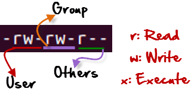

# Permissions

## Basics


## Files
When listing files we can see it's permissions:

```console
$ ls -lh
total 8,0K
drwxrwxr-x 2 alice alice 4,0K gru  4 19:18 folder
-rw-rw-r-- 1 alice alice 12 gru  4 19:14 text_file.txt
```

Key:
r: read permissions
w: write permissions
x: execute permissions
-: no permissions
d: directory



First bit defines if it's a file or a directory. Next 3 characters define owner access, next 3 characters define group members access and last 3 characters define everyone else access.
In the above example:
i) everyone can read a text_file.txt, but they cannot write to the file or execute it if it would be a binary
ii) all group members can both read and write to file, but they cannot execute it
iii) alice can read and write to file but she cannot execute it


## Linux tasks
As most relevant informations about a process, it's permissions are also stored inside `task_struct`:

```c
struct task_struct {
    [...]
	/* Process credentials: */

	/* Tracer's credentials at attach: */
	const struct cred __rcu		*ptracer_cred;

	/* Objective and real subjective task credentials (COW): */
	const struct cred __rcu		*real_cred;

	/* Effective (overridable) subjective task credentials (COW): */
	const struct cred __rcu		*cred;
    [...]
};
```

Where struct `cred` is defined as:

```c
struct cred {
    [...]
	kuid_t		uid;		/* real UID of the task */
	kgid_t		gid;		/* real GID of the task */
	kuid_t		suid;		/* saved UID of the task */
	kgid_t		sgid;		/* saved GID of the task */
	kuid_t		euid;		/* effective UID of the task */
	kgid_t		egid;		/* effective GID of the task */
	kuid_t		fsuid;		/* UID for VFS ops */
	kgid_t		fsgid;		/* GID for VFS ops */
	unsigned	securebits;	/* SUID-less security management */
	kernel_cap_t	cap_inheritable; /* caps our children can inherit */
	kernel_cap_t	cap_permitted;	/* caps we're permitted */
	kernel_cap_t	cap_effective;	/* caps we can actually use */
	kernel_cap_t	cap_bset;	/* capability bounding set */
    [...]
#ifdef CONFIG_SECURITY
	void		*security;	/* subjective LSM security */
#endif
    [...]
};
```


## References:
- [great kernel exploit writing tutorial](https://blog.lexfo.fr/cve-2017-11176-linux-kernel-exploitation-part4.html)
- [liveoverflow video](https://www.youtube.com/watch?v=Y-4WHf0of6Y)