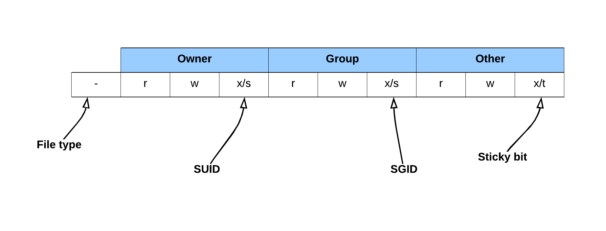

# Permissions

## Files
Everyone is familiar with such view, when listing directory content:

```console
$ ls -lh
total 8,0K
drwxrwxr-x 2 alice alice 4,0K gru  4 19:18 folder
-rw-rw-r-- 1 alice alice 12 gru  4 19:14 text_file.txt
```

I will now try to explain how should we read such output.



First bit defines file type: '-' stands for normal file, 'd' for a directory, 'f' for fifo, 's' for socket, 'c' for character device and 'b' for block device.

Then we have 3 groups each 4 bits long.
First group defines owner access, second group members access and last defines everyone's else permissions.
In the above example:
i) everyone can read a text_file.txt, but they cannot write to the file or execute it if it would be a binary
ii) all group members can both read and write to file, but they cannot execute it
iii) alice can read and write to file but she cannot execute it


Key for files. </br>
Read, write and execute are same for owner, group and other:
- r: can user read file content
- w: can user modify the file content
- x: can user execute file. 

Moreover if SUID bit is set for executable file it means that when executed it will be always run with privileges of an owner of a file. It is useful in situations when a program has to perform some actions that require high privileges. A standard example is `ping` (or `sudo`, or `passwd`) which has to create raw network socket and so needs root permissions. But as we want every user to be able to use it, ping has to have SUID set.

```console
$ ls -l /bin/ping
-rwsr-xr-x 1 root root 64424 cze 28 13:05 /bin/ping
```

The problem with SUID bit is that one has to very careful when assigning it is a perfect attack vector for someone who wan't to escalate their privileges.

To find all files with SUID set one can use find command:

```console
$ find / -perm /4000 -user root -type f 2>/dev/null
/usr/bin/newgrp
/usr/bin/gpasswd
/usr/bin/pkexec
/usr/bin/arping
/usr/bin/chfn
/usr/bin/traceroute6.iputils
/usr/bin/passwd
/usr/bin/chsh
/usr/bin/sudo
[...]
```

Similary when SGID bit is set for an executable file it means that when executed it's group identifier will be subsituted with an owner's of a file gid.    


```console
$ find / -perm /2000 -user root -type f 2>/dev/null
/usr/bin/wall
/usr/bin/mlocate
/usr/bin/crontab
/usr/bin/ssh-agent
/usr/bin/bsd-write
/usr/bin/chage
/usr/bin/expiry
[...]
```

Sticky bit on normal files is very rarely set. When set on executable file it enforces that the code (.text section) will be cached in swap memory.


Key for directories: </br>
Read, write and execute are same for owner, group and other:
- r: can user list files within directory
- w: can user create, rename, or delete files within the directory, and modify the directory's attributes
- x: can user enter the directory, and access files and directories inside. Moreover can user access file inode (metadata informations such as size). 

SUID bit has no effect when set on directory.

When directory has been assigned SGID bit all files created in it will be assigned to an directory group instead to an file creator one:

```console
$ ls -l
total 4
drwxrwsrwx 2 alice alice 4096 gru  4 22:07 folder

$ id
uid=1002(bob) gid=1002(bob) groups=1002(bob)

$ touch folder/bob_file

$ ls -l folder/
total 0
-rw-rw-r-- 1 bob alice 0 gru  4 22:08 bob_file
```

When sticky bit is set it means that that the files within the folder can be modified only by the owners. The example usage is a shared between all users /tmp folder (drwxrwxrwt root root) and sticky bit is set to prevent users from deleting files which are not theirs.


Important: directory permissions are more important then file permissions! That's why directory sticky bit is so useful!

```console
$ id
uid=1002(bob) gid=1002(bob) groups=1002(bob)

$ ls -l
total 4
drwxrwxrwx 2 alice alice 4096 gru  4 20:16 folder

$ ls -l folder
total 4
-rw-rw-r-- 1 alice alice 4 gru  4 20:16 file_inside_folder.txt

$ rm folder/file_inside_folder.txt
rm: remove write-protected regular file 'folder/file_inside_folder.txt'? y

$ ls -l folder
total 0
```

Note:  Because `ls` on default linux requires `x` mode to succeed it might be misleading when testing the directory permissions. It is exmplained [here](https://unix.stackexchange.com/questions/395990/why-cant-i-list-a-directory-with-read-permissions). To list files in directory with only `r` flag set one must disable coloring first:

```console
$ unalias ls 2>/dev/null
$ unset -f ls
$ unset CLICOLOR
```

## Real, effective, saved
Sometimes a process needs to escalate or downgrade it's privilages for some time. For example a user process might want to escalate it's privilages to root when running `/bin/sudo` and downgrade it's privilages when running not very secure web server (we don't want someone who would find RCE on our server to get root on our machine!).
But then the process want's to get it's old privilages back, so they must be saved somewhere and that's why we need both real and effective id!

Real user id defines process REAL id which doesn't change and the effective user id will be changes whenever user needs to upgrade/downgrade his privilages for some period of time.

The things get complicated when a user runs an program with elevated privilages which at some point needs to do some unprivileged work temporarily. Then the value of effective user id has to be saved somewhere and such storage is called saved user id.


## Linux processes
As most relevant informations about a process, it's permissions are also stored inside `task_struct`:

```c
struct task_struct {
    [...]
	/* Process credentials: */

	/* Tracer's credentials at attach: */
	const struct cred __rcu		*ptracer_cred;

	/* Objective and real subjective task credentials (COW): */
	const struct cred __rcu		*real_cred;

	/* Effective (overridable) subjective task credentials (COW): */
	const struct cred __rcu		*cred;
    [...]
};
```

Where struct `cred` is defined as:

```c
struct cred {
    [...]
	kuid_t		uid;		/* real UID of the task */
	kgid_t		gid;		/* real GID of the task */
	kuid_t		suid;		/* saved UID of the task */
	kgid_t		sgid;		/* saved GID of the task */
	kuid_t		euid;		/* effective UID of the task */
	kgid_t		egid;		/* effective GID of the task */
	kuid_t		fsuid;		/* UID for VFS ops */
	kgid_t		fsgid;		/* GID for VFS ops */
	unsigned	securebits;	/* SUID-less security management */
	kernel_cap_t	cap_inheritable; /* caps our children can inherit */
	kernel_cap_t	cap_permitted;	/* caps we're permitted */
	kernel_cap_t	cap_effective;	/* caps we can actually use */
	kernel_cap_t	cap_bset;	/* capability bounding set */
    [...]
#ifdef CONFIG_SECURITY
	void		*security;	/* subjective LSM security */
#endif
    [...]
};
```


## References:
- https://blog.lexfo.fr/cve-2017-11176-linux-kernel-exploitation-part4.html
- https://www.youtube.com/watch?v=Y-4WHf0of6Y
- https://unix.stackexchange.com/questions/21251/execute-vs-read-bit-how-do-directory-permissions-in-linux-work
- https://null-byte.wonderhowto.com/how-to/hack-like-pro-finding-potential-suid-sgid-vulnerabilities-linux-unix-systems-0158373/
- https://stackoverflow.com/questions/32455684/unix-linux-difference-between-real-user-id-effective-user-id-and-saved-user