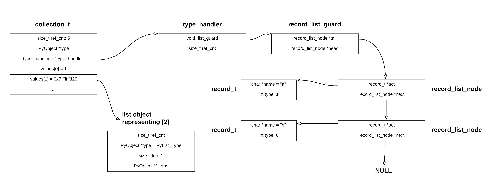

# Collection (sandbox, cpython, type confusion)
This challenge was marked as easy and so I thought it might be a good task for first python sandbox escape task. I was wrong and in the end I had to glance few times to some other writeups which I found on web.
But besides that I have to say that this challenge has opened my eyes as I would never thought that high level languages such as python can be treated as reallistic target. I would like to recommend [this](https://hackernoon.com/python-sandbox-escape-via-a-memory-corruption-bug-19dde4d5fea5) writeup from bug bounty program which I found online when searching for some cpython exploitation examples.

## Intro
We are given a bunch of files:

```console
$ ls
libc-2.27.so test.py Collection.cpython-36m-x86_64-linux-gnu.so python3.6 server.py
```

The main file is `server.py`. It reads user provided code and then executes it. The goal is to read a flag file content. Moreover we are given a file descriptor to the open flag file, so all we need to do is to read from this flag descriptor and write the loaded content to stdout:

```python3
# server.py
flag = open("flag", "r")

prefix = """
from sys import modules
del modules['os']
import Collection
keys = list(__builtins__.__dict__.keys())
for k in keys:
    if k != 'id' and k != 'hex' and k != 'print' and k != 'range':
        del __builtins__.__dict__[k]

"""

code = prefix
new = ""
finished = False

while size_max > len(code):
    new = input("code> ")
    if new == "END_OF_PWN":
        finished = True
        break
    code += new + "\n"

if not finished:
    print("max length exceeded")
    sys.exit(42)


file_name = "/tmp/%s" % randstr()
with open(file_name, "wb+") as f:
    f.write(code.encode())


os.dup2(flag.fileno(), 1023)
flag.close()

cmd = "python3.6 -u %s" % file_name
os.system(cmd)


```

There is one flaw. Before our code gets interpreted, the prefix code gets interpreted:

```python3
from sys import modules
del modules['os']
import Collection
keys = list(__builtins__.__dict__.keys())
for k in keys:
    if k != 'id' and k != 'hex' and k != 'print' and k != 'range':
        del __builtins__.__dict__[k]
```

It imports custom Collection module, deletes 'os' and all builtins methods except of `id`, `hex`, `print` and `range`.

So in fact this code is setting a python sandbox. If for example the prefix was just an empty string, then we could just gain content of flag by: 

```python3
from os import read
print(read(1023, 30))
```

## Collection.so
As I've mentioned at the beginning it was my first python escape challenge and so I wasn't sure where to look for vulnerabilities. I thought that it has to do with the way `modules` has been imported and I've wasted some time trying to escape this sandbox without touching Collection.so library.

But as I saw no progres, I've moved onto reverse engineering the Collection.so file.
Looking at `test.py` and using `dir` method I knew that Collection has some `__init__`, `__new__` and `get` methods.
```console
$ python3
import Collection
dir(Collection.Collection)
['__class__', '__delattr__', '__dir__', '__doc__', '__eq__', '__format__', '__ge__', '__getattribute__', '__gt__', '__hash__', '__init__', '__init_subclass__', '__le__', '__lt__', '__ne__', '__new__', '__reduce__', '__reduce_ex__', '__repr__', '__setattr__', '__sizeof__', '__str__', '__subclasshook__', 'get']
```

## Seccomp
So how to start reversing cpython module? Well refering to the [documentation](https://docs.python.org/3/extending/extending.html) every module has PyInit_modulename function. This function is  invoked when module is being imported. It is responsible for declaring methods and types (in this case the Collection type and get method). And so it was my starting point:

```c
PyObject* PyInit_Collection() {
    PyObject *module;

    PyType_Ready(&type);
    module = PyModule_Create2(&def,0x3f5);
    if (module != 0) {
        _type = _type + 1;
        PyModule_AddObject(module,0x102740,&type);
        mprotect((void *)0x439000,1,7);
        [...]
        mprotect((void *)0x439000,1,5);
        init_sandbox();
    }
    return module;
}
```

The only interesting part in PyInit_Collection was `init_sandbox` function. It was setting some seccomp rules. I hate to reverse those rules by hand, so I've used `seccomp-tools` to dump them.

```console
$ seccomp-tools
$ seccomp-tools dump -c "python3 test.py"
 line  CODE  JT   JF      K
=================================
 0000: 0x20 0x00 0x00 0x00000004  A = arch
 0001: 0x15 0x01 0x00 0xc000003e  if (A == ARCH_X86_64) goto 0003
 0002: 0x06 0x00 0x00 0x00000000  return KILL
 0003: 0x20 0x00 0x00 0x00000000  A = sys_number
 0004: 0x15 0x00 0x01 0x0000003c  if (A != exit) goto 0006
 0005: 0x06 0x00 0x00 0x7fff0000  return ALLOW
 0006: 0x15 0x00 0x01 0x000000e7  if (A != exit_group) goto 0008
 0007: 0x06 0x00 0x00 0x7fff0000  return ALLOW
 0008: 0x15 0x00 0x01 0x0000000c  if (A != brk) goto 0010
 0009: 0x06 0x00 0x00 0x7fff0000  return ALLOW
 0010: 0x15 0x00 0x01 0x00000009  if (A != mmap) goto 0012
 0011: 0x05 0x00 0x00 0x00000011  goto 0029
 0012: 0x15 0x00 0x01 0x0000000b  if (A != munmap) goto 0014
 0013: 0x06 0x00 0x00 0x7fff0000  return ALLOW
 0014: 0x15 0x00 0x01 0x00000019  if (A != mremap) goto 0016
 0015: 0x06 0x00 0x00 0x7fff0000  return ALLOW
 0016: 0x15 0x00 0x01 0x00000013  if (A != readv) goto 0018
 0017: 0x06 0x00 0x00 0x7fff0000  return ALLOW
 0018: 0x15 0x00 0x01 0x000000ca  if (A != futex) goto 0020
 0019: 0x06 0x00 0x00 0x7fff0000  return ALLOW
 0020: 0x15 0x00 0x01 0x00000083  if (A != sigaltstack) goto 0022
 0021: 0x06 0x00 0x00 0x7fff0000  return ALLOW
 0022: 0x15 0x00 0x01 0x00000003  if (A != close) goto 0024
 0023: 0x06 0x00 0x00 0x7fff0000  return ALLOW
 0024: 0x15 0x00 0x01 0x00000001  if (A != write) goto 0026
 0025: 0x05 0x00 0x00 0x00000037  goto 0081
 0026: 0x15 0x00 0x01 0x0000000d  if (A != rt_sigaction) goto 0028
 0027: 0x06 0x00 0x00 0x7fff0000  return ALLOW
 0028: 0x06 0x00 0x00 0x00000000  return KILL
```

Not useful right now, but might be helpful later on. For now I've patched the `init_sandbox` with nops as those rules where really anoying. For example with unpatched `init_sandbox` I was unable to import module after `import Collection` instruction:

```console
$ cat test_imports.py
import Collection
import signal

$ python3.6 test_imports.py
Bad system call (core dumped)

$ dmesg | tail -1
[43598.415996] audit: type=1326 audit(1586369880.557:43): auid=1000 uid=1000 gid=1000 ses=2 pid=20482 comm="python3" exe="/usr/bin/python3.6" sig=31 arch=c000003e syscall=4 compat=0 ip=0x7fce78771775 code=0x0
```

## Breakpoints
Before moving to reversing `__init__` and `__new__` functions let me paste some useful tricks and explain some basics about how cpython objects are structured.
First thing that has been bothering me, was how can I examine the memory layout of an objects from gdb. So some useful tricks:

1) To get address of an object use `id` function.
2) To invoke breakpoint at any time use trick with signal.

```console
$ cat tricks.py 

import signal
import os

def do_nothing(*args):
    pass

# Declare custom signal
signal.signal(signal.SIGUSR1, do_nothing)

# Create list
example_list = [1, 2, 3, 4, 5]
print(f"[i] Address of example_list: {hex(id(example_list))}")

# Invoke signal to capture execution in gdb
os.kill(os.getpid(), signal.SIGUSR1)

$ gdb --args python3 tricks.py
pwndbg> run
[i] Address of example_list: 0x7ffff6024908

Program received signal SIGUSR1, User defined signal 1
pwndbg> x/4gx 0x7ffff6024908
0x7ffff6024908:	0x0000000000000001	0x00000000009c70e0
0x7ffff6024918:	0x0000000000000005	0x00007ffff7ecfad0

pwndbg> x/1gx 0x00000000009c70e0
0x9c70e0 <PyList_Type>:	0x000000000000002a
pwndbg> x/5gx 0x00007ffff7ecfad0
0x7ffff7ecfad0:	0x0000000000a68ac0	0x0000000000a68ae0
0x7ffff7ecfae0:	0x0000000000a68b00	0x0000000000a68b20
0x7ffff7ecfaf0:	0x0000000000a68b40
```

## Understanding PyObject memory layout
It is very important to understand the memory layout of objects in cpython. Take a look at the above example in which we have declared a simple list object.
Every object in cpython has two fields: `ref_cnt` and `type`. The first one is used by garbage collector. When reference count drops to 0, the python will call `__del__` method on the object. Of course the destructors should differ for lists and for example for dicts and so the garbage collector must differentiate them somehow. And this is where `type` field comes into play. It is a pointer to type object. In above example the `example_list` lies at address 0x7ffff6024908. The `ref_cnt` is at 0x7ffff6024910 and `type` field at 0x00000000009c70e0. When checking 0x00000000009c70e0 we can see that it is in fact pointer to PyList_Type.

Next, for containers such as lists we have a `length` field. In this example our `example_list` has 5 elements and so the `length` field is set to 5. You can see the address of length field is at 0x7ffff6024918. Finally a list object has PyObject **items field. 

## Back to RE
With this knowledge the reverse engineering part should be quite easy. The `__new__` method just checks that when creating a new Collection a user provided a dictionary with no more then 32 keys.

The `__init__` function is much longer. It starts with some type checking. Every key of provided dictionary must be string and every value must be either long, list or dictionary.

```python3
c = Collection.Collection({'a': 8, 'b': {'aaa': 'bbb'}, 'c': [], 'd': 9}) # Correct collection as all values are of a correct types

c2 = Collection.Collection([1, 2, 3]) # Will fail as constructor expects dictionary

c3 = Collection.Collection({'a': 'bbb'}) #  Will fail as value is not long, list nor dictionary
```

After `__init__` does some type checking it creates a new Collection. 

```c
struct collection_t {
    size_t ref_cnt; # standard PyObject field
    PyObject *type; # standard PyObject field
    type_handler_t *type_handler;
    void*[32] values;
};
```

While `ref_cnt` and `type` are standard PyObject fields, the type_handler is more interesting. 
It stores information about the dictionary entries. This information is stored in form of a linked
list. 
Each record in the list has name of the key and type field which can be either 0 or 1. 
1 indicates that the value associated with the key is of basic type – long and 0 that it is of type list/dictionary.

Let's see an example:

```python3
c = Collection.Collection({'a': 8, 'b': {'bb': 8}, 'c': [1, 2, 3]})
```

The type handler will look like:

['a', 1] --> ['b', 0] -> ['c', 0]

The reason behind this type handler is to know whether `get` must convert the type from long to PyLong. 
This is because the the values of type long are stored as a raw number and not as a PyLong. 

You can check the pseudo code of `__init__` in [source.c](source.c)

## type_handler
There is one more thing about type handler. When we have two dictionaries with same types and key names the program doesn't
create a new handler but first checks if there exists already such a handler. If yes it just stores a reference to it 
instead of creating a new one. This is just an optimization mechanizm.
Lets check this in practice:

```gdb
$ cat test.py
import signal
import os
import Collection


def do_nothing(*args):
    pass

# Declare custom signal
signal.signal(signal.SIGUSR1, do_nothing)

c1 = Collection.Collection({'a': 1, 'b': [1, 2]})
c2 = Collection.Collection({'a': 88, 'b': [6, 4, 2]})
print(f"[i] c1: {hex(id(c1))}")
print(f"[i] c2: {hex(id(c2))}")

# Invoke signal to capture execution in gdb
os.kill(os.getpid(), signal.SIGUSR1)

$ gdb --args python3.6 test.py
pwndbg> run
[i] c1: 0x7ffff6034030
[i] c2: 0x7ffff6034260

Program received signal SIGUSR1, User defined signal 1.
pwndbg> x/3gx 0x7ffff6034030
0x7ffff6034030:	0x0000000000000001	0x00007ffff60101e0
0x7ffff6034040:	0x0000000000b460a0	
pwndbg> x/3gx 0x7ffff6034260
0x7ffff6034260:	0x0000000000000001	0x00007ffff60101e0
0x7ffff6034270:	0x0000000000b460a0
```

The pointer to type_handler of c1 lies at 0x7ffff6034040 and to c2 lies at 0x7ffff6034270. As you can see those pointers are equal meaning they point to same type_handler_t structure. 

## Vulnerability
So it look legit, right? Well not exactly. There is huge flaw in the way the program checks if there already exists a type_handler. By looking at how the `getTypeHandler` and `listIsEquivalent` functions you should nitice that two collections:

```python3
c1 = Collection.Collection({'a': 1, 'b': [2]})
c2 = Collection.Collection({'b': [3, 4], 'a': 5)
```

will share the same type handler! And this is great for us as it leads to type confusion!

## get
We havn't look at get yet. How it works? Lets say we want to find the result of `c1.get('a')`. This is how the collection_t looks like for `c1`.



The program needs to find: 1) the position of 'a' key. 2) the type of value associated to 'a' key. 

The 1 is done just be iterating from `tail` to `head` and comparing the record names.
When the program finds the record with the name equal to passed argument it checks the `type` field. If `type` is equal to 1 (which is in this case) it indicates that the value stored at values[0] is of raw type and must be packed before returned to the user. This is why it gets converted to PyLong.

On the other hand if we ask for `c1.get('b')`, the program finds the index – which is 1, checks the `type` field of record with name 'b'. The type is equal to 0, meaning that the values[1] is of PyObject type and can be returned to user witout any conversion.

Till this point everything should be clear. But how does it look like when it comes to type confusion. Look at `c2` defined above. As we have mentioned it has exactly the same `type_handler`, but the values look different:


So this time let's ask for `c2.get('a')`. The program is checking the type and the position. The position is `0` (not 1!!!) and the type is `1` indicating it is a raw type. So the program will return the address of list [3, 4]!!!

## Arbitrary read/write