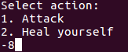

# Game (pwn, bsk, integer_overflow)

### Notes
- source code given: yes
- binary given: yes


### Goal
Make the game anounce the user's win without crashing the game.

### Enumeration
First lets check the protections.
  

As we can see the binary hasn't been compiled as PIE. This means that if we gain control over _\$eip_ we can then jump to a function of our choice.

As to the code, we could easly spot a missing check when prompt to pick an action:

```c
int read_action() {
	int action_no;
	while (1) {
		printf("Select action:\n1. Attack\n"
			   "2. Heal yourself\n");
		if (scanf("%d", &action_no) > 0 && action_no <= (int) ACTIONS_SIZE) {
			break;
		}
		getchar();
	}

	return action_no - 1;
}
```

As we can see, the attacker can provide a negative number.



We can see that the program first reads an action index, and then calls a function from `action_t actions[2]` array.
```c
int action_no = read_action();
human.actions[action_no](&human, &bot);
```
Let's look at a deassembled code:


If attacker provides a negative number when prompt for action, the final value in eax will come from the value placed on the stack right above the actions table.
Lets examine the stack layout.

Run the game under gdb and create a warrior with 27 hp, 2 strenght and 1 luck point.


Than let's search stack for "ALLADYN" string to find out where human structure has been alocated.


Now examine the memory


Based on that we can draw the stack layout:


So if attacker passed value 0 instead of 1, 2 when asked to pick an action, the program will call a pointer with address being last bytes of name field (16-20).

This means that the attacker can controll the function call. So how can we use that to win the game. Note that we cannot pass any arguments.
My first thought was to call heal function. As the human structure is placed at the top of the stack, we would super heal ourselves (the amount would be large number, as it is a pointer to bot structure). Although because of the check we cannot heal more than `max_hp`.

```c
void heal(pplayer_t player, int amount) {
	player->hp = MIN(player->hp + amount, player->max_hp);
}
```

Then I camed out with an idea to exploit `hit` functionality with integer overflow. 

```c
void hit(pplayer_t player, int amount) {
	player->hp = MAX(0, player->hp - amount);
}
```

We can hit overselves and the hp - amount will overflow becoming large integer.
Let's try this out!

First we need to find the address of hit function. It is stable as the binary hasn't been compiled as PIE.


Now let's use very useful trick to build poc. It allows to mix python input without closing the stdin pipe.


As we can see, our warrior is now nicely enhanced. We can finish the boss and win the game:

