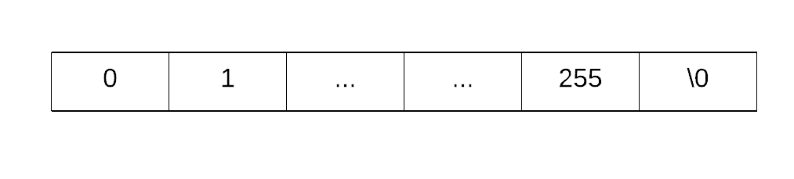

# Greeter2.0 (pwn, bsk, ret2libc, off-by-one)

### Notes:
- source code given: yes
- binary given: yes
- staticly linked: no
- ASLR enabled: no
- canaries: no
- PIE: no

The source code:
```c
/*
Compile with:
gcc -m32 -fno-stack-protector -mpreferred-stack-boundary=2 greeter2.0.c -o greeter2.0
*/

#include <stdio.h>

void greet(int times) {
	char buffer[256];

	printf("Your name (can be long one): ");
	if (scanf("%256s", buffer) > 0) {
		while (times > 0) {
			printf("Hi %s!\n", buffer);
			times--;
		}
	}
}

int main(void) {
	//setvbuf(stdout, NULL, _IONBF, 0);
	greet(1);
	return 0;
}
```

We can easily spot that a vulnerable part of code is the _scanf_ function which will not only read 256 characters but also place additional null byte \0 character at the end of loaded input. In total scanf will try to place 257 bytes into buffer. Therefore the \0 character will overflow the buffer by one byte.



