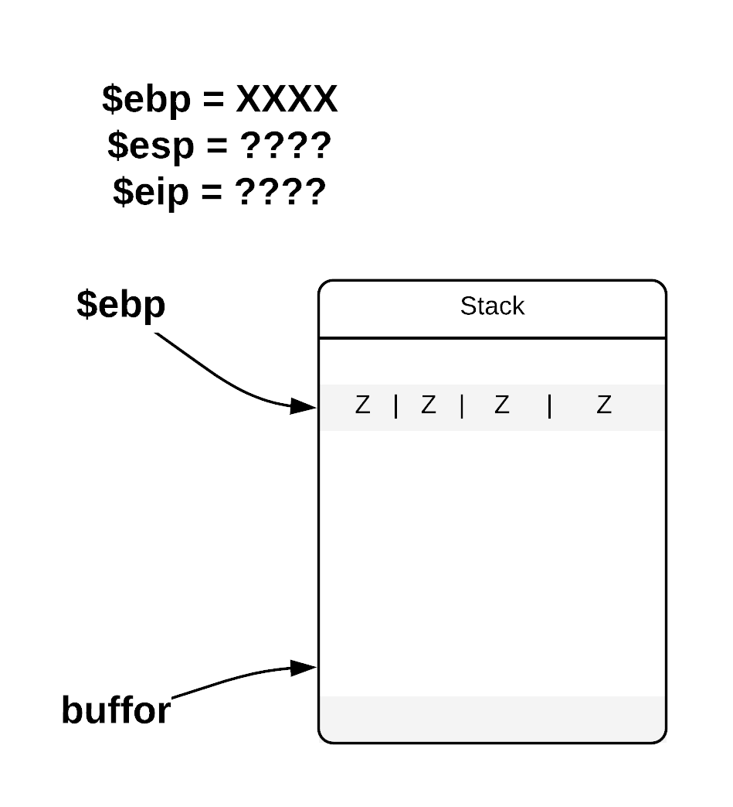

# Greeter2.0 (pwn, bsk, ret2libc, off-by-one)

### Notes
- source code given: yes
- binary given: yes


The source code:
```c
/*
Compile with:
gcc -m32 -fno-stack-protector -mpreferred-stack-boundary=2 greeter2.0.c -o greeter2.0
*/

#include <stdio.h>

void greet(int times) {
	char buffer[256];

	printf("Your name (can be long one): ");
	if (scanf("%256s", buffer) > 0) {
		while (times > 0) {
			printf("Hi %s!\n", buffer);
			times--;
		}
	}
}

int main(void) {
	//setvbuf(stdout, NULL, _IONBF, 0);
	greet(1);
	return 0;
}
```
</br>

### Enumeration
First lets check the protections.
  
Moreover from the task content we know that ASLR is disabled with:
```bash
$ sudo sysctl kernel.randomize_va_space=0
kernel.randomize_va_space = 0
```
This will be very important later on.
</br>
</br>
Back to the code, we can easily spot that a vulnerable part of code is the `scanf` function which will not only read 256 characters but also place a null byte \0 character at the end of loaded input. The \0 character will overflow the buffer.

The question arises how can we exploit this bug. Let's see what can we override with the null character. Here is how the stack looks like before and after providing input of length >= 256.

So the _\0_ character replaces the least significant bit of _\$ebp_. Moreover new value of _\$ebp_ now points onto the attacker controlled buffer as: 0xffffcd00 belongs to [0xffffcc7c, 0xffffcd7c] range.
I have found on internet a [really good explanation](https://sploitfun.wordpress.com/2015/06/07/off-by-one-vulnerability-stack-based-2/) on how to exploit such vulnerability.

Our goal is to gain control over instruction register. And the assembly 32 bit convension will help as with it. If we look closely at assembled code we can see that each function ends with leave instruction followed with ret.


And `leave` instruction is equivalent to:</br>
```assembly
mov esp,ebp
pop ebp
```

The above sequence will be called twice: first when leaving the `greet` function and secondly when leaving the `main` function. This should allow us not only to override _\$eip_ with value of our choice but also to control the stack arguments.

Here is how the flow will look like:


</br>
</br>
### Exploit
You might got lost in the above explanation, but I hope everything will become clear soon. Our plan:
- [ ] Override the lsb of _\$ebp_ stored on stack with 0x0, so that the value now points to the middle of the buffer.
</br>


- [ ] first `leave; ret` sequence will make _\$ebp_ point to the middle of the buffer.
- [ ] second `leave; ret` sequence will make _\$esp_ point to the middle of the buffer.
- [ ] `ret` will override _\$eip_ with the value stored in the buffer


