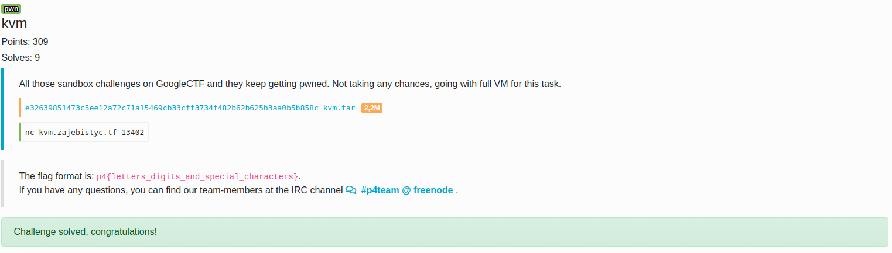

# kvm (vm escape, kvm, long mode)
This was one of the most interesting challenges I've seen recently. I always wanted to learn about the misterious vm escapes and this was a great opportunity.


## Files
```bash
$ ls
example.shellcode  kvm  third_party
$ ls third_party/
ld-linux-x86-64.so.2  libc.so.6
```

In the challenge we are given a small binary named `kvm` without any source code. The good news is that the binary have debuging symbols included which ease reversing. I've included the reversed pseudo code [here](kvm_source.c).

## Architecture
In general, the program is asking user for some untrusted shellcode and then it is using `kvm` (real kvm, not the provided binary) to spawn a virtual machine in which it will execute this code. So as the task description suggest, our goal is to break out of this sandbox.

## General overview
The program is performing standard initialization routines. I've decided not to go throught it as it is explained in details [here](https://lwn.net/Articles/658511/). But in short it opens the `/dev/kvm` device, it creates a virtual machine, allocates a memory for the guest, sets the guest registers and guest special registers, paging and finally it passes the control to the guest vm.

The non standard thing is that the guest in the article linked above executes in `real mode` while the guest in the challenge executes in `long mode`. This means that there must be some paging included. And indeeed it is as you can see in this part of the code:

```c
int main()
{
    // [...]

    // Setup paging long mode.
    guest_sregs.cr0 = CR0_PE | CR0_MP | CR0_ET | CR0_NE | CR0_WP | CR0_AM | CR0_PG;
    guest_sregs.cr4 = CR4_PAE;
    guest_sregs.efer = EFER_LMA | EFER_LME;
    guest_sregs.cr3 = 0x4000;
    (__u64*)(aligned_guest_mem + 0x4000) = 0x5003; // P4 Table[0]
    (__u64*)(aligned_guest_mem + 0x5000) = 0x6003; // P3 Table[0]
    (__u64*)(aligned_guest_mem + 0x6000) = 0x7003; // P2 Table[0]
    (__u64*)(aligned_guest_mem + 0x7000) = 0x3;    // P1 Table[0]
    (__u64*)(aligned_guest_mem + 0x7008) = 0x1003; // P1 Table[1]
    (__u64*)(aligned_guest_mem + 0x7010) = 0x2003; // P1 Table[2]
    (__u64*)(aligned_guest_mem + 0x7018) = 0x3003; // P1 Table[3]
    // meaning 0x0, 0x1000, 0x2000, 0x3000 are physical pages

    // [...]
}
```

## Memory layout and vulnerability
Let's look how the memory for the guest is being allocated:

```c
int main()
{
    char guest_mem[0x8000]; // <-- I.
    memset(&guest_mem, 0, 0x8000); // <-- II.
    char *aligned_guest_mem = guest_mem + (4096 - guest_mem % 4096); // <-- III.

    // [...] (open /dev/kvm, create vm, etc)

    struct kvm_userspace_memory_region region = { // <-- IV.
        .slot = 0,
        .flags = 0,
        .guest_phys_addr = 0,
        .memory_size = 0x8000,
        .userspace_addr = aligned_guest_mem
    };
    ioctl(vm_fd, KVM_SET_USER_MEMORY_REGION, &region); // <-- IV.
}
```
<b>I.</b> Program starts with allocating big buffer on the stack for guest memory which I will call `guest_mem`.</br>
<b>II.</b> It then zeros the memory with memset. Without reseting the memory the guest could leak some interesting addresses which are there.</br>
<b>III.</b> It then creates a pointer `aligned_guest_mem`. Why? Well if you have read the [article](https://lwn.net/Articles/658511/) I've linked above you perhaps remember that the `ioctl(vm_fd, KVM_SET_USER_MEMORY_REGION, &region);` requires that the passed `region.userspace_addr` argument points to aligned memory.</br>
<b>IV.</b> As mentioned above, after aligning the memory, the program invokes `KVM_SET_USER_MEMORY_REGION` to allocate 0x8000 bytes of memory for the guest.
This means that the <b>virtual</b> memory in the host: `[aligned_guest_mem, aligned_guest_mem + 0x8000]` will be seen in guest as <b>physical</b> memory as `[0, 0x8000]`. Well, can you spot the bug? The `aligned_guest_mem + 0x8000` overflows the allocated `guest_mem` buffer! The `region.memory_size` should be at maximum of `0x8000 - (aligned_guest_mem - guest_mem)` bytes!</br> 

## References
I) [Using KVM API](https://lwn.net/Articles/658511/)<br>
II) [KVM hello world](https://github.com/dpw/kvm-hello-world)</br>