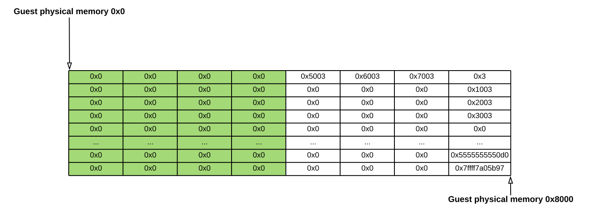
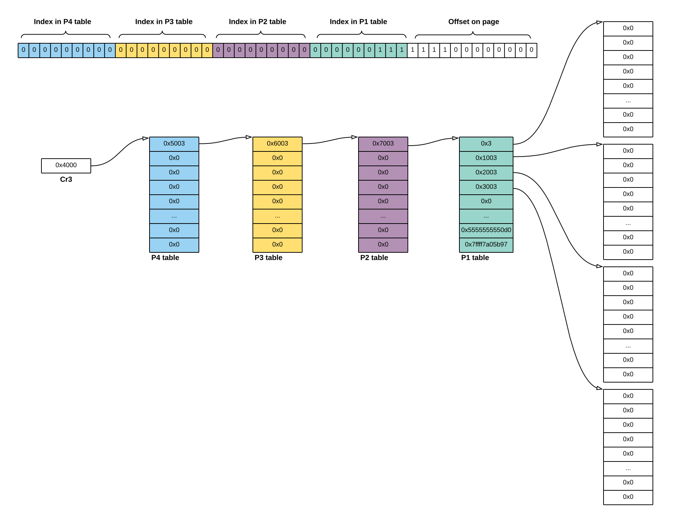
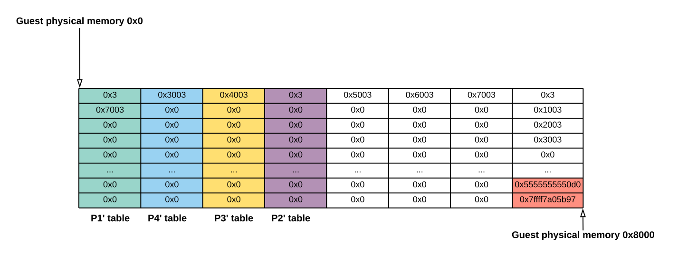

# kvm (vm escape, kvm, long mode)
This was one of the most interesting challenges I've seen recently. I always wanted to learn about the misterious vm escapes and this was a great opportunity.

Note, that I've solved this challenge together with `Iga Supinska`.

## Files
```bash
$ ls
example.shellcode  kvm  third_party
$ ls third_party/
ld-linux-x86-64.so.2  libc.so.6
```

In the challenge we are given a small binary named `kvm` without any source code. The good news is that the binary have debuging symbols included which ease reversing. I've included the reversed pseudo code [here](kvm_source.c).

## Architecture
In general, the program is asking user for some untrusted shellcode and then it is using `kvm` (real kvm, not the provided binary) to spawn a virtual machine in which it will execute this code. So as the task description suggest, our goal is to break out of this sandbox.

## General overview
The program is performing standard initialization routines. I've decided not to go throught it as it is explained in details [here](https://lwn.net/Articles/658511/). But in short it opens the `/dev/kvm` device, it creates a virtual machine, allocates a memory for the guest, sets the guest registers and guest special registers, paging and finally it passes the control to the guest vm.

The non standard thing is that the guest in the article linked above executes in `real mode` while the guest in the challenge executes in `long mode`. This means that there must be some paging included. And indeeed it is as you can see in this part of the code:

```c
int main()
{
    // [...]

    // Setup paging long mode.
    guest_sregs.cr0 = CR0_PE | CR0_MP | CR0_ET | CR0_NE | CR0_WP | CR0_AM | CR0_PG;
    guest_sregs.cr4 = CR4_PAE;
    guest_sregs.efer = EFER_LMA | EFER_LME;
    guest_sregs.cr3 = 0x4000;
    (__u64*)(aligned_guest_mem + 0x4000) = 0x5003; // P4 Table[0]
    (__u64*)(aligned_guest_mem + 0x5000) = 0x6003; // P3 Table[0]
    (__u64*)(aligned_guest_mem + 0x6000) = 0x7003; // P2 Table[0]
    (__u64*)(aligned_guest_mem + 0x7000) = 0x3;    // P1 Table[0]
    (__u64*)(aligned_guest_mem + 0x7008) = 0x1003; // P1 Table[1]
    (__u64*)(aligned_guest_mem + 0x7010) = 0x2003; // P1 Table[2]
    (__u64*)(aligned_guest_mem + 0x7018) = 0x3003; // P1 Table[3]
    // meaning 0x0, 0x1000, 0x2000, 0x3000 are physical pages

    // [...]
}
```

## Memory layout and vulnerability
Let's look how the memory for the guest is being allocated:

```c
int main()
{
    char guest_mem[0x8000]; // <-- I.
    memset(&guest_mem, 0, 0x8000); // <-- II.
    char *aligned_guest_mem = guest_mem + (4096 - guest_mem % 4096); // <-- III.

    // [...] (open /dev/kvm, create vm, etc)

    struct kvm_userspace_memory_region region = { // <-- IV.
        .slot = 0,
        .flags = 0,
        .guest_phys_addr = 0,
        .memory_size = 0x8000,
        .userspace_addr = aligned_guest_mem
    };
    ioctl(vm_fd, KVM_SET_USER_MEMORY_REGION, &region); // <-- IV.
}
```
<b>I.</b> Program starts with allocating big buffer on the stack for guest memory which I will call `guest_mem`.</br>
<b>II.</b> It then zeros the memory with memset. Without reseting the memory the guest could leak some interesting addresses which are there.</br>
<b>III.</b> It then creates a pointer `aligned_guest_mem`. Why? Well if you have read the [article](https://lwn.net/Articles/658511/) I've linked above you perhaps remember that the `ioctl(vm_fd, KVM_SET_USER_MEMORY_REGION, &region);` requires that the passed `region.userspace_addr` argument points to aligned memory.</br>
<b>IV.</b> As mentioned above, after aligning the memory, the program invokes `KVM_SET_USER_MEMORY_REGION` to allocate 0x8000 bytes of memory for the guest.
This means that the <b>virtual</b> memory in the host: `[aligned_guest_mem, aligned_guest_mem + 0x8000]` will be seen in guest as <b>physical</b> memory as `[0, 0x8000]`. Well, can you spot the bug? The `aligned_guest_mem + 0x8000` overflows the allocated `guest_mem` buffer! The `region.memory_size` should be at maximum of `0x8000 - (aligned_guest_mem - guest_mem)` bytes!</br> 


This means that the last bytes of guest physical memory come from outside of `guest_mem` buffer.

## Accessing host memory
As pointed above, the last bytes in guest physical memory come from outside of `guest_mem` buffer. The goal is obvious, we need a way to access this memory as we could then for example overwrite the return address of the `host` and so escape the vm. You might wonder, if we can execute code inside the guest, can't we just access this memory like this?

```asm
mov rax, 0x7ff0
mov qword ptr [rax], 0x41424344
```

And the answer is no. Why? Because of paging. When we try to reach memory at address `0x7ff0` it is treated as virtual memory which mmu converts then to physical memory. In fact it first converts it to linear address, but as all segment bases are set to 0 and limits to 0xffff this convertion is unnoticible and I will skip it.

The pages are at guest memory [0x4000, 0x8000]. I don't like the names PLM4, PDP, PD, PT and so I will call them P4, P3, P2, P1.



So as I hope you can tell from the above explanation, when trying to access `virtual address` 0x7ff0 on guest the mmu:</br>
<b>I.</b> Checks cr3 for address of P4. In this case it sees that the P4 is add physical address 0x4000.</br>
<b>II.</b> Check that the bits highest 9 bits of 0x7ff0 are b'000000000' = 0 and so it looks at index 0 of P4 table for physical address of P3 table. You might ask the entry in the table contains 0x5003 instead of 0x5000? Well, the lowest 12 bits are used for additional informations. The important for us are bits 0 and bit 1 which determinate whether we can access this page for writing (2^0 + 2^1 = 3).</br>
<b>III.</b> It proceeds to P3 table. Again, it looks at the next 9 bits of 0x7ff0 which are again b'000000000' = 0 and so it looks at index 0 of P3 table for physical address of P2 table which turns out to be 0x6000.</br>
<b>IV.</b>  It proceeds to P2 table. Again, it looks at the next 9 bits of 0x7ff0 which are again b'000000000' = 0 and so it looks at index 0 of P2 table for physical address of P1 table which turns out to be 0x7000.</br>
<b>V.</b>  It proceeds to P1 table. Again, it looks at the next 9 bits of 0x7ff0 which are b'00000111' = 8 and so it looks at index 8 of P1 table for physical address of a physical page. But under this index there is 0 (or some random address from host) which almost for sure doesn't have valid page bits set and so it generates an segfault.</br>


## Substitude cr3
So at first glance it may seem that we cannot access the host memory as every time we try to access virtual memory outside of range `[0x0, 0x4000]` we get a segfault as the mapping is missing. But noone told us we cannot change the value of `cr3`! And so we can create our own page tables P4', P3', P2', P1' inside memory range `[0x0, 0x4000]` and make P1' have an entry with value `0x7003`. Finally we can set `cr3` to point to our memory. This way we can legitimaly access such memory. 

Our code for this part:

```asm
; Build custom P4', P3', P2', P1' tables.
mov qword ptr [0x1000], 0x2003
mov qword ptr [0x2000], 0x3003
mov qword ptr [0x3000], 0x0003
mov qword ptr [0x0], 0x3
mov qword ptr [0x8], 0x7003

mov rax, 0x1000
mov cr3, rax
```

And this is how these pages look in memory:


## Shell
Now we can access addresses from `[0x7000-0x8000]` range! So we can try to find return address of host and overwrite it with address found by `one_gadget`. ASLR is enabled, but we can just increase the return address by the required delta. So the last question is how can we find the return address (as the location will slightly change every time). Well, after examing the memory under gdb I've found that the page range `[0x7020, 0x8000]` is filled with 0 values (from memset) and then we have 4 addresses before we reach return address. So we can just scan the memory till we find the first non zero value.</br>
In our exploit it looks like this:
```asm
mov rcx, 0x1028
look_for_ra:
    add rcx, 8
    cmp qword ptr [rcx], 0
    je look_for_ra

    add rcx, 24
overwrite_ra:
    mov rax, qword ptr [rcx]
    add rax, {delta}
    mov qword ptr [rcx], rax
```

## References
I) [Using KVM API](https://lwn.net/Articles/658511/)<br>
II) [KVM hello world](https://github.com/dpw/kvm-hello-world)</br>