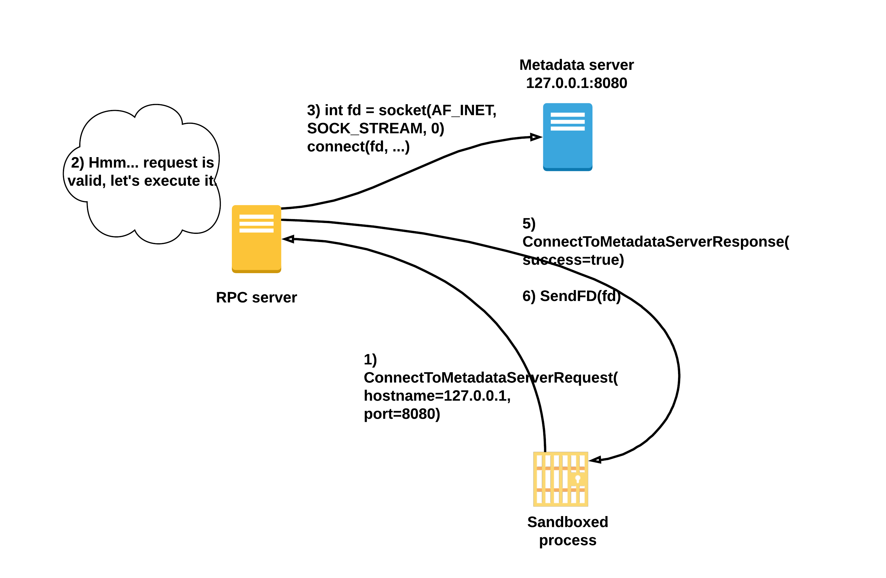

# sandbox-caas (sandbox, net namespace, sockets, shellcode)
I havn't fully solved the challenge myself. I've got stack on ReceiveFD implementation in assembly which just wasn't working for some reasons.
After few hours I gave up and started looking for some other implementations and found [this](https://ctftime.org/writeup/15869) cool writeup which used some g++ flags and objcopy to extract shellcode from c. I have copied the assembly part of the code. 


## Infrastructure
As a user we can connect to the challenge server. It will ask us to provide the binary which we want to execute (shellcode). This binary will be run in a custom sandbox based on linux namespaces, rlimit and seccomp.


Moreover we know that on same machine there are two other services running. One listening on localhost:8080 being a metadata server and one listening on localhost:6666 being a flag server.

## Flag Server
There is nothing tricky about flag server. When client connects to it, it will just send him the flag. So the goal is quite obvious – we need to connect to the Flag Server.

## Metadata Server
It seems that metadata server havn't been yet finished. When connecting to it, it just responds with 'Not implemented' message.

## RPC Server
RPC Server is a bridge between the sandboxed process and the rest of the world. They communicate using a pipe (descriptor 100). The sandboxed process can for example ask RPC Server to connect to Metadata Server for him.

## Sandbox
You might wonder, why sandboxed process needs to ask RPC Server to connect him with Metadata Server. Well, the sandbox is quite restrictive and sandboxed process is placed in new NET_NAMESPACE, meaning he won't see any network interfaces of the host.

Sandbox details:
i) The process is placed in new new, ipc, cgroups, user, uts, pid, mount namespaces.
ii) The process has no capabilities.
iii) The pivot_root was invoked before passing control to our shellcode and so, the process root is in an empty tmpfs folder /tmp/.challenge/. The old root was umounted.
iv) Seccomp policy allows only: read, write, close, munmap, sched_yield, dup, dup2, nanosleep, connect, accept, recvmsg, bind, exit, exit_group, clone, mmap syscalls.
iv) The proces memory maps have been unmaped, leaving only the stack and user shellcode.

## API
Reading through sandbox details it is quite obvious that it is rather decent sandbox and perhaps the weak point is this RPC Server. Let's check it closer.
The RPC Server works in an infinite loop:

```c
void Server(pid_t pid, int comms_fd) {
  Request req;
  while (true) {
    Response res;
    int fd_to_send = -1;

    if (TEMP_FAILURE_RETRY(read(comms_fd, &req, sizeof(req))) != sizeof(req)) {
      return;
    }

    // Validate request parameters.
    if (!ValidateRequest(pid, req)) {
      fprintf(stderr, "Request validation failed.\n");
      return;
    }

    // Parameters good, actually execute the request.
    if (!ExecuteRequest(pid, req, &res, &fd_to_send)) {
      return;
    }

    if (TEMP_FAILURE_RETRY(write(comms_fd, &res, sizeof(res))) != sizeof(res)) {
      return;
    }

    if (fd_to_send != -1) {
      if (!SendFD(comms_fd, fd_to_send)) {
        return;
      }
      close(fd_to_send);
    }
  }
}
```

It reads a request from a sandboxed process, then it checks if the request is valid. If the request is valid, it executes it. Finally it sends a reply to the process and when needed also a file descriptor. 

There are two types of requests that a sandboxed process can send, but only one – ConnectToMetadataServerRequest is interesting (the other one – GetEnvironmentDataRequest is just not yet implemented). 

So let's check out ConnectToMetadataServerRequest.



It takes a <b>pointer</b> to a hostname string and an uint16_t port number. It then checks if the request is valid:

```c++
template <>
bool ValidateRequest(pid_t pid, const ConnectToMetadataServerRequest &req) {
  static constexpr std::pair<const char *, uint16_t> allowed_hosts[] = {
    // Allow service to connect to the metadata service to obtain secrets etc.
    {"127.0.0.1", 8080},          // Early access.
    // {"169.254.169.254", 80},   // Full blown metadata service, not yet implemented
  };
  std::string host;
  if (!SafeRead(pid, req.hostname, 4 * 3 + 3, &host)) {
    return false;
  }

  fprintf(stderr, "host: %s port: %d\n", host.c_str(), req.port);

  bool allowed = false;
  for (const auto &p : allowed_hosts) {
    if (!strcmp(p.first, host.c_str()) && p.second == req.port) {
      allowed = true;
    }
  }

  return allowed;
}
```

All this function does is it retrieves the hostname string from the sandboxed process memory space via SafeRead and then checks if hostname and port provided are in the whitelist. So for example if sandboxed process would ask a RPC Server to connect it to Flag Server this request would not pass the ValidateRequest function.

Let's see what happens next, so when the request was marked as valid.

```c++

template <>
bool ExecuteRequest(pid_t pid, const ConnectToMetadataServerRequest &req, ConnectToMetadataServerResponse *res,
                    int *fd_to_send) {
  std::string host;
  if (!SafeRead(pid, req.hostname, 31, &host)) {
    return false;
  }

  *fd_to_send = socket(AF_INET, SOCK_STREAM, 0);
  struct sockaddr_in serv_addr = {};
  serv_addr.sin_family = AF_INET;
  serv_addr.sin_port = htons(req.port);

  if (inet_pton(AF_INET, host.c_str(), &serv_addr.sin_addr.s_addr) != 1) {
    fprintf(stderr, "inet_pton failed\n");
    *fd_to_send = -1;
    res->success = false;
  } else if (connect(*fd_to_send, (struct sockaddr *)&serv_addr,
                     sizeof(sockaddr_in)) < 0) {
    perror("connect");
    res->success = false;
  } else {
    res->success = true;
  }
  return true;
}
```

Then the RPC Server will convert the hostname to binary form using inet_pton and try to establish the connection with the socket. Nothing complicated. 

## Vulnerabilities
After looking at how the whole infrastructure looks like and how the sandboxed process was supposed to communicate with the RPC Server it is time to think of what could go wrong. 

### Time of check, time of use
One of vulnerabilities is quite obvious. After the request passes the validation the RPC Server again invokes `SafeRead` function to get the hostname. Remember that the hostname string lies in memory of sandboxed process, so it can just modify it.
So as an attacker we could make RPC Server try to connect to some other address then 127.0.0.1. Unfortunately for us, we cannot modify the port as it was passed as an integer in the request. So is there anything we can achieve?

### Sockets and namespaces
Of course, after all this is a CTF challenge! Sockets belong to network namespace in which they have been created. So the next question is, why do we need time of check, time of use, can't we just reconnect the valid socket associated with Metadata Server to Flag Server? Well according to [man](http://man7.org/linux/man-pages/man2/connect.2.html) page:

```
Some protocol sockets (e.g., UNIX domain stream sockets) may
successfully connect() only once.

Some protocol sockets (e.g., datagram sockets in the UNIX and
Internet domains) may use connect() multiple times to change their
association.
```

So unfortunately for us, the stream sockets can be connected only once. But here comes the third bug! When connect fails, the `fd_to_send` is not being set to -1 and therefore the socket will be send to us anyway!

## Exploit
So to sum up. We want to make connect fail by winning race condition and changing the hostname just after `ValidateRequest` but before `SafeRead` from `ExecuteRequest`. Then we will receive the unconnected stream socket which belongs to outer network namespace and so we can use it to connect to Flag Server and read the flag.

## SafeRead
The last problem is how will we win the race condition. I havn't yet looked in the implementation details of `SafeRead` which is used to retrieve the hostname from sandboxed process memory:

```c++
bool SafeRead(pid_t pid, const void *addr, size_t size, std::string *buf) {
  buf->resize(size + 1);
  struct iovec iov_remote = {};
  iov_remote.iov_base = (void *)addr;
  iov_remote.iov_len = size;

  struct iovec iov_local = {};
  iov_local.iov_base = (void *)buf->data();
  iov_local.iov_len = size;

  // Make sure that the calling process is blocked in read() or recvmsg().
  auto is_process_blocked_by = [](pid_t pid, int syscall_no) {
    char buf[5];
    snprintf(buf, sizeof(buf), "%d", syscall_no);

    char path[PATH_MAX];
    snprintf(path, PATH_MAX, "/proc/%d/syscall", pid);
    int f = open(path, O_RDONLY);
    if (f == -1) {
      perror("open()");
      return false;
    } else {
      char actual[5] = {};
      if (read(f, actual, sizeof(actual) - 1) != sizeof(actual) - 1) {
        close(f);
        return false;
      }
      close(f);
      return !strncmp(buf, actual, strlen(buf));
    }
  };

  bool is_blocked = false;
  // Try a couple of times, the process might not have called read / recvmsg
  // yet.
  for (int i = 0; !is_blocked && i < 3; i++) {
    is_blocked = is_process_blocked_by(pid, __NR_read) ||
                 is_process_blocked_by(pid, __NR_recvmsg);
    struct timespec t = {};
    t.tv_sec = 0;
    t.tv_nsec = 100000;
    nanosleep(&t, nullptr);
  }

  if (!is_blocked) {
    fprintf(stderr, "Process still not blocked on syscall.\n");
    return false;
  }

  int n_threads = -1;
  if (!GetNumberOfThreads(pid, &n_threads) || n_threads > 1) {
    fprintf(stderr, "Error: n_threads > 1\n");
    return false;
  }

  if (process_vm_readv(pid, &iov_local, 1, &iov_remote, 1, 0) < 0) {
    perror("process_vm_readv");
    return false;
  }

  return true;
}
```

## One more bug
It checks if the process is blocked on `read` syscall and the `Threads` number from `status` file. We can pass the first check by creating a new thread which will modify the hostname while the parent process will be blocked on read.
But wouldn't `SafeRead` detect it with the `Threads` check? Well no. And to be fair I could not find the reason till I followed the flow in gdb. It turned out that the bug is the `ReadWholeFile` function which `GetNumberOfThreads` uses to read the `/proc/<pid>/status` file. Let's check the body of the function:

```c++
bool ReadWholeFile(const char *path, std::string *buf) {
  std::unique_ptr<FILE, decltype(&fclose)> f(fopen(path, "rb"), &fclose);
  if (!f) {
    return false;
  }

  if (fseek(f.get(), 0, SEEK_END)) {
    fprintf(stderr, "fseek failed\n");
    return false;
  }

  size_t filesize = ftell(f.get());
  if (fseek(f.get(), 0, SEEK_SET)) {
    fprintf(stderr, "fseek failed\n");
    return false;
  }

  // Read whole buffer.
  buf->resize(filesize);

  std::string &buf_ = *buf;
  fread(&buf_[0], 1, filesize, f.get());
  return true;
}
```

Can you spot the bug? Well the problem is that `filesize` will be 0, because of how procfs files work and therefore the number of threads will be 0.


## Code
As I pointed out at the begining, I've failed for some unknown reasons to implement my exploit in assembler. ReceiveFD succeeded and returned 1 as result, but no socket was created. I've looked through the net to see how other people have implemented it and I've found out this [writeup](https://ctftime.org/writeup/15869) which shows how to create shellcode with g++ and objcopy.

## POC
I had to try multiple times as race condition vulnerabilities are not very reliable, but finally I've received the flag:)

```console
$ python3 exp.py REMOTE
[*] '/home/k/caas/challenge'
    Arch:     amd64-64-little
    RELRO:    Partial RELRO
    Stack:    No canary found
    NX:       NX enabled
    PIE:      PIE enabled
[+] Opening connection to caas.ctfcompetition.com on port 1337: Done
[+] Receiving all data: Done (32B)
[*] Closed connection to caas.ctfcompetition.com port 1337
b'CTF{W3irD_qu1rKs}\n\x00\x00\x00\x00\x00\x00\x00\x00\x00\x00\x00\x00\x00\x00'
[*] Switching to interactive mode
[*] Got EOF while reading in interactive
$
```

