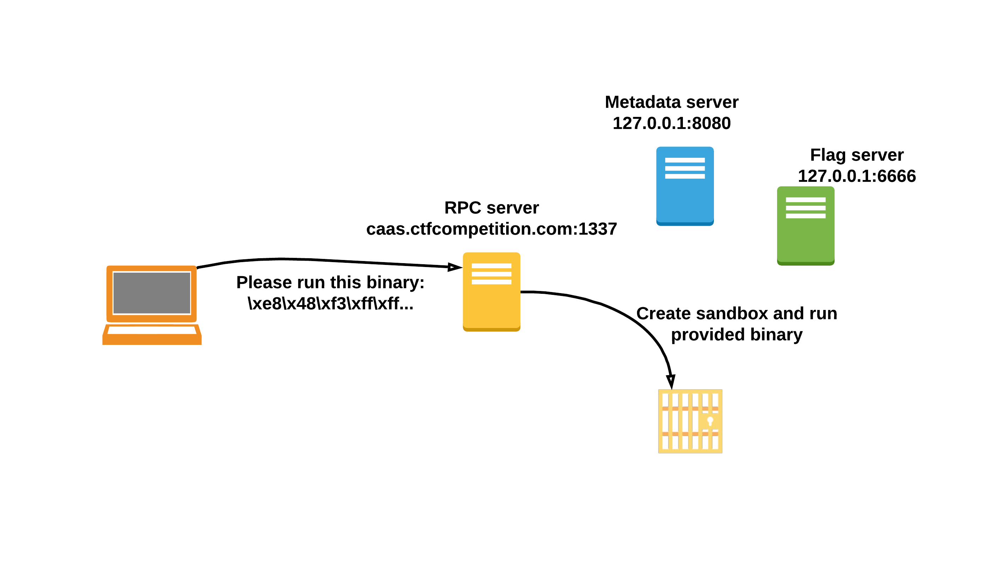

# sandbox-caas (sandbox, net namespace, sockets, shellcode)
I havn't fully solved the challenge myself. I've got stack on ReceiveFD implementation in assembly which just wasn't working for some reasons.
After few hours I gave up and started looking for some other implementations and found [this](https://ctftime.org/writeup/15869) cool writeup which used some g++ flags and objcopy to extract shellcode from c. I have copied the assembly part of the code. 

## Infrastructure
As a user we can connect to the challenge server. It will ask us to provide the binary which we want to execute. This binary will be run in a custom sandbox based on linux namespaces, rlimit and seccomp.

