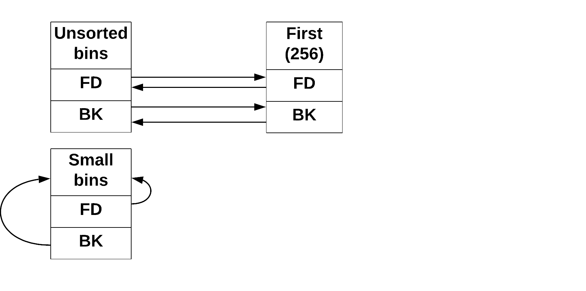

# AfterLife (pwn, pico, heap-exploitation, use-after-free, unlink macro, GOT)

### Notes
- source code given
- binary given


### Enumeration
The program contains two obvious vulnerabilities:

```c
[...]
// address leak vulnerability
printf("%d\n",first);
[...]

// use after free vulnerability
free(first);
[...]
gets(first);
[...]
```


### Exploit
To obtain a flag we have to call `win` function, meaning we need to find a way to redirect code execution. There are two most popular ways to redirect code. One is based on overwriting the return address and the other one is to overwrite the address placed in GOT table. Here we will try the GOT one by overwriting the address under `got.exit` with `win` function address.

Ok, but how can we make a program write to GOT table? Yes, we do have a vulnerable `gets`, but we cannot just override the whole memory hoping that we are lucky and we wont cause any SIGSEV. We need to be smarter.

We will use [unlink macro](https://heap-exploitation.dhavalkapil.com/attacks/unlink_exploit.html) to write for us. I won't explain this technique in details as there are good materials avaible in internet.

Let's look how the bins look in memory:

```c
free(first)
```



```c
free(third)
```


```c
fifth=malloc(128);
```

