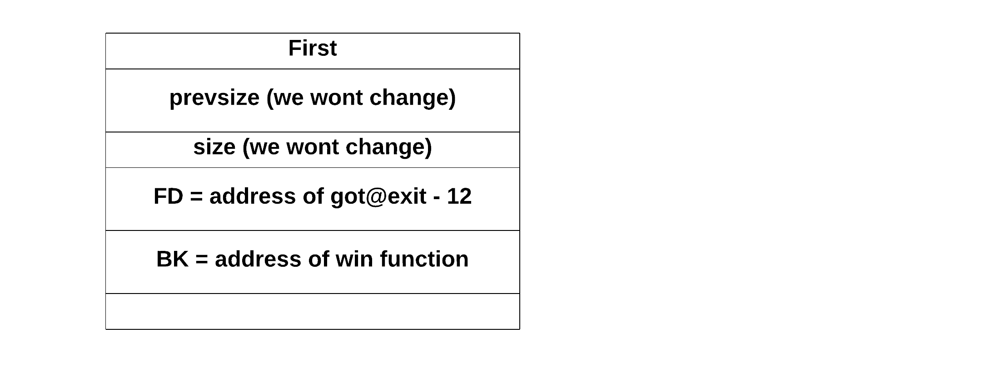

# AfterLife (pwn, pico, heap-exploitation, use-after-free, unlink macro, GOT)

### Notes
- source code given
- binary given


### Enumeration
The program contains two obvious vulnerabilities:

```c
[...]
// address leak vulnerability
printf("%d\n",first);
[...]

// use after free vulnerability
free(first);
[...]
gets(first);
[...]
```


### Exploit
To obtain a flag we have to call `win` function, meaning we need to find a way to redirect code execution. There are two most popular ways to redirect code. One is based on overwriting the return address and the other one is to overwrite the address placed in GOT table. Here we will try the GOT one by overwriting the address under `got.exit` with `win` function address.

Ok, but how can we make a program write to GOT table? Yes, we do have a vulnerable `gets`, but we cannot just override the whole memory hoping that we are lucky and we wont cause any SIGSEV. We need to be smarter.

We will use [unlink macro](https://heap-exploitation.dhavalkapil.com/attacks/unlink_exploit.html) to write for us. I won't explain this technique in details as there are good materials avaible in internet.

Let's look how the bins look in memory:

```c
free(first)
```


The `first` chunk landed in unsorted bin. This is because all small & large chunks land in this bin (there are few exceptions, like when they are close to top chunk they won't).

```c
free(third)
```

The `third` chunk landed in unsorted bin for the same reason. Note that unsorted bin acts like FIFO.


```c
fifth=malloc(128);
```

Now things get a bit more complicated. A program requested 128 bytes of memory. It will first check if small bin for suitable chunk. Small bins are empty, so it will move to unsorted bin. It will go throught the list from the tail to the head (FIFO!) looking for a suitable chunk (best fit). If on the way it will find a chunk belonging to a small/large bin it will move it there. This is why `first` got moved to small bin. 


And in this state we are left with the undermentioned instructions:

```c
gets(first);
seventh=malloc(256); // will call unlink(first)
exit(0);
```

Not much to play with? Well, `gets` will change everything. Our plan is to:
- [ ] prepare the exploit with `gets`
- [ ] `malloc` call will overwrite the GOT table
- [ ] `exit(0)` instead of calling `exit@libc` will invoke `win` function


So how the exploit should look like? Let's check the `unlink` macro which will be called on `first`.

```c
unlink(fist):
  FD = first->fd
  BK = first->bk
  FD->bk = BK
  BK->fd = FD
```

So can we just make `first` chunk look like:



Well 