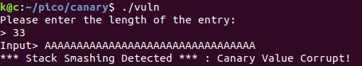
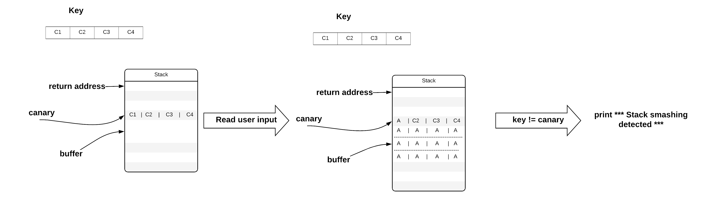
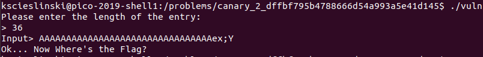
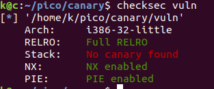
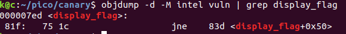
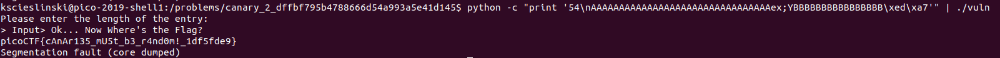

# CanaRy 300 points (pwn, pico, brute force canary byte by byte, buffer overflow, PIE)

### Notes
- source code given: yes
- binary given: yes

### Enumeration
As in almost every pico binary exploitation task the challenge is to not to find a vulnerable part of code, but to find a way to exploit it. Therefore it is super easy to spot a vulnerable to buffer overflow part of code:

```c
printf("Please enter the length of the entry:\n> ");

while (x<BUF_SIZE) {
    read(0,user_len+x,1);
    if (user_len[x]=='\n') break;
    x++;
}
sscanf(user_len,"%d",&count);

printf("Input> ");
read(0,buf,count);
```

We can overflow the `buf` by providing a number larger than 32 when prompt for input length:



But we immediately get _*** Stack Smashing Dectected ***_ alert. By reading the code we can see, that the program proctects from buffer overflow by:
1) first read a value of a canary to a _key_ buffer. 
2) before reading a user input copies value from _key_ buffer into _canary_ buffer which in placed just after _buf_ buffer on stack.
3) reads user input
4) after reading a user input checks if the values in _canary_ buffer has changed in order to detect buffer overflow.



But this prevention mechanism has one big gap! The canary is same in each program instance. It is only 4 bytes long so we could try to brute force the canary in time $2^32$, but we will be smarter. We will brute force the canary byte by byte in time 4 * 256. How? First we will brute the fist byte, by overflowing the _buf_ by just one byte. Each time the overflowing byte will be different. And if we get no _*** Stack Smashing Detected ***_ error this means that we found the correct byte. Next we will overflow the _buf_ with two bytes where the first byte is the one we found in previous step. We will continue till we find all 4 bytes.



Ok, so are we done? Heh, no! I forgot to check the protection mechanisms!



The binary has been compiled as _Position independent executable (PIE)_. Therefore we don't know the address of `display_flag` function, as the base address of a program will be randomized. 



When dumping a code we can see that the address of the `display_flag` function is now just an offset from the base address of a program (as the real address will stay unknown till the program is loaded into memory).
Fortunetely often the least significant bytes of the program will not be randomized, and the base address is usually aligned to bigger number like 64kB in windows. Therefore we can hope that if for ex. base address is equal to 0x11223000, the address of `display_flag` is equal to 0x112237ed.

We will try to bruteforce the `display_flag` address by overriding only 2 least significant bytes of a return address.

Ha, after few runs we finally got the flag!


