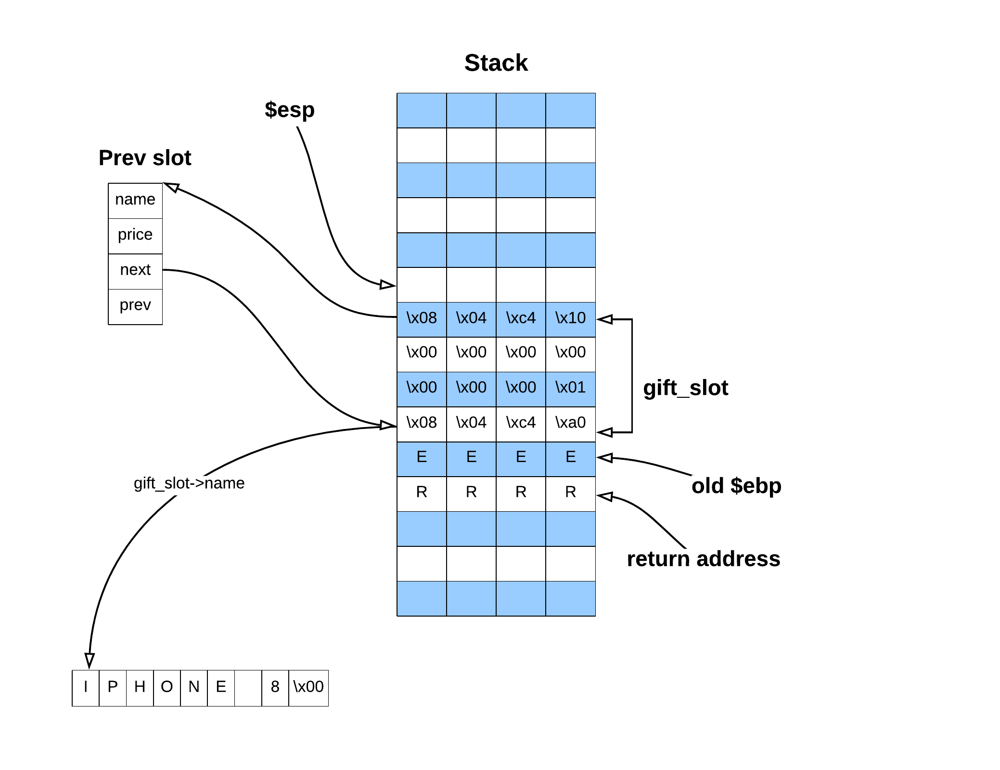
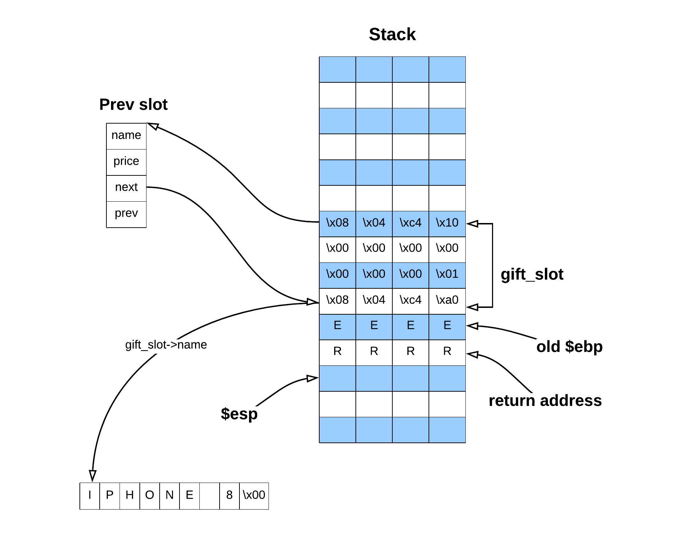
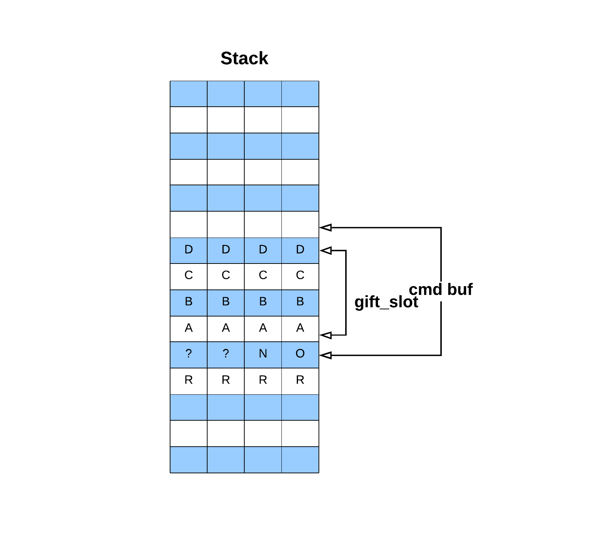

# applestore (stack pivoting, ebp overwrite)

Notes:
- binary given
- ASLR enabled
- exploit does not depend on libc version

## Enumerate
We start with playing around with a program:

```bash
$ LD_PRELOAD=$PWD/libc_32.so.6 ./applestore 
=== Menu ===
1: Apple Store
2: Add into your shopping cart
3: Remove from your shopping cart
4: List your shopping cart
5: Checkout
6: Exit
> 1
=== Device List ===
1: iPhone 6 - $199
2: iPhone 6 Plus - $299
3: iPad Air 2 - $499
4: iPad Mini 3 - $399
5: iPod Touch - $199
> 2
Device Number> 3
You've put *iPad Air 2* in your shopping cart.
Brilliant! That's an amazing idea.
> 4
Let me check your cart. ok? (y/n) > y
==== Cart ====
1: iPad Air 2 - $499
> 5
Let me check your cart. ok? (y/n) > y
==== Cart ====
1: iPad Air 2 - $499
Total: $499
Want to checkout? Maybe next time!
> 
```

As we can see, the program is a simple command line shopping application. Users can add, remove or list items inside cart. They can also do checkout which will just print a total sum of items in cart.

At this point (without reversing) we can think of standard heap vulnerability. But let's check if we will really find such in code!

### Reversing
We can use Ghidra to reverse the binary. The binary has not been stripped and has not been compiled as PIE, meaning this part should be quite easy:

```bash
$ file applestore 
applestore: ELF 32-bit LSB executable, Intel 80386, version 1 (SYSV), dynamically linked, interpreter ./ld-2.2, for GNU/Linux 2.6.24, BuildID[sha1]=35f3890fc458c22154fbc1d65e9108a6c8738111, not stripped

$ checksec applestore
[*] './applestore'
    Arch:     i386-32-little
    RELRO:    Partial RELRO
    Stack:    Canary found
    NX:       NX enabled
    PIE:      No PIE (0x8048000) <- no PIE!
```

We can start with main, but it is not interesting at all. It just calls handler function:

```c
void main(void)
{
  signal(0xe,timeout); 
  alarm(0x3c); // just NOP
  memset(myCart,0,0x10);
  menu();
  handler();
  return;
}
```

which is just one big switch function:

```c
void handler(void)

{
  char cmd_buf [22];
  
  int canary = *(int *)(in_GS_OFFSET + 0x14);
  do {
    printf("> ");
    fflush(stdout);
    my_read(cmd_buf,0x15);
    int cmd = atoi(cmd_buf);
    switch(cmd) {
        default:
            puts("It\'s not a choice! Idiot.");
            break;

        case 1:
            list();
            break;

        case 2:
            add();
            break;

        case 3:
            delete();
            break;

        case 4:
            cart();
            break;

        case 5:
            checkout();
            break;

        case 6:
            puts("Thank You for Your Purchase!");
            if (canary != *(int *)(in_GS_OFFSET + 0x14)) {
                            /* WARNING: Subroutine does not return */
                __stack_chk_fail();
            }
            return;
    }
  } while(true);
}
```

No real, detailed logic so far. Let's go into actions. We will start from list() which is nothing more then listing the items for sail:

```c
void list(void)
{
  puts("=== Device List ===");
  printf("%d: iPhone 6 - $%d\n",1,199);
  printf("%d: iPhone 6 Plus - $%d\n",2,299);
  printf("%d: iPad Air 2 - $%d\n",3,499);
  printf("%d: iPad Mini 3 - $%d\n",4,399);
  printf("%d: iPod Touch - $%d\n",5,199);
  return;
}
```

Then we have logic responsible for adding item to cart:

```c
struct slot {
    char *name;
    int price;
    struct slot *next;
    struct slot *prev;
};

struct slot myCart;

void insert(struct slot *new_slot)
{
  struct slot *free_slot_ptr;
  
  free_slot_ptr = (struct slot *)myCart;
  while (free_slot_ptr->next != (struct slot *)0x0) {
    free_slot_ptr = free_slot_ptr->next;
  }
  free_slot_ptr->next = new_slot;
  new_slot->prev = free_slot_ptr;
  return;
}

void add(void)
{
  int device_num;
  struct slot *slot;
  char device_num_buf [22];
  int canary;
  
  int canary = *(int *)(in_GS_OFFSET + 0x14);
  printf("Device Number> ");
  fflush(stdout);
  my_read(device_num_buf,0x15);
  device_num = atoi(device_num_buf);
  switch(device_num) {
    default:
        puts("Stop doing that. Idiot!");
        goto LAB_08048986;
    case 1:
        slot = create("iPhone 6",199);
        break;
    case 2:
        slot = create("iPhone 6 Plus",299);
        break;
    case 3:
        slot = create("iPad Air 2",499);
        break;
    case 4:
        slot = create("iPad Mini 3",399);
        break;
    case 5:
        slot = create("iPod Touch",199);
  }
  insert(slot);
  printf("You\'ve put *%s* in your shopping cart.\n",slot->name);
  puts("Brilliant! That\'s an amazing idea.");
LAB_08048986:
  if (canary != *(int *)(in_GS_OFFSET + 0x14)) {
                    /* WARNING: Subroutine does not return */
    __stack_chk_fail();
  }
  return;
```

Ok, this is actually a bit more interesting. At least we can tell from it how are the items stored in memory. They are kept as double linked list and there is a globaly declared guard called myCart. Anytime a user want's to add an item to cart, the program iterates to the end of a list and adds a new slot there.
But (at least I) couldn't spot any vulnerabilities there :/

Let's move to next action. Here's how delete looks like:

```c

void delete(void)
{
  int slot_idx;
  int idx;
  struct slot *slot_ptr;
  char slot_idx_buf [22];
  struct slot *next;
  struct slot *prev;
  
  int canary = *(int *)(in_GS_OFFSET + 0x14);
  idx = 1;
  slot_ptr = myCart.next;
  printf("Item Number> ");
  fflush(stdout);
  my_read(slot_idx_buf,0x15);
  slot_idx = atoi(slot_idx_buf);
  do {
    if (slot_ptr == (struct slot *)0x0) {
LAB_08048a5e:
      if (canary != *(int *)(in_GS_OFFSET + 0x14)) {
                    /* WARNING: Subroutine does not return */
        __stack_chk_fail();
      }
      return;
    }
    if (idx == slot_idx) {
      next = slot_ptr->next;
      prev = slot_ptr->prev;
      if (prev != (struct slot *)0x0) {
        prev->next = next;
      }
      if (next != (struct slot *)0x0) {
        next->prev = prev;
      }
      printf("Remove %d:%s from your shopping cart.\n",idx,slot_ptr->name);
      goto LAB_08048a5e;
    }
    idx = idx + 1;
    slot_ptr = slot_ptr->next;
  } while(true);
```

Again, it is very simple as we already know how the data is stored. The program just looks for a slot and then unlinks it from double linked list. Note that by controling next and prev pointers of a slot we remove, we gain power to write to arbitrary location! It is very similar to UNLINK MACRO from heap exploitation and the reason is that the chunks from small bin are also kept as double linked list!

Cool, but we don't have any real vulnerability yet. We have to look futher... cart:

```c
int cart(void)
{
  int idx;
  int sum;
  struct slot *slot_ptr;
  char answer_buf [22];
  int local_10;
  
  int canary = *(int *)(in_GS_OFFSET + 0x14);
  idx = 1;
  sum = 0;
  printf("Let me check your cart. ok? (y/n) > ");
  fflush(stdout);
  my_read(answer_buf,0x15);
  if (answer_buf[0] == 'y') {
    puts("==== Cart ====");
    slot_ptr = myCart.next;
    while (slot_ptr != (struct slot *)0x0) {
      printf("%d: %s - $%d\n",idx,slot_ptr->name,slot_ptr->price);
      sum = sum + slot_ptr->price;
      slot_ptr = slot_ptr->next;
      idx = idx + 1;
    }
  }
  if (canary != *(int *)(in_GS_OFFSET + 0x14)) {
                    /* WARNING: Subroutine does not return */
    __stack_chk_fail();
  }
  return sum;
}
```

It just lists the user's cart displaying what we have in it. Nothing interesting :(

Ok, last function. We just have to find something here:

```c
void checkout(void)
{
  int sum;
  struct slot gift_slot;
  
  int canary = *(int *)(in_GS_OFFSET + 0x14);
  sum = cart();
  if (sum == 0x1c06) {
    puts("*: iPhone 8 - $1");
    asprintf((char **)&gift_slot,"%s","iPhone 8");
    gift_slot.price = 1;
    insert(&gift_slot);
    sum = 0x1c07;
  }
  printf("Total: $%d\n",sum);
  puts("Want to checkout? Maybe next time!");
  if (canary != *(int *)(in_GS_OFFSET + 0x14)) {
                    /* WARNING: Subroutine does not return */
    __stack_chk_fail();
  }
  return;
}
```

Ok, so this simple function first checks if total sum of all items in user's cart is equal to 0x1c06. If yes, the user gets a gift (iphone 8)! Then user is being asked if he want's to checkout, but his answer is not really important as there is not checkout logic yet and it is noop anyway.

So at this place I've spend over 30 minutes staring at the functions and looking for the vulnerabilities. And I couldn't spot any! The user is only asked for indexes when removing/adding item to cart and 'yes'/'no' answer when prompt if he is ok with checking his cart in cart function.

But then I found it. When you see it, it is pretty obvious. The gift_slot in checkout function has been declared on stack, meaning that when function returns back to handler function and latter invokes new function it will be overwriten by new values!

Normaly it would be overwriten by some function arguments, frame registers or old return addresses. But as an attacker we can try to control what will overwrite the gift_slot.
For example look what happens if we call checkout followed by cart() function!

That's how the stack looks like before leaving checkout function:



We can see the gift_slot has been declared correctly. The name points to "Iphone 8" string, the price is set to 1 and the prev slot points to previous slot in double linked list.

Now when we leave checkout function the memory is not being erased, however the proccess sees it as free.



See where $esp points to?

Now why we choosed cart() function? Well, we want to control the values which will overwrite the gift_slot. This means that we need a function which allocates some memory on stack which we can write to.
And this is exactly what is done in cart() function:

```c
int cart(void)
{
  int idx;
  int sum;
  struct slot *slot_ptr;
  char answer_buf [22];
  [...]
  printf("Let me check your cart. ok? (y/n) > ");
  fflush(stdout);
  my_read(answer_buf,0x15);
  [...]
```

The cart function allocates temporary buffer named answer_buf just to read user answer.
I've found under gdb an exact address of cmd_buf(0xffffddc6) and gift_slot(0xffffddc8).
As stack address is randomized due to ASLR + environment variables they will vary different systems, but the important is only the offset between (0xffffddc8 - 0xffffddc6 = 2).

So if we provide as an answer in cart function: 'NOAAAABBBBCCCCDDDD' we would end with following memory layout:


