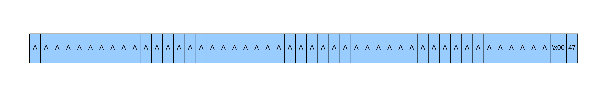

# Silver Bullet (buffer overflow, off-by-one)

Notes:
- binary given
- ASLR enabled
- glibc 2.23 (doesn't matter)

## Enumeration

### Setting lab environment
As always we start with downloading appropriate dynamic linker for provided libc and paching binary so we can easly test it localy. I've described step by step how to do it [here](https://github.com/kscieslinski/CTF/tree/master/pwn/pwnabletw/dubblesort)

```bash
$ ls
silver_bullet ld-2.23.so libc_32.so.6
$ patchelf silver_bullet --set-interpreter ./ld-2.23.so patched 
$ ls
silver_bullet ld-2.23.so libc_32.so.6 patched
$ ldd patched
    linux-gate.so.1 (0xf7fd4000)
    libc.so.6 => /lib/i386-linux-gnu/libc.so.6 (0xf7dd5000)
    ./ld-2.23.so => /lib/ld-linux.so.2 (0xf7fd6000)
```

To be fair this wasn't needed as it turns out the vulnerabilities in the task doesn't rely on libc version.

### Reversing binary
After setting lab environment we move to analyzing the binary. 

```bash
$ LD_PRELOAD=$PWD/libc_32.so.6 ./patched
+++++++++++++++++++++++++++
       Silver Bullet       
+++++++++++++++++++++++++++
 1. Create a Silver Bullet 
 2. Power up Silver Bullet 
 3. Beat the Werewolf      
 4. Return                 
+++++++++++++++++++++++++++
Your choice :1
Give me your description of bullet :Initial bullet description
Your power is : 26
Good luck !!
+++++++++++++++++++++++++++
       Silver Bullet       
+++++++++++++++++++++++++++
 1. Create a Silver Bullet 
 2. Power up Silver Bullet 
 3. Beat the Werewolf      
 4. Return                 
+++++++++++++++++++++++++++
Your choice :2
Give me your another description of bullet :New bullet description
Your new power is : 22
Enjoy it !
+++++++++++++++++++++++++++
       Silver Bullet       
+++++++++++++++++++++++++++
 1. Create a Silver Bullet 
 2. Power up Silver Bullet 
 3. Beat the Werewolf      
 4. Return                 
+++++++++++++++++++++++++++
Your choice :Invalid choice
+++++++++++++++++++++++++++
       Silver Bullet       
+++++++++++++++++++++++++++
 1. Create a Silver Bullet 
 2. Power up Silver Bullet 
 3. Beat the Werewolf      
 4. Return                 
+++++++++++++++++++++++++++
Your choice :3
>----------- Werewolf -----------<
 + NAME : Gin
 + HP : 2147483647
>--------------------------------<
Try to beat it .....
Sorry ... It still alive !!
Give me more power !!
+++++++++++++++++++++++++++
       Silver Bullet       
+++++++++++++++++++++++++++
 1. Create a Silver Bullet 
 2. Power up Silver Bullet 
 3. Beat the Werewolf      
 4. Return                 
+++++++++++++++++++++++++++
Your choice :3
>----------- Werewolf -----------<
 + NAME : Gin
 + HP : 2147483625
>--------------------------------<
Try to beat it .....
Sorry ... It still alive !!
Give me more power !!
+++++++++++++++++++++++++++
       Silver Bullet       
+++++++++++++++++++++++++++
 1. Create a Silver Bullet 
 2. Power up Silver Bullet 
 3. Beat the Werewolf      
 4. Return                 
+++++++++++++++++++++++++++
Your choice :4
Don't give up !
```

Ok, so we enter a simple game. We can either:
- create a bullet
- improve bullet
- fight wolf

Moreover the first action has to be creating a bullet:

```bash
$ LD_PRELOAD=$PWD/libc_32.so.6 ./patched
+++++++++++++++++++++++++++
       Silver Bullet       
+++++++++++++++++++++++++++
 1. Create a Silver Bullet 
 2. Power up Silver Bullet 
 3. Beat the Werewolf      
 4. Return                 
+++++++++++++++++++++++++++
Your choice :2
You need create the bullet first !
+++++++++++++++++++++++++++
       Silver Bullet       
+++++++++++++++++++++++++++
 1. Create a Silver Bullet 
 2. Power up Silver Bullet 
 3. Beat the Werewolf      
 4. Return                 
+++++++++++++++++++++++++++
Your choice :3
You need create the bullet first !
Give me more power !!
+++++++++++++++++++++++++++
       Silver Bullet       
+++++++++++++++++++++++++++
 1. Create a Silver Bullet 
 2. Power up Silver Bullet 
 3. Beat the Werewolf      
 4. Return                 
+++++++++++++++++++++++++++
Your choice :4
Don't give up !
```

The goal of the game is to kill a Werewolf. The wolf has a huge hp pool and when we fight him, we hit him only for the amount of our actual power. Meaning:
new_wolf_hp = old_wold_hp - user_power

We can use Ghidra to confirm above assumptions:

```c
int beat(char *bullet_desc,int *wolf_stats)
{
  int res;
  
  if (*bullet_desc == '\0') {
    puts("You need create the bullet first !");
    res = 0;
  }
  else {
    puts(">----------- Werewolf -----------<");
    printf(" + NAME : %s\n",wolf_stats[1]);
    printf(" + HP : %d\n",*wolf_stats);
    puts(">--------------------------------<");
    puts("Try to beat it .....");
    usleep(1000000);
    *wolf_stats = *wolf_stats - *(int *)(bullet_desc + 0x30);
    if (*wolf_stats < 1) {
      puts("Oh ! You win !!");
      res = 1;
    }
    else {
      puts("Sorry ... It still alive !!");
      res = 0;
    }
  }
  return res;
}
```

So maybe we can just loop and hit wolf over and over again till he dies. Unfortunetely it looks like there is `usleep` function invoked as it takes 1 second to hit a wolf. This means that with power of 20 it would take me like 200 years to kill the wolf :(

Ok so let's check how is the power set initialy:


```c
ssize_t read_input(void *new_bullet_desc,size_t to_read)
{  
  size_t bytes_read = read(0,bullet_desc,to_read);

  if (bullet_desc[bytes_read] == '\n') {
      bullet_desc[bytes_read] = 0;
  }
}

void create_bullet(char *bullet_desc)
{
  size_t bullet_len;
  
  if (bullet_desc[0] == '\0') {
    printf("Give me your description of bullet :",0);
    read_input(bullet_desc,48);
    bullet_len = strlen(bullet_desc);
    printf("Your power is : %u\n",bullet_len);
    bullet_desc[48] = bullet_len;
    puts("Good luck !!");
  }
  else {
    puts("You have been created the Bullet !");
  }
  return;
}
```

Hmm, so the power is just a length of description. And the description cannot be longer then 48 characters. That's very bad information for all fair players. But the interesting operation for us is that the lenght of a description (power) is stored at the end of a bullet_desc array!
Meaning when we provide as an input `some_description` string the memory layout would be:

[S][O][M][E][_][D][E][S][C][R][I][P][T][I][O][N][\x00]...[\x00][16]

Still we cannot overflow the buffer and overwrite the length. At least for now, but we have one more function to look at:

```c
void power_up(char *old_bullet_desc)
{
  int old_len;
  size_t new_len;
  char new_bullet_desc [48];
  
  memset(new_bullet_desc,0,48);
  if (old_bullet_desc[0] == '\0') { // [0]
    puts("You need create the bullet first !");
  }
  else {
    if (old_bullet_desc[48] < 48) { // [1]
      printf("Give me your another description of bullet :");
      read_input(new_bullet_desc,48 - old_bullet_desc[48]); // [2]
      strncat(old_bullet_desc, 48 - old_bullet_desc[48]); // [3]
      new_len = strlen(new_bullet_desc);
      old_len = old_bullet_desc[48];
      printf("Your new power is : %u\n",old_len + new_len);
      old_bullet_desc[48] = old_len + new_len; // [4]
      puts("Enjoy it !");
    }
    else {
      puts("You can\'t power up any more !");
    }
  }
  return;
}
```

The function:
- [0] starts with checking if bullet has been initialized. If not it exits
- [1] checks if we can increase description size
- [2] reads new part of description. New description lenght + old description lenght must be less or equal to 48
- [3] concatenates new description to old description
- [4] updates description lenght

Can you spot the bug? There is off-by-one vulnerability in the code. Let's say we have created a bullet and entered a power_up function:

```bash
+++++++++++++++++++++++++++
       Silver Bullet       
+++++++++++++++++++++++++++
 1. Create a Silver Bullet 
 2. Power up Silver Bullet 
 3. Beat the Werewolf      
 4. Return                 
+++++++++++++++++++++++++++
Your choice :1
Give me your description of bullet :AAAAAAAAAAAAAAAAAAAAAAAAAAAAAAAAAAAAAAAAAAAAAAA
Your power is : 47
Good luck !!
```

The bullet_desc layout:



Now let's power_up the bullet:

```bash
+++++++++++++++++++++++++++
       Silver Bullet       
+++++++++++++++++++++++++++
 1. Create a Silver Bullet 
 2. Power up Silver Bullet 
 3. Beat the Werewolf      
 4. Return                 
+++++++++++++++++++++++++++
Your choice :2
Give me your another description of bullet :B
Your new power is : 1
Enjoy it !
```

Wait? Shouldn't the power be 48 (47 + 1)? It should, let's look what happened:
